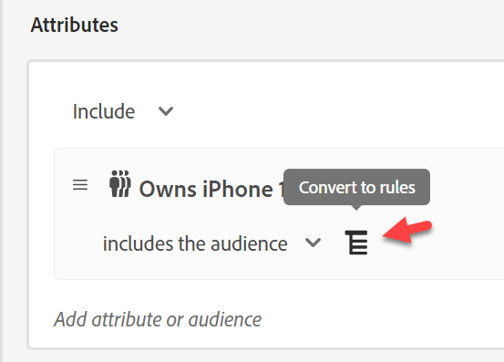
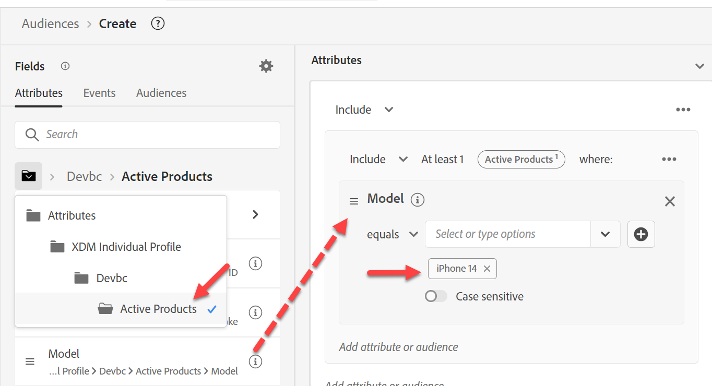

# 建立受眾#2

## 實驗室目標

建立受眾，尋找所有沒有作用中行（即iPhone 14）的設定檔

## 分析任務

此對象是「沒有作用中iPhone 14的使用者」

- 我們如何知道某人沒有「使用中的iPhone 14」？  構思：
  - 包括已購買iPhone 14的使用者
  - 包括擁有iPhone 14計費資料的使用者
  - 包括擁有來自iPhone 14之任何網頁資料的使用者
  - 有其他人嗎？

歸根結底，這取決於他們想要向誰行銷的商業選擇。 在我們的案例中，公司認為這非常重要，因此我們建立了定義Active Lines的結構描述，以便使用。

>[!NOTE]
>
>由於Active Lines是儲存在設定檔中的陣列，因此這將會選取該帳戶的擁有者與裝置的每個個別擁有者。 請確定行銷團隊知道且想要。 否則，您可能會想要不同的方式。

## 建立新對象（擁有iPhone 14）

1. 在左側邊欄的「屬性」標籤中，向下導覽至「產品名稱」 （或搜尋產品名稱）。
   - XDM個別設定檔 — > \&lt;租使用者名稱稱> —>作用中產品 — >產品ID屬性 — >產品名稱
1. 將產品名稱拖曳至畫布

## 儲存對象

1. 輸入iPhone 14 （保留為批次評估）
1. 提供說明
1. 將對象儲存為「*擁有iPhone 14*」
   - 請針對畫素7 （如果您有時間）執行上述相同步驟。

>[!TIP]
>
>**側邊想：「我們難道不能篩選事件，而不是在設定檔存放區中讓另一個欄位儲存相同內容嗎？」**
>
>是的，我們可以，但我們必須探討一些讓受眾變得複雜的業務和技術細微差別，並引入一些挑戰：
>
>1. 如果我們使用「購買事件」：
>   1. 如果他們不是向我們購買產品，但擁有有效產品線，該怎麼辦？
>   1. 如果他們在2年前購買，我的規則必須回顧N年，而我們只保留1年的事件在設定檔上，該怎麼辦？
>1. 帳單活動似乎更適合：
>   1. 但現在，資料是在一個月前。
>   1. 如果上次計費事件是2年前，這可能包括非客戶的人員
>   1. 如果我的資料載入失敗，如果我只回顧一個月以排除舊資料，計數可能會降至零
>   1. 我們甚至會擷取裝置的計費事件嗎？ 否，因此我們必須變更資料摘要
>
>最後，我們必須權衡此對象所需付出的代價。 如果您仍然堅持使用適用於此規則的事件，請閱讀這篇部落格： https\：//experienceleaguecommunities.adobe.com/t5/adobe-experience-platform-blogs/how-to-capture-latest-experience-event-in-adobe-experience/ba-p/430941

>[!NOTE]
>
>**啟用Edge的合併原則**
>
>確認您的合併原則已針對Edge受眾完成設定。 前往合併原則並編輯\_xdm.context.profile的預設合併原則。  開啟Active-On-Edge合併原則並儲存。
>
>的預設合併原則
>
>
>
>

## 重建對象

行銷部門今天介入，並要求我們提供此串流，不幸的是，我們建立此串流的方式是批次。 修正此問題：

1. 開啟「*擁有iPhone 14*」對象，並將名稱變更為「*擁有iPhone 14批次*」。

   >[!WARNING]
   >
   >目前無法在UI中變更評估方法。 參考此對象的任何對象也都必須刪除。 在決定使用區段內區段的建置策略時，請記住這一點。

2. 建立新對象。 將「擁有iPhone 14對象批次」對象新增至畫布，然後按一下「轉換為規則」。

   

   

3. 將說明、名稱和評估方法更新至右下角的串流，然後按一下評估方法旁的資料夾圖示。 您應會看到以下內容：

   按一下資料夾圖示後，

   雖然不明顯，但這是因為我們在查詢結構描述上使用產品名稱

   >[!NOTE]
   >
   >每當使用查詢時，我們的評估方法都會強制設為批次。
   >
   >如果您檢視路徑，發現路徑中任何位置都有「屬性」，就能分辨出來
   >
   >

4. 將產品名稱的現有值取代為現在來自XDM個別設定檔結構描述

   取代下列路徑：

   - XDM個別設定檔>部門>作用中產品>產品ID屬性>產品名稱

   新增路徑：

   - XDM個別設定檔>dep >作用中產品>模型

   

   

5. 將評估方法變更為串流，然後按一下資料夾圖示

   

6. 對於新的串流合格對象，請提供說明。

   - 將對象儲存為&quot;*擁有iPhone 14*&quot;對象。
   - 按一下藍色按鈕&#x200B;**啟用受眾**&#x200B;到目的地

   

7. 選取&#x200B;**串流DEP Webhook**&#x200B;目的地並按一下&#x200B;**下一步**

8. 按一下&#x200B;**下一步**&#x200B;和&#x200B;**完成**

>[!NOTE]
>
>考量為什麼您可能想要選取批次vs串流或Edge：
>
>最新的護欄： [https://experienceleague.adobe.com/docs/experience-platform/profile/guardrails.html?lang=en](https://experienceleague.adobe.com/docs/experience-platform/profile/guardrails.html?lang=zh-Hant)

>[!TIP]
>
>**選用的挑戰實驗室**
>
>提早完成？
>
>在一個家庭中建立「Apple裝置忠誠度」對象。  計畫中的所有人都擁有相同型別的裝置(Apple)。
