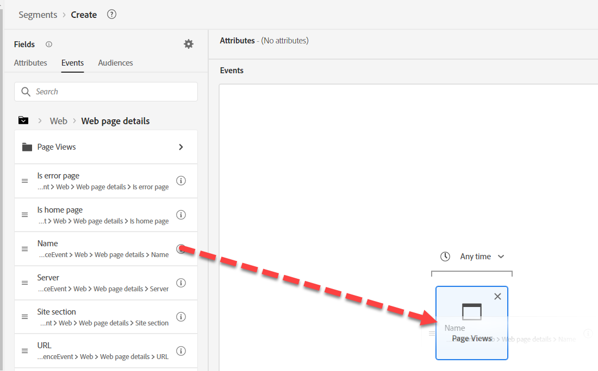
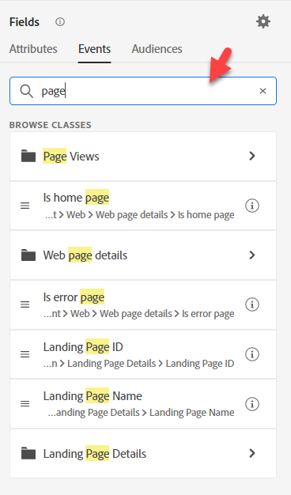
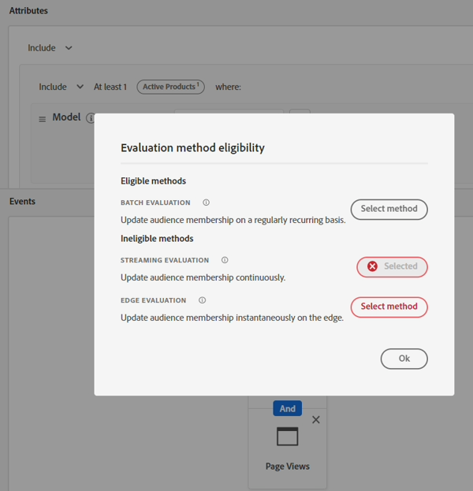

# 建立受眾#3

## 實驗室目標

建立造訪iPhone 14產品頁面的對象

## 分析任務

此對象應直截了當。  我們可能有多個產品頁面，但此處絕非棘手。

## 建立對象（造訪過任何頁面）

1. 在左側邊欄的「事件型別」下的「事件」標籤上尋找「頁面檢視」事件，並將其新增至對象

   

   >[!NOTE]
   >
   >**使用事件型別**
   >
   >藉由使用「頁面檢視事件」，我們確保對象只會在「頁面檢視」內容中評估「頁面名稱」 。 由於「頁面名稱」僅存在於「頁面檢視」中，但提供兩項優點，因此應多此一舉：
   >
   >- 向檢視UI的使用者提供高階視覺檔案
   >- 提供篩選條件，確保當加入新事件時，當不是意圖時，不會包含這些事件
   >
   >因此，我們建議您在建置的每個事件結構描述中，都應充分考慮您使用的事件型別。 這些是篩選和視覺指南的基礎。

2. 提供說明，並使其成為串流。

3. 在「已放置事件」上方，將「任何時間」變更為「今天」

   

4. 將此對象儲存為&quot;*造訪過的任何頁面*&quot;

5. 按一下藍色按鈕&#x200B;**啟用受眾**&#x200B;到目的地

6. 選取&#x200B;**串流DEP Webhook**&#x200B;目的地，然後按[下一步]

7. 按一下「下一步」並完成

## 建立對象（已造訪iPhone 14頁面，但未擁有/訂購頁面）

1. 建立新對象並新增頁面檢視事件

   

2. 導覽至「頁面名稱」所在的位置，並將「頁面名稱」欄位新增至「事件」，以便我們篩選。

   - XDM ExperienceEvent —>網頁 — >網頁詳細資料 — >名稱

   

3. 新增包含「iPhone 14」

   

   >[!TIP]
   >
   >**正在搜尋「頁面」**
   >
   >請嘗試搜尋「頁面」，而非導覽至欄位
   >
   >您看到頁面名稱未出現。 這是因為其命名方式：
   >
   >- XDM ExperienceEvent >網頁>網頁詳細資料>名稱
   >
   >所以您的資料夾會出現，但欄位本身不會出現。 將命名慣例組合在一起時，請考量此辭彙以及人們可能搜尋的其他常用辭彙，並將這些辭彙合併至您的命名中。
   >
   >搜尋不會搜尋說明
   >
   >

4. 在「已放置事件」上方，將「任何時間」變更為「今天」

   

   >[!NOTE]
   >
   >由於我們是根據今天發生的事件啟動，因此我們僅關注今天的頁面檢視。

5. 驗證這是串流並提供說明。

6. 將對象儲存為&quot;*造訪的iPhone 14頁面*&quot;

   

7. 按一下藍色按鈕&#x200B;**啟用受眾**&#x200B;到目的地

8. 選取&#x200B;**串流DEP Webhook**&#x200B;目的地，然後按[下一步]

9. 按一下「下一步」並完成

## 建立受眾對象

1. 導覽至左上方的「對象」標籤
1. 深入研究至Experience Platform
1. 提取我們先前建立的其他三個對象
1. 針對擁有iPhone 14和已下訂單iPhone 14，將「包含」變更為「不包含」 。

   

1. 提供說明。

1. 變更為串流

1. 儲存為&quot;*造訪的iPhone 14頁面但不擁有/訂購*&quot;

1. 按一下藍色按鈕&#x200B;**啟用受眾**&#x200B;到目的地

1. 選取&#x200B;**串流DEP Webhook**&#x200B;目的地，然後按[下一步]

1. 按一下「下一步」並完成

>[!NOTE]
>
>**時間篩選器**
>
>這些要求沒有時間要求，因此如果某人三年前造訪過，則符合資格。 這取決於我們的使用案例，不一定管用。 這值得一問。 我們新增了一個，因為我們正在根據今天造訪我們網站的人進行啟用。  這可能不適用於所有使用案例。  如果新增時間篩選器，要多久後Edge對象才會變成串流或批次？

>[!NOTE]
>
>**分解此專案的影響**
>
>出於一些原因，我們將簡單的需求分割成許多對象。 此需求適用於串流，但這兩項需求會將我們的對象轉換為批次。 如需串流適用性規則的詳細資訊，請參閱此處：
>
>[https://experienceleague.adobe.com/docs/experience-platform/segmentation/ui/streaming-segmentation.html?lang=zh-Hant](https://experienceleague.adobe.com/docs/experience-platform/segmentation/ui/streaming-segmentation.html?lang=zh-Hant)

>[!NOTE]
>
>**什麼是受眾串流**
>
>我們的&#x200B;*Peeking Under the Hunder of Audience*&#x200B;部落格（連結如下），以下會介紹一些相關內容。 它會顯示如何將對象的結果儲存在設定檔上。 這點很重要，因為其中的資料串流是檢視設定檔中儲存之對象的結果，因此不會在該時間點重新執行對象！ 簡單的細微差別但值得瞭解。 大部分的設定檔屬性都會定期更新，因此此方法較為合理。
>
>我們需要瞭解，在對象中使用對象時，AEP將會嘗試在必要時進行排序。 在有些邊緣案例中這是不可能的，例如如果使用「對象」，則每24小時會進行設定檔取消資格。
>
>[https://experienceleaguecommunities.adobe.com/t5/adobe-experience-platform-blogs/peeking-underneath-the-hood-of-segments-in-aep-adobe-experience/ba-p/453535?profile.language=zh-Hant](https://experienceleaguecommunities.adobe.com/t5/adobe-experience-platform-blogs/peeking-underneath-the-hood-of-segments-in-aep-adobe-experience/ba-p/453535?profile.language=zh-Hant)

## 為什麼要建立多個對象？

如果我們將所有這些對象建立在一個對象中，而不是四個對象中，那麼即使每個對象個別為串流，我們仍會獲得批次評估方法。

藉由劃分這些對象並使用對象對象，我們會得到此行為。  這些對象在中作為資料串流的即時資格

- 訂購iPhone 14
- 擁有iPhone 14
- 已造訪iPhone 14頁面

>[!WARNING]
>
>現在，對象會每日/24小時延遲取消資格

利潤：我們以更快的速度進入對象來交換，我們將它分割成多個片段，並有24小時的延遲，這些片段會從對象中流失。

>[!TIP]
>
>**選用的挑戰實驗室**
>
>提早完成？
>
>如果有人有舊手機，我想以電子郵件鎖定他們。  建立「有舊手機」的對象。  我們如何鎖定他們？
