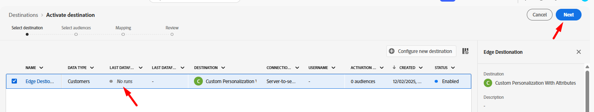

# 設定自訂Personalization目的地

使用[自訂Personalization目的地](https://experienceleague.adobe.com/en/docs/experience-platform/destinations/catalog/personalization/custom-personalization)是讓對象可在Edge上供第三方使用的方法，通常使用網路伺服器API來用於個人化。

本實驗會設定自訂Personalization目的地，好讓我們可以將設定檔屬性傳送至Edge。

## 瀏覽目的地目錄

>[!NOTE]
>
>若要使用Adobe Target進行個人化，請使用[Adobe Target目的地。](https://experienceleague.adobe.com/en/docs/experience-platform/destinations/catalog/personalization/adobe-target-v2) 此行為等同於自訂Personalization。

1. 在左側邊欄中按一下&#x200B;**目的地**
1. 在頂端邊欄中，按一下&#x200B;**目錄**
1. 接著選取&#x200B;**Personalization**&#x200B;的類別
1. 在畫面中央，您應該會看到標題為&#x200B;**具有屬性的自訂Personalization。** 按一下該卡片上的&#x200B;**設定**&#x200B;按鈕。

## 設定目的地

### 設定帳戶

命名您的帳戶`DEP Labs Custom PZN`，然後按一下&#x200B;**[連線到目的地]按鈕**

### 新增目的地詳細資料

填寫以下目的地詳細資料：

1. 名稱 — > **Edge目的地**
1. 整合別名 — > **edgeAlias**
1. 資料流識別碼 — > *選取您先前建立的資料流名稱*
1. 完成時，按一下&#x200B;**下一步**&#x200B;按鈕

>[!CAUTION]
>
>按一下[下一步]之後，就無法變更&#x200B;**名稱**&#x200B;或&#x200B;**整合別名**。  這些內容稍後會在Edge Network回應中顯示

### 選取治理原則

選取&#x200B;**現場Personalization**，然後按一下&#x200B;**建立**&#x200B;按鈕

>[!NOTE]
>
>雖然此步驟為選用，但強烈建議您建立任何目的地，為其指派治理原則，以避免錯誤啟用設定檔

完成時，您應該會看到此畫面並指出您成功！

## 啟用目的地

### 選取對象

按一下資料列以反白該資料列，然後按一下&#x200B;**下一步**&#x200B;按鈕，以選取您剛建立的目的地

選取&#x200B;**所有對象**&#x200B;並按一下&#x200B;**下一步**

### 對應

新增&#x200B;**新對應**，如下所示：

| Source欄位 | 目標欄位 |
| ---------------------- | ------------ |
| \_tenantName.plan.name | 計畫名稱 |

>[!NOTE]
>
>請記得將&#x200B;**\_tenantName**&#x200B;取代為您的租使用者名稱稱

>[!NOTE]
>
>目標欄位可提供與XDM名稱不同的易記名稱

完成後，您的畫面應該看起來像下面的影像。  然後您可以按一下「下一步&#x200B;**」按鈕**

>[!NOTE]
>
>由於設定檔屬性可能包含敏感資料，因此所有[Edge Network伺服器API](https://experienceleague.adobe.com/en/docs/experience-platform/edge-network-server-api/overview)呼叫都必須在已驗證的內容中進行，才能在Edge上擷取屬性。

### 檢閱

在最後一個畫面中，您可以檢閱設定的詳細資訊，然後按一下「完成」按鈕。

>[!NOTE]
>
>這是[自動強制執行](https://experienceleague.adobe.com/en/docs/experience-platform/data-governance/enforcement/auto-enforcement)會針對您的[資料使用原則](https://experienceleague.adobe.com/en/docs/experience-platform/data-governance/policies/overview)檢查的位置。 它將會使用您建立的規則檢查您的行銷動作，並引發任何錯誤。
