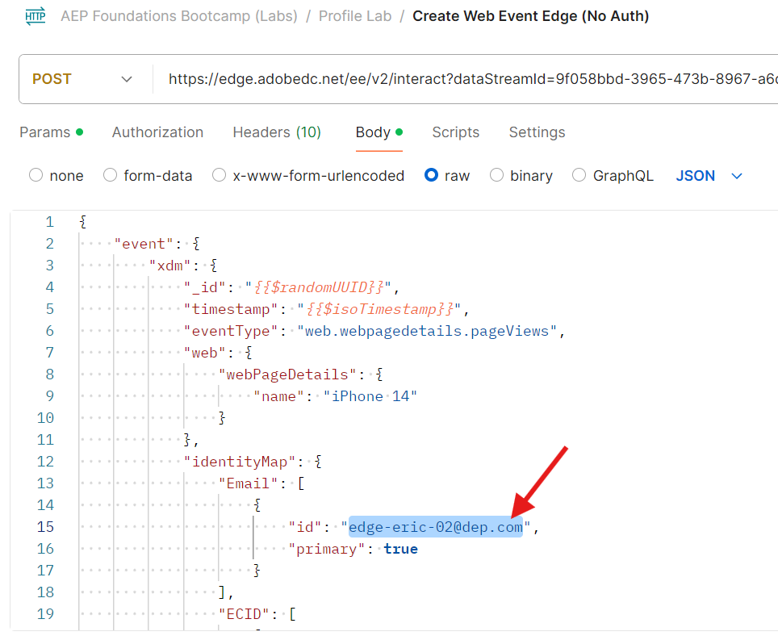

# 傳送Edge事件

現在所有專案皆已設定，請將事件傳送至Edge以檢視其運作情況。 若要這麼做，請使用Postman將網頁事件傳送至您建立的資料流。 這會傳送沒有OAuth權杖&#x200B;**的事件**&#x200B;來模擬從網路進入Edge的頁面檢視。  請確認您的電腦已開啟Postman以執行本實驗作業。

>[!NOTE]
>
>因為您未傳入已驗證的Token，所以無法取回任何屬性。

## 實驗室期望

1. 點選Edge的體驗事件
1. 使用事件轉送服務的資料流設定
1. 事件轉寄以將事件傳送至webhook
1. 使用AEP服務的資料流設定
   1. 要執行的Edge對象
   2. 將事件傳送至中樞
1. Postman回應以包含Edge對象（不含屬性）
1. 用於接收事件並新增事件設定檔片段的設定檔存放區
1. 要新增關係的身分存放區
1. 要接收資料並儲存在Data Lake中的資料集
1. 串流受眾，以在集線器上的設定檔上評估及儲存結果
1. 自訂Personalization目標，將任何串流對象「登入」傳送回Edge
1. HTTP API目標將任何串流對象「登入」傳送至webhook
1. 最終HTTP API目標會將任何串流對象「退出」傳送至webhook
1. 最終自訂Personalization目標，以傳送任何串流對象「退出」至Edge


## 導覽至通話

1. **Postman左側邊欄** ->集合
1. **系列** -> AEP Foundation Bootcamp （實驗室）
1. **資料夾** ->設定檔實驗室
1. **API要求** ->建立Web事件Edge （無驗證）


## 修改API請求

如果您已完成此操作，您可以跳至「執行API」。

在執行API請求之前，您需要將一些其他資訊新增到請求中。 首先，收集下列值：

## 收集資料串流ID

1. 在左側邊欄中，按一下&#x200B;**資料串流** （在「資料收集」標題下）
1. 選取您的資料流並複製&#x200B;**資料流ID**&#x200B;值


## 更新Postman查詢引數

1. 在要求本身中按一下&#x200B;**引數**
1. 使用上一步驟的資料流ID更新&#x200B;**值**
1. 按一下&#x200B;**儲存**&#x200B;按鈕以儲存您的更新
1. 將電子郵件變更為您的電子郵件

![使用資料流ID更新Params值，然後按一下[儲存]](assets/send-an-edge-event-update-datastreamid.png)



## 執行API

按一下&#x200B;**傳送**&#x200B;按鈕以執行您的要求。


您應會看到回應中傳回以下核心內容：

- 200 OK回應表示Edge Network已成功傳送及接受資料
- 在裝載回應中，您也應該看到下列內容：
  - 您設定的自訂Personalization目的地的destinationId
  - 該目的地的別名（您的別名稱為customPersonalization）
  - 輪廓符合資格的任何存在於邊緣的區段

>[!NOTE]
>
>所有串流和批次區段直到在中心先評估後才會顯示

>[!NOTE]
>
>如果您使用持有人權杖傳送至server.adobedc.net ，您也會看到在自訂Personalization目的地中設定的屬性

## 您可能會遇到的錯誤

以下是您可能會遇到的錯誤範例。 這表示邊緣區段評估還無法評估傳送到邊緣網路的資料。

```none
"errors": [
        {
            "type": "https://ns.adobe.com/aep/errors/EXEG-0203-502",
            "status": 502,
            "title": "The service call has failed.",
            "detail": "An error occurred while calling the 'com.adobe.experience_platform.edge_segmentation' service for this request. Try again.",
            "report": {
                "eventIndex": 0
            }
        }
    ]
```

## 驗證事件轉送

在webhook.site上，您應該會立即看到您透過Postman請求傳送的相同裝載內文。


>[!NOTE]
>
>請注意，裝載已新增您在設定邊緣設定中使用的資料流時要求的地理查閱資訊

## 查詢設定檔

在Adobe Experience Platform中，查詢您剛才從您剛傳送至Edge Network的事件傳送的設定檔。  瀏覽至「設定檔 — >瀏覽」，使用下列資訊執行查詢：

- 合併原則 — >預設時間
- 身分名稱空間 — >電子郵件
- 身分值 — > edge-email\@dep.com


1. 按一下&#x200B;**檢視**&#x200B;以查閱設定檔
1. 按一下&#x200B;**設定檔識別碼**&#x200B;以開啟設定檔


3. 按一下頂端導覽列中的&#x200B;**事件**，您就可以看到剛才傳入的事件

![在設定檔的[事件]索引標籤中檢視事件](assets/send-an-edge-event-view-the-profile-event.png)


4. 檢閱頂端導覽中的「對象成員資格」索引標籤，以驗證設定檔是否符合對象的資格。  您應該會看到下列內容：

- 任何事件Edge （過去15分鐘內）
- 任何事件串流（過去一小時內）
- 在使用案例#1，您也應該看到受眾：
  - 已瀏覽iPhone 14頁面但未擁有/訂購
  - 已造訪iPhone 14頁面


## 驗證串流目的地啟用

檢查您的webhook，檢視您設定的串流目的地是否已啟用任何區段。  它們應該會在\~5分鐘後出現。


>[!NOTE]
>
>如果兩個身分尚未連結，串流目的地可能會傳送另一個區段資格裝載。

如果尚未連結ECID和電子郵件，幾分鐘後，另一個裝載可能會以相同的值出現，但identityMap除外，現在將有兩個身分（電子郵件和ecid）

隨著時間過去，您應該開始接收更多負載到webhook的「已退出」狀態。

的「已退出」狀態

## 如何解譯所有檢查

1. 檢查Postman中的200回應（正確格式化的裝載）
1. 檢查webhook是否有事件（正確設定的事件轉送）
1. 檢查設定檔是否有事件（正確設定的AEP服務、集線器上已接收及處理的事件）
1. 檢查設定檔是否有兩個身分（身分圖表已連結到集線器）
1. 檢查設定檔是否符合對象的資格（正確定義的對象）
1. 檢查webhook是否收到串流對象（正確設定的HTTP API目的地）
1. 檢查Postman回應是否包含區段（正確設定的自訂Personalization目的地）
1. 檢查Data Lake是否有傳送記錄（已正確設定並傳送對象資格和串流目的地）。 請參閱下文。

## 目的地的Data Lake「記錄」

在至少60分鐘後，您甚至可以檢查資料集是否含有您傳送的事件。 若要這麼做，請使用「查詢服務」執行下列查詢。

將下方的表格名稱變更為沙箱中的表格名稱。 若要尋找，請前往您的資料集清單並在&quot;`dest`&quot;上篩選，開啟資料集並在右側邊欄上複製表格名稱。

```sql
SELECT * FROM profile_export_for_destination_merge_policy_xxx
WHERE extSourceSystemAudit.LASTREFERENCEDDATE >= CURRENT_DATE
AND identitymap['email'][0].ID in ('edge-email@dep.com')
ORDER BY extSourceSystemAudit.LASTREFERENCEDDATE DESC
LIMIT 10
```
