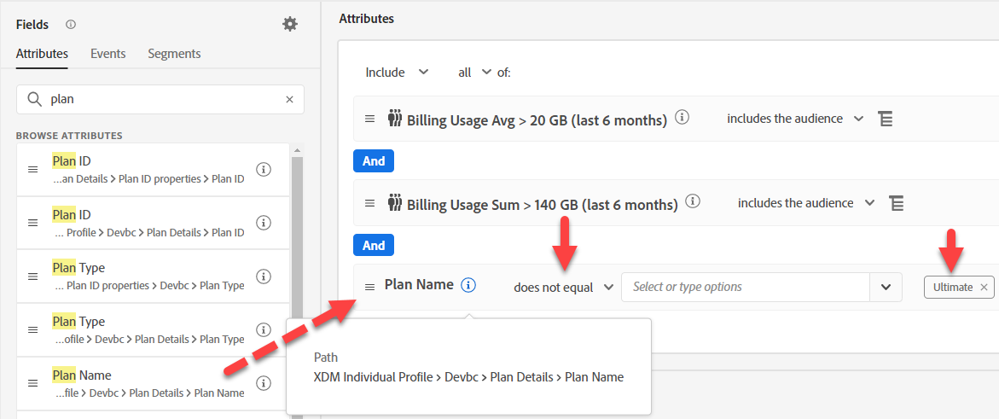

# 選項#1 — 使用對象來彙總

對象中的彙總可讓我們彙總對象規則中的事件。 但由於我們一次只能做一個彙總，因此我們需要從使用案例中分割這兩者。

## 對象#1 — 過去6個月的計費資料使用量> 140GB

在此對象建置中，您需判斷過去6個月的總計費資料使用量> 140gb。 若要這麼做，請執行下列動作：

1. 建立新對象。  使用帳單事件卡。

   

   >[!NOTE]
   >
   >良好的事件型別結構可讓您的使用者輕鬆使用和瞭解。  請花點時間，針對您的方案開發標準化方法。
   >
   >這有助於處理拼字錯誤。
   >
   >您一律可以後退至「事件型別」欄位，並手動輸入內容。

2. 按一下右下角規則中的「橢圓」，然後選擇「彙總」。 按一下「選取屬性」並輸入「使用方式」。 選取「計費資料使用量」欄位。

   ![選取屬性並選擇[帳單資料使用量]欄位](assets/option-1-using-audiences-to-aggregate-select-billing-data-usage-field.png)

   

3. 將「等於」變更為「大於」，並將值變更為140。

4. 將事件卡片上方的時間從「任何時間」變更為「最近」，並將值變更為6，將天數變更為「月」

   

5. 提供說明並儲存。

6. 為對象命名「*計費使用總和> 140 GB （過去6個月）*」

>[!NOTE]
>
>彙總對象只能儲存為批次

>[!NOTE]
>
>在「對象」中使用彙總的方式有兩種。
>
>- 總和/計數/最小值/最大值/平均值（如同先前操作）
>- 僅計算（即每個事件均計算為1）
>
>
>
>如有需要，兩者可搭配使用
>
>

## 對象#2 — 滾動6個月平均 每月資料使用量>= 20GB

1. 請勿按一下超連結，但在對象清單UI中選取該列，使其醒目顯示我們剛才建立的對象。 反白之後，按一下「複製」。

   

2. 按一下副本並加以編輯。  按一下「事件」卡片，並將「總和」變更為「平均」。 將大於變更為大於或等於，並將值變更為20。 將偽程式碼複製到說明中。

   

3. 為對象命名「*計費使用量平均> 20 GB （過去6個月）*」

## Audience #3 — 沒有最終的電話方案

1. 建立新對象
1. 在屬性中，搜尋計畫名稱
1. 新增計畫名稱（計畫名稱）
1. 選取「Ultimate」。  變更為不等於

   >[!NOTE]
   >
   >還記得我們的前期工作嗎？ 這會在查詢維度上使用欄位：
   >
   >XDM個人設定檔> Devbc >計畫詳細資料>計畫ID屬性> **計畫名稱（計畫名稱）**

   

1. 按一下「對象 — > Experience Platform」。 將「計費使用總和」>「140 GB」與「計費使用平均」>= 20 GB拖曳至「計畫名稱」旁。

   

1. 將虛擬程式碼複製到說明中

1. 勾選此專案可以是串流。 **它不能是串流**。 進行一些變更：

   >[!NOTE]
   >
   >只要使用查詢資料集，就會建立多實體對象，並以批次進行評估。  我們在對象中使用了欄位：
   >
   >XDM個人設定檔> Devbc >計畫詳細資料>計畫ID屬性>計畫名稱（計畫名稱）

1. 將&#x200B;**計畫名稱（計畫名稱）**&#x200B;取代為： XDM個人設定檔> Devbc >計畫詳細資料> **計畫名稱**

   

   >[!NOTE]
   >
   >回想一下LID反標準化步驟會將計畫名稱新增至設定檔。 這可讓您在對象中參照它。 因此，這會移除查閱的聯結，並讓您讓評估方法串流。
   >
   >這裡的取捨是，我們已將此邏輯上游移至預先資料擷取，而非在對象評估期間。
   >
   >如果計畫名稱變更，我們現在也必須更新任何設定檔。
   >
   >不過這樣做的好處是，我們現在可以即時做出反應。

1. 驗證您現在是否可以將它儲存為串流。 將對象儲存為&quot;*計費資料使用量高但無Ultimate計畫*&quot;

>[!NOTE]
>
>雖然此評估方法是串流，但其對象資格是以兩個批次對象為基礎。

>[!NOTE]
>
>此方法將可運作，但我們現在有使用批次對象（每24小時執行一次）的串流對象（即時）。 如果這適用於我們的使用案例和資料載入，則這是個不錯的選擇（例如，也許我們的計費資料是每日或每月載入，這很有可能，但並非所有使用案例都像這樣）。 如果沒有，常見的做法是在傳送至AEP之前彙總資料。 如果您需要更即時的方法，請檢視另一個選項。
