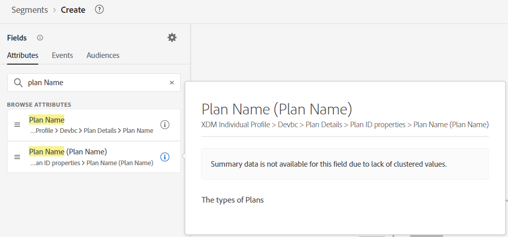

# 前期工作

對於此使用案例，沒有多少前置工作可做。 我們基本上要尋找兩樣東西：1)使用狀況，2)計畫。  找出他們在哪裡。

## 計費資料使用情況

1. 建立新對象
1. 在屬性中搜尋「使用狀況」。 按一下「i」以檢閱說明（沒有說明）。

&#x200B;3. 搜尋「事件」中的「使用狀況」。  按一下「i」以檢閱說明（沒有說明）。

&#x200B;> [!NOTE]
>
>這些都沒有說明，因此行銷人員可能會做出一些假設並猜測錯誤。
>
>說明很重要。  若無說明，行銷人員如何知道：
>
>- 使用哪一個？
>- 資料的延遲？
>- 在特定使用案例中推薦/偏好？
>
>在說明中提供這些資訊，我們就能提供更好的指引。
> [!NOTE]
>
>嘗試搜尋「帳單」。  請注意，不會顯示為設定檔屬性。  這會顯示為「事件型別卡」以及「計費資料使用量」欄位。
>
>您的行銷人員也有命名慣例。  根據他們搜尋的內容，或如果他們尋找/預期這會是事件或設定檔，則會影響他們找到及最終使用的內容。

## 計畫

在屬性中搜尋「計畫」。  請注意，我們有許多專案可供選擇。  將其縮小至「計畫名稱」。  我們有兩個計畫名稱?!

搜尋計畫時找到第一個計畫名稱屬性

搜尋計畫時找到第二個計畫名稱屬性

根據說明，計畫名稱（計畫名稱）似乎是我們需要的名稱，而另一個名稱缺少說明。
