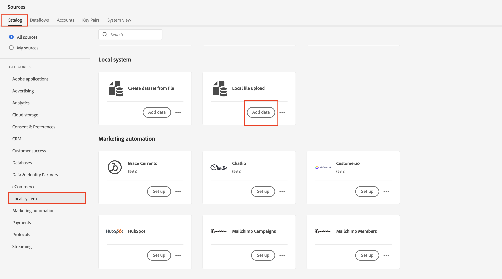

# 建立新的資料流

## 導覽至來源

1. 在Adobe Experience Platform UI中導覽至下列位置：\
   **來源** -> **目錄** -> **本機系統**
1. 接著按一下&#x200B;**本機檔案上傳**&#x200B;卡片的&#x200B;**新增資料**&#x200B;按鈕

## 設定資料流

1. 在資料流詳細資訊畫面中，選擇&#x200B;**現有的資料集**。
1. 使用您先前建立的資料集，名稱為&#x200B;**客戶帳戶 — \&lt;您的縮寫>**
1. 確定您已開啟&#x200B;**設定檔資料集**&#x200B;切換功能。
（如果您未開啟此功能，設定檔存放區將無法監視是否有新資料進入此資料集，因此不會將此資料擷取到設定檔中）
1. 確定您已開啟&#x200B;**啟用部分擷取**&#x200B;切換功能
（如果您未開啟此功能，如果只有一個記錄發生錯誤，則整個擷取可能會失敗）
1. 將資料流名稱設為&#x200B;**客戶帳戶批次v2 - \&lt;您的首字母>**
1. 開啟所有警示&#x200B;**來源資料流開始/成功/失敗**
1. 如果一切正常，請按一下畫面右上角的&#x200B;**下一步**&#x200B;按鈕，繼續下一步。

## 上傳範例檔案

1. 拖曳&#39;n拖放和/或上傳UI中的&#x200B;**Lab\_Customer\_Account.csv**&#x200B;檔案。  完成後，您的畫面應該如下所示。

## 匯入對應

在對映畫面上，您可以匯入先前建立的對映，而不必再次設定所有對映。

1. 按一下&#x200B;**匯入對應**&#x200B;按鈕
1. 選取具有您先前建立之對應的資料流

對應畫面上的

匯入對映的對話方塊

>[!NOTE]
>
>匯入對應是重複使用其他資料流對應並減少您需要執行之對應工作量的簡便方法
