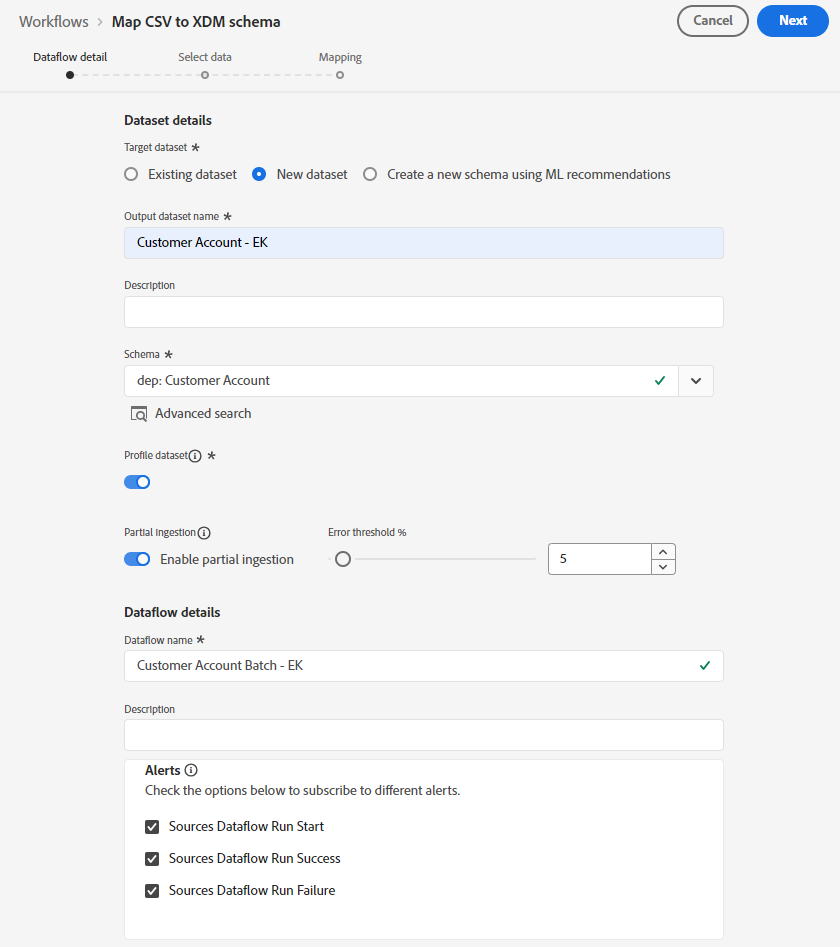
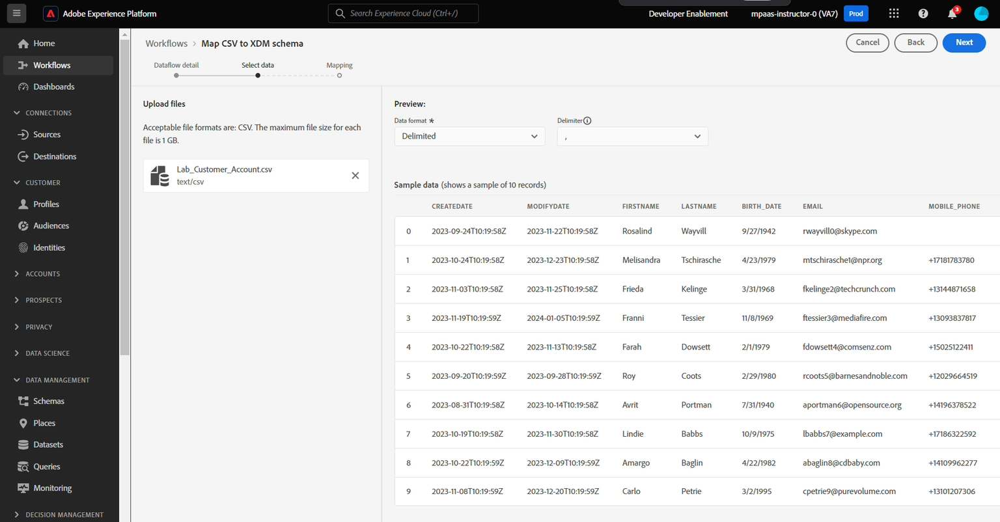

# 建立資料流

## 導覽至來源

1. 在Adobe Experience Platform UI中導覽至下列位置：\
   **來源** -> **目錄** -> **本機系統**
1. 接著按一下&#x200B;**本機檔案上傳**&#x200B;卡片的&#x200B;**新增資料**&#x200B;按鈕

## 設定資料流

1. 在資料流詳細資訊畫面中，選擇&#x200B;**新資料集**。
1. 將輸出資料集命名為&#x200B;**客戶帳戶 — \&lt;您的縮寫>**
1. 從下拉式清單中選取&#x200B;**dep：客戶帳戶**&#x200B;結構描述。
1. 開啟&#x200B;**設定檔資料集**切換方塊。
（如果您未開啟此功能，設定檔存放區將無法監視是否有新資料進入此資料集，因此不會將此資料擷取到設定檔中）
1. 開啟&#x200B;**啟用部分擷取**。
（如果您未開啟此功能，如果只有一個記錄發生錯誤，則整個擷取可能會失敗）
1. 將資料流名稱設為&#x200B;**客戶帳戶批次 — \&lt;您的首字母>**
1. 開啟所有警示&#x200B;**來源資料流開始/成功/失敗**

   

   >[!NOTE]
   >
   >**啟用部分擷取**&#x200B;指定錯誤數目（**INGEST**&#x200B;和&#x200B;**DCVS**），以在整個資料流宣告失敗之前可以失敗的記錄總數百分比表示。

   >[!CAUTION]
   >
   >在繼續之前，請確定您已針對設定檔和部分擷取啟用&#x200B;**該**&#x200B;資料集！

1. 如果一切正常，請按一下畫面右上角的&#x200B;**下一步**&#x200B;按鈕，繼續下一步。

## 上傳範例檔案

1. 從[範例檔案](../sample-files.md)下載範例檔案，以搭配此實驗室使用
1. 拖曳&#39;n拖放和/或上傳UI中的&#x200B;**Lab\_Customer\_Account.csv**&#x200B;檔案。  完成後，您的畫面應該如下所示。

   

1. 在預覽窗格中，檢視下列屬性並注意下列事項：

   - **sms\_optIn**&#x200B;為同意欄位，有數個遺失值（在預覽中顯示為 — ）
   - **account\_create\_date**&#x200B;沒有適當的日期格式。 它有一個字串值，以及一個字串中的日期和時間值。
   - **account\_end\_date**&#x200B;具有適當的日期格式。

   

   

   >[!NOTE]
   >
   >稍後在本實驗後面的對應步驟中，您將需要處理缺少的值、日期以及格式不正確的欄位

1. 按一下畫面右上角的&#x200B;**下一步**&#x200B;按鈕以繼續下一步
