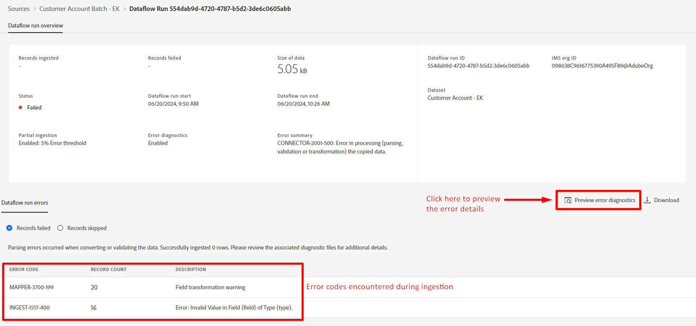
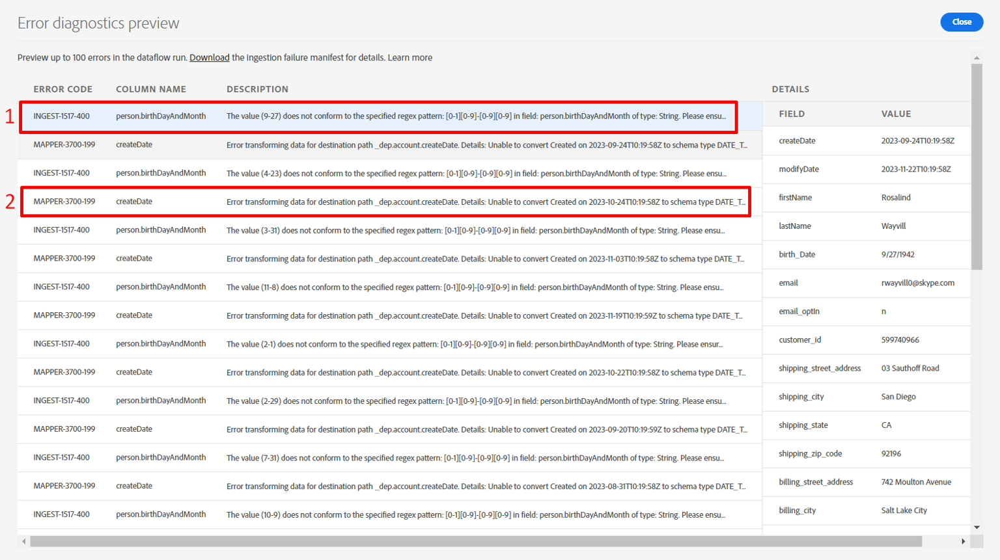

# 偵錯錯誤

## 預覽錯誤診斷

幾分鐘後，您應該會注意到&#x200B;**狀態**&#x200B;顯示失敗。 深入瞭解失敗詳細資料，以瞭解導致失敗的原因。

1. 按一下&#x200B;**資料流執行開始**&#x200B;日期
1. 按一下&#x200B;**預覽錯誤診斷**，檢視每個失敗資料列的特定詳細資料





您現在看到的畫面會顯示許多詳細資訊，說明錯誤代碼對完整錯誤訊息和失敗列的意義。



>[!NOTE]
>
>捲動到右側以檢視與此錯誤碼關聯的來源資料


## 瞭解錯誤型別

### INGEST-XXXX-XXX錯誤

發生此錯誤是因為&#x200B;**person.birthDayAndMonth**&#x200B;應為兩位數月份加兩位數日期的格式（亦即4月27日的格式應為04-27）

```none
The value (9-27) does not conform to the specified
regex pattern: [0-1][0-9]-[0-9][0-9] in field: 
person.birthDayAndMonth of type: String
```

>[!CAUTION]
>
>請注意，person.birthDayAndMonth不是必要欄位，但系統會將不符合規則運算式視為「資料損毀問題」，而且是嚴重錯誤。


### MAPPER-XXXX-XXX錯誤

發生此錯誤是因為&#x200B;**createDate**&#x200B;的來源欄位有`Created on 2022-04-22T19:34:17Z`字串值。 此值無法自動轉換為日期，因為開頭的文字： `Created on`。 必須使用計算欄位來清除資料。

```none
Error transforming data for destination path 
_dep.account.createDate. Details: Unable to convert 
Created on 2023-09-24T10:19:58Z to schema type DATE_TIME
```

> [!NOTE]
>
>此錯誤並不嚴重，因為只會在對應期間導致警告。 資料流執行不會因此而失敗，所以本實驗不會修正此錯誤。
