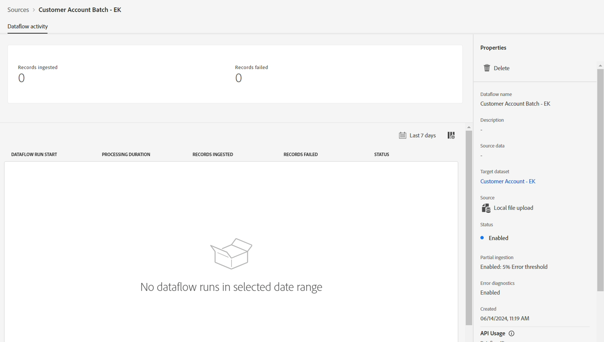

# 執行資料流

如果一切正常，請按一下右上方的&#x200B;**完成**&#x200B;按鈕以執行資料載入。

按一下&#x200B;**完成**&#x200B;後，您會回到&#x200B;**資料流**&#x200B;畫面。 建立資料流需要幾分鐘的時間。 第一次執行應該會在幾分鐘後開始。

>[!NOTE]
>
>您需要持續重新整理頁面才能看到狀態更新，因為後端不會將更新推送到UI。

>[!NOTE]
>
>如果您開啟所有警報，當流程開始執行並成功完成或失敗時，您會在瀏覽器右上角收到警報
