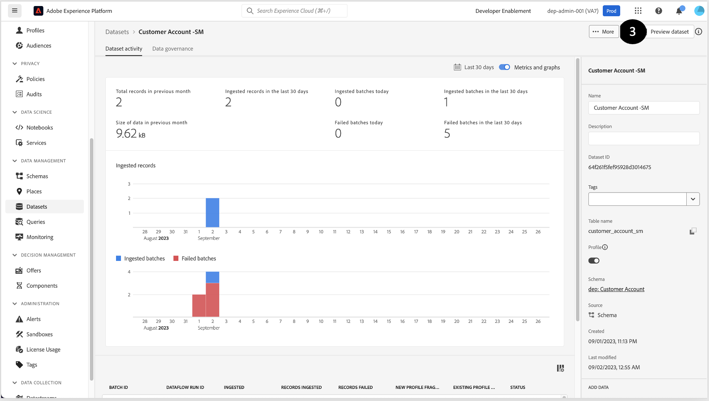
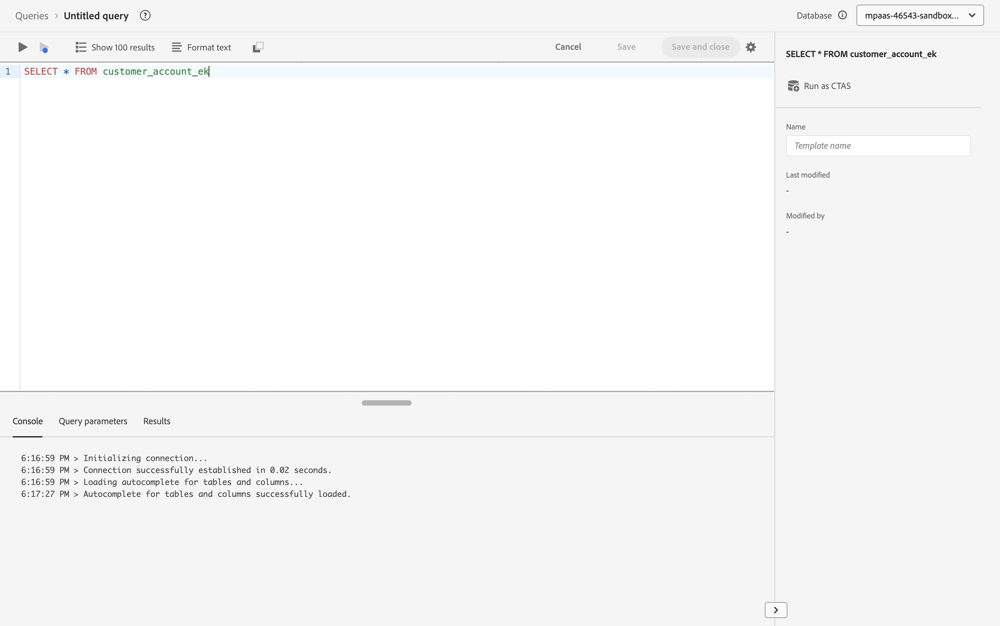

# 驗證與驗證

## 預覽資料集

1. 按一下&#x200B;**資料集**
1. **找到**&#x200B;並&#x200B;**按一下**&#x200B;您建立的資料集名稱。


1. 按一下右上角的&#x200B;**預覽資料集**




1. 按一下顯示結構描述階層的左窗格，**驗證**&#x200B;和&#x200B;**驗證**&#x200B;您所擷取的相同記錄。


>[!NOTE]
>
>**預覽資料集**&#x200B;會顯示此資料集中最近成功的批次。 您看不到先前的批次。 此外，陣列和地圖等複雜資料今天無法檢視，且顯示為空白欄。 不要驚慌！ 若要取得更完整的檢視，您需要使用SQL來探索資料集，如下所述。


## 查詢資料集

1. **關閉**&#x200B;預覽
1. 在資料集畫面中，按一下&#x200B;**資料表名稱**&#x200B;上的復製圖示。 在下列範例畫面中，資料表名稱為`customer_account_sm`

在資料集畫面中，複製資料表名稱旁的圖示![複製資料表名稱")] (assets/verification-and-validation-copy-table-name.png "


1. 瀏覽至&#x200B;**查詢**&#x200B;區段

1. 按一下&#x200B;**建立查詢**


1. 將下列SQL查詢複製貼到&#x200B;**編輯器**&#x200B;中。 請記得使用您在步驟6中取得的值來取代`<table_name>`。

```sql
SELECT * FROM <table_name>
```


1. 按&#x200B;**播放**&#x200B;按鈕。




1. **預覽**&#x200B;結果

1. 此外，執行以下SQL查詢以擷取XDM結構描述以及資料：

```sql
SELECT to_json(shippingAddress) FROM <table_name>
```

若要存取`postalCode` **節點**&#x200B;中的資料，您可以輸入：

```sql
SELECT shippingAddress.postalCode FROM <table_name>
```

>[!TIP]
>
>恭喜！  您已成功內嵌並建立一組即時客戶個人檔案的範例
