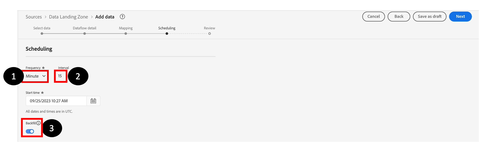

# 排程資料流

在&#x200B;**排程**&#x200B;步驟中：

1. 將&#x200B;**頻率**&#x200B;設定為「分鐘」。
1. 將&#x200B;**間隔**&#x200B;設為15 （即15分鐘）。
1. 開啟&#x200B;**回填**&#x200B;選項。

>[!NOTE]
>
>請注意，**開始時間**&#x200B;為UTC。
>
>國際標準時間(UTC)是全球時間標準，是全球計時基準。 對於分散於全球各地的團隊而言，它可提供不同地區和國家的共同參考，讓您更輕鬆地協調不同時區的活動並排程事件。
>
>在AEP UI的不同部分，您會看到UTC時間是時間排程的基礎。 UTC時間比倫敦時間晚1小時。 如果您不確定UTC時間，只需google &quot;UTC時間&quot;即可。

>[!NOTE]
>
>實際上，**回填**&#x200B;選項會執行所有檔案的一次性回填，而後續執行會取得新檔案。

檢閱資料流，然後按一下&#x200B;**完成。**

![在按一下[完成]之前檢閱最終資料流設定](assets/schedule-dataflow-review-final-dataflow.png "檢閱最終資料流")

>[!CAUTION]
>
>如果您為資料流選擇&#x200B;**執行一次**&#x200B;選項，則無法在稍後編輯此排程或更新資料流。 不過，您可以視需要執行資料流，亦即如果您需要內嵌新資料，可以再次執行。

按一下&#x200B;**完成**&#x200B;後，您會回到&#x200B;**資料流**&#x200B;畫面。 建立資料流需要幾分鐘的時間。 請注意，上次資料流執行狀態表示&#x200B;**沒有執行**。 第一次執行應該會在幾分鐘後開始。

> [!NOTE]
>
>您需要持續重新整理頁面才能看到狀態更新，因為後端不會將更新推送到UI。

>[!NOTE]
>
>如果您開啟所有警報，當流程開始執行並成功完成或失敗時，您會在瀏覽器右上角收到警報
