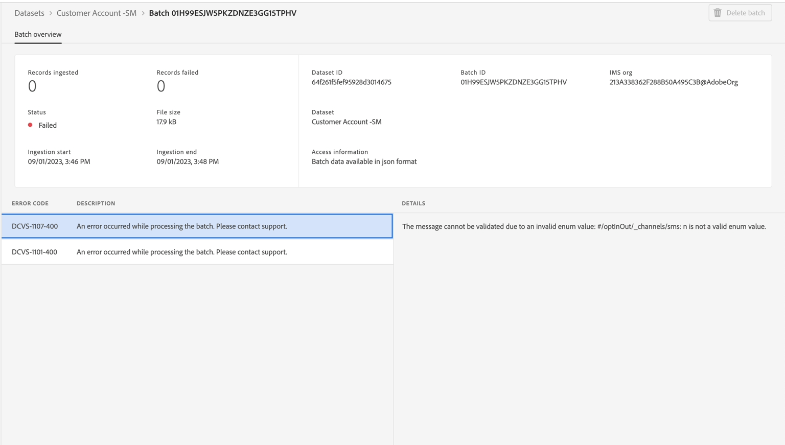

# 監視和偵錯錯誤

>[!NOTE]
>
>監控串流擷取會發生在資料流層級，這表示當您在UI中檢視它時，您實際上是檢視資料湖。  這表示您大約每60分鐘會看到一次批次出現（串流管道的微批次處理）。  因此，如果您在即時客戶設定檔中未看到資料，則必須等候最多60分鐘才能診斷問題。

## 檢視監視儀表板

1. 導覽至&#x200B;**監視 — >串流端對端**，並找出您的&#x200B;**資料流**：

1. 您可能想要預覽&#x200B;**儀表板**&#x200B;標籤，以檢視與批次擷取工作流程相關的管道量度。

>[!NOTE]
>
>此監視畫面可讓您檢視各種資料流執行的狀態。  請注意頂端面板中可供您使用的各種量度。  這些量度對於瞭解Experience Platform中資料管道的健全狀態可能非常有用

## 偵錯錯誤

1. 如果您的資料流因未遵循指示而發生錯誤，您會看到以下內容。

1. 如果按一下「失敗」，您將獲得以下畫面：

>[!NOTE]
>
>成功的微批次可能需要超過15分鐘，因為可能需要時間將記錄寫入Data Lake。

1. 分析錯誤訊息，識別&#x200B;**來源/目標欄位，**&#x200B;並尋找代碼：

- **擷取XXXX** — 由於資料損毀或格式問題（例如未遵循Regex格式），這是嚴重的錯誤。
- **DCVS XXXX** — 在`required`欄位中看到此錯誤。 如果值不存在或對映不正確（不在列舉清單中），則會跳過這些列。
- **對應程式XXXX** — 這些是警告，不會略過任何資料列。 但值可能已為「無效」，因此您應進行檢查，確保它們不會影響下游活動。

1. 若要從錯誤中復原，您必須移至&#x200B;**來源 — >資料流 — >資料流名稱 — >更新資料流**&#x200B;並修正對應。

&#x200B;> [!NOTE]
>
>您必須先刪除JSON範例檔案，然後再新增回JSON範例檔案，以便對應程式現在以新復本重新整理以進行驗證。

