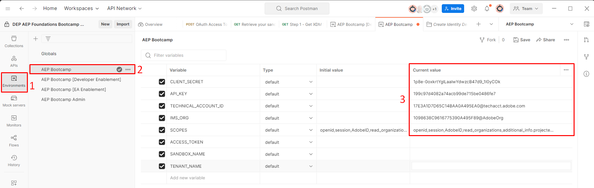

# 環境檔案

## Postman環境檔案

下載檔案 — [AEP Bootcamp.postman_environment.json](assets/aep-bootcamp.postman_environment.json)

## 匯入環境檔案

1. 按一下檔案，從瀏覽器上開啟`Environment File`
1. 將檔案URL複製到剪貼簿
1. 在本機電腦上啟動Postman，然後按一下工作區中的`Import`按鈕
1. 將`Environment File`的URL貼到覆蓋圖上的匯入模組文字方塊中。  這應該會觸發自動匯入

![在Postman工作區中按一下[匯入]按鈕以匯入環境檔案](assets/environment-file-click-import-button.png "匯入按鈕")

匯入後，您可以按一下左側邊欄中的「`Environments`」標籤，以驗證您的環境檔案是否存在。  您應該會看到類似下列的內容。

匯入後

## 環境變數

發出任何API呼叫之前，您需要更新剛剛匯入的環境檔案中的幾個變數。  這些變數會在API呼叫中參考，請確定已正確填入。  變數分為兩個群組：

- **開發人員專案值** ->這些是從Adobe Developer Console中建立的開發人員專案產生的預設變數
- **其他值** ->這些是自訂建立的變數，通常由使用者建立，以使用各種Experience Platform API

>[!NOTE]
>
>這些值來自您在[Developer Console安裝程式](../sandbox-setup/developer-console-setup.md#collect-your-values)中建立的OAuth伺服器對伺服器認證

### 更新開發人員專案值

1. 按一下Postman左側邊欄中的`Environments`標籤
1. 接著按一下`AEP Bootcamp`環境檔案
1. 更新下列變數的`current values`：
   - 使用者端\_密碼
   - CLIENT\_ID （也稱為API金鑰）
   - TECHNICAL\_ACCOUNT\_ID
   - IMS\_ORG

完成時，您的環境檔案應如下所示：

更新CLIENT_SECRET、CLIENT_ID、TECHNICAL_ACCOUNT_ID和IMS_ORG值之後的

### 更新其他值

唯一需要更新的其他值是`SANDBOX_NAME`變數和`TENANT_NAME`變數。

- `SANDBOX_NAME` — 告訴Adobe Experience Platform要針對哪個沙箱執行
- `TENANT_NAME` — 用於預先填入特定XDM呼叫中的租使用者名稱稱

>[!NOTE]
>
>如果您按照自己的步調使用這些Labs （而不是使用sandbox-assignment.pdf的即時培訓活動），您可以在從Adobe Experience Platform UI URL登入沙箱時找到這兩個值，例如：
>
>`https://experience.adobe.com/#/@dep/sname:prod/platform/home`
>
>- `SANDBOX_NAME`是`sname:`之後的值 — 在此範例中，`prod`
>- `TENANT_NAME`是`@`符號之後的值，前置詞為底線 — 在此範例中，`_dep`

1. 更新下列變數的`current values`：
   - 沙箱\_名稱
   - 租使用者\_名稱
1. 按一下環境工作區右上角的`Save`按鈕以儲存您的更新

完成後，您的環境檔案應該如下所示：

更新SANDBOX_NAME和TENANT_NAME值之後的

>[!TIP]
>
>恭喜！ 您已完成Postman環境設定
