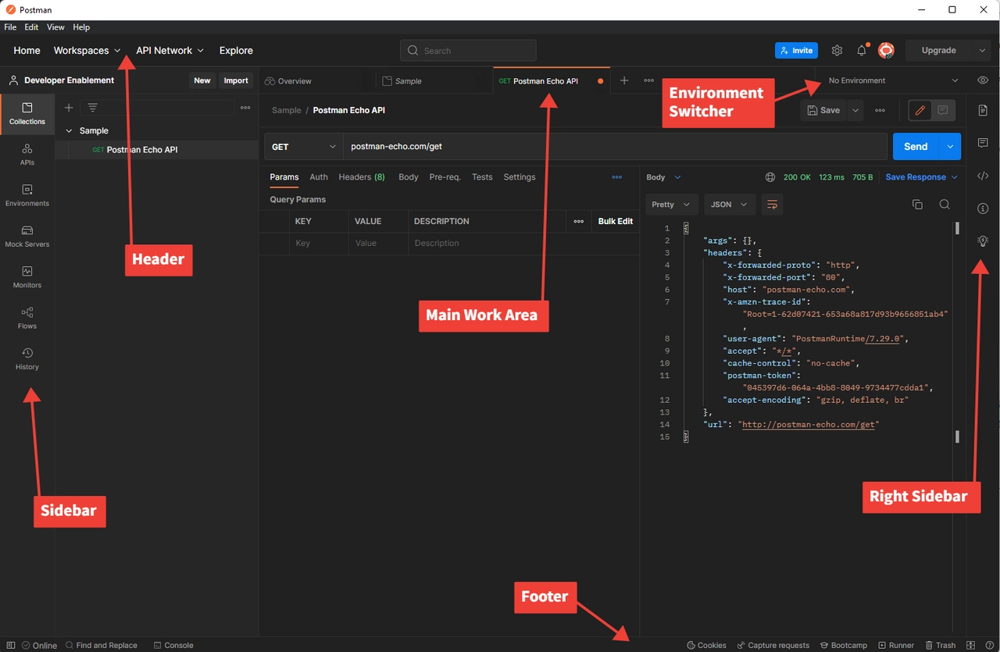

# Postman安裝

>[!NOTE]
>
>本課程的各個labs需要Postman。  即使您已安裝Postman，也需要通過本實驗來確保您已安裝並正確設定環境檔案和API集合。

## 安裝Postman

導覽至Postman網站，然後下載Postman應用程式或利用Web版本 — > [https://www.postman.com/download/](https://www.postman.com/download/)

用於安裝案頭應用程式或使用Web版本的

## Postman介面

開啟Postman，快速熟悉應用程式的幾個方面。 為了與Experience Platform合作，我們實際上只需要專注於應用程式的幾個關鍵領域。

## 側欄

側邊欄可讓您快速瀏覽不同的Postman元素。 在Labs中，您只會使用下列兩個專案：

**集合** — 可從外部位置匯入或自行建立的已儲存要求群組。

**環境** — 可在Postman要求中參考的一組變數。 在Experience Platform中，您可以將Postman環境視為與Adobe IMS組織的同義詞。 我們將使用Postman中的環境功能

## 頁首

工作區 — 可讓您將工作組織成各種群組（即專案、團隊等）

## 主要工作區

主要工作區是您在Postman中工作時將執行大部分工作的區域。 所有API請求都會顯示在主要工作區域的特定標籤中。

**右側邊欄** — 根據目前選取的索引標籤，提供工具的額外存取權。 範例是請求、註釋和程式碼片段的檔案，以列舉一些功能。

**環境選擇器** — 可讓您在使用API時，快速切換不同的環境以存取預先設定的變數。 使用Experience Platform時，您將在特定Adobe IMS組織中運用此工具。

## 頁尾

在Postman應用程式的最底部，您會找到一組函式，可讓您快速檢視呼叫的記錄、快速尋找和取代的存取，以及各種其他函式。
