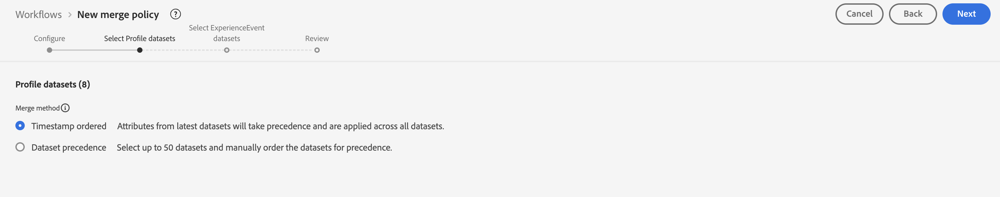
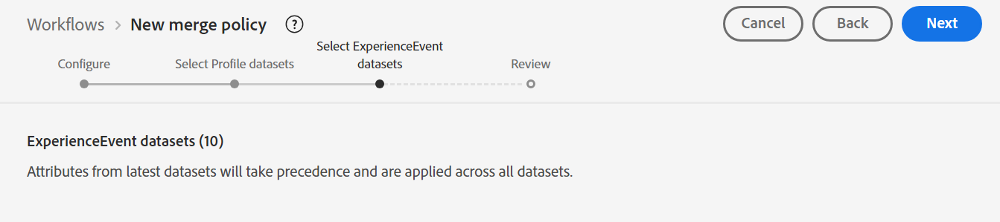
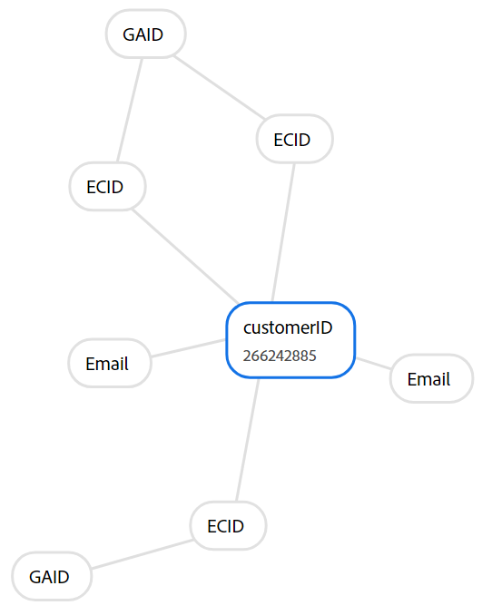
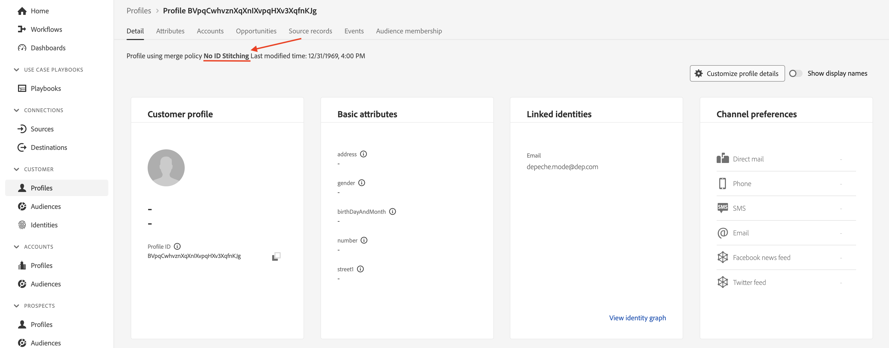

# 合併原則

## 這是什麼？

每次搜尋設定檔時，您都會在設定檔檢視器中看到合併原則（您可能只是不知道它做了些什麼）

合併原則有兩個作用：

1. 提供如何在設定檔存放區中組合片段的指示（即身分拼接）。 有兩個選項：
   - 使用身分圖表（即身分服務）
   - 請勿使用身分圖表（即僅依賴提供的身分來尋找類似儲存的設定檔片段）
1. 當欄位可能來自多個資料集時（即合併方法），告知設定檔服務如何解決XDM個別設定檔類別型資料集中的欄位衝突。 有兩個選項：
   - 時間戳記優先順序 — 將所有資料集的最新記錄當做真值集使用，並讓所有其他記錄以從最近到最舊的順序填入間隙
   - 資料集優先順序 — 挑選哪些XDM個別設定檔資料集允許用於形成設定檔，以及以什麼順序進行組合

> [!NOTE]
>
>當選擇資料集優先順序的合併方法時，您可以選擇在設定檔的格式中允許使用哪些XDM個別設定檔和XDM體驗事件資料集。
>
>時間戳記優先順序合併方法一律使用所有資料集

>[!WARNING]
>
>每個沙箱至少需要一個標籤為&#x200B;**預設**&#x200B;合併原則的合併原則，才能進行分段和設定檔

>[!NOTE]
>
>我們經常會設計成不需要使用使用資料集優先順序的自訂合併原則。
>
>- 與其讓多個資料集記錄相同的欄位，我們提供它們唯一的名稱，例如：
>  - 名字 — CRM
>  - 名字 — 忠誠度
>  - 名字 — 網路表單
>- 這可讓行銷人員選擇要使用哪個資料來源+欄位，而非系統根據他們可能不瞭解的規則集自動選擇一個欄位，並可能從某個來源選擇設定檔的欄位，然後從另一個來源選擇其他欄位，而不瞭解正在發生的情況。
>- 對於我們的資料模型，我們不需要解決任何欄位衝突，因此不需要自訂合併原則

若要最清楚瞭解合併原則如何與身分圖表搭配運作，您可以建立不會利用身分圖表進行ID銜接的合併原則。

## 建立無拼接合併原則

建立不使用ID圖表的合併原則，以便檢視其行為與設定檔形成。

## 建立

1. 按一下左側邊欄中的&#x200B;**設定檔**
1. 按一下頂端導覽列中的&#x200B;**合併原則**
1. 按一下熒幕最右邊附近的&#x200B;**建立合併原則**

![按一下合併原則畫面右上角附近的[建立合併原則]](assets/merge-policies-click-create-merge-policy-button.png)

## 設定

您現在需要設定合併原則設定。  輸入下列資訊：

| 設定 | 值 |
| --------------------------- | --------------- |
| 名稱 | 無ID拼接 |
| ID拼接 | 無 |
| 預設合併原則 | 已停用 |
| Edge上主動式合併原則 | 已停用 |

完成時，按一下&#x200B;**下一步**

## 選取設定檔資料集

1. 對於合併方法，請選取&#x200B;**排序的時間戳記**
1. 按一下&#x200B;**下一步**

## 選取體驗事件資料集

請記住，如果您選取針對合併方法排序的時間戳記，您會告訴設定檔服務，所有XDM個別設定檔和體驗事件類別型資料集都會參與設定檔的形成。

因此，您只需按一下&#x200B;**下一步**&#x200B;即可，因為此步驟沒有任何可執行的動作。

## 檢閱

在最後一個步驟中，您會看到所選設定的預覽，以及顯示執行中合併原則的範例設定檔。

按一下&#x200B;**完成**&#x200B;按鈕以建立合併原則

![按一下[完成]之前，請先檢閱步驟顯示最終的合併原則設定和範例設定檔](assets/merge-policies-review-and-finish.png "檢閱合併原則")

## 動作中的合併方法

記住設定檔的身分圖表（深度模式），看起來像下面的熒幕擷圖。 若要瞭解設定檔服務的運作方式，最好在組裝過程中忽略使用此識別圖。

## 使用電子郵件比較

請依照以下步驟開啟設定檔檢視器：

1. 按一下左側邊欄中的&#x200B;**設定檔**，然後在頂端導覽中選取&#x200B;**瀏覽**
1. 選取&#x200B;**電子郵件**&#x200B;的身分名稱空間
1. 輸入&#x200B;**depeche.mode\@dep.com**&#x200B;的識別值
1. 按一下&#x200B;**檢視**&#x200B;按鈕以查閱設定檔
1. 按一下設定檔的&#x200B;**連結**&#x200B;以檢視設定檔的詳細資料

再次搜尋Depeche模式設定檔，但這次使用&#x200B;**無ID拼接**&#x200B;合併原則。

1. 在左側邊欄中的&#x200B;**設定檔**&#x200B;上按一下滑鼠右鍵，然後選取&#x200B;**在新索引標籤中開啟**
1. 在頂端導覽列中選取&#x200B;**瀏覽**
1. 選取&#x200B;**無ID拼接**&#x200B;的合併原則
1. 選取&#x200B;**電子郵件**&#x200B;的身分名稱空間
1. 輸入&#x200B;**depeche.mode\@dep.com**&#x200B;的識別值
1. 按一下&#x200B;**檢視**&#x200B;按鈕以查閱設定檔
1. 按一下設定檔的&#x200B;**連結**&#x200B;以檢視設定檔的詳細資料

比較設定檔的兩個檢視時，您應該注意到它們非常不同。 使用&#x200B;**無ID拼接**&#x200B;合併原則的版本遺漏了一些屬性和身分。

組合的Depeche模式設定檔

如果您檢視每個設定檔的事件，您會發現使用&#x200B;**無ID拼接**&#x200B;合併原則的設定檔僅包含單一事件，而其他版本則包含所有事件。

設定檔的「無ID拼接」版本有單一事件，因為該事件是使用「personalEmail.address」的主要身分來儲存。

>[!NOTE]
>
>請記住，當使用未使用身分圖表設定檔的合併方法時，將僅依賴提供的身分來尋找類似儲存的設定檔片段。

## 使用客戶ID進行比較

您可以使用圖表中的部分其他身分來檢視深層模式設定檔的各種片段。  請嘗試使用無ID拼接合併原則再次查詢相同的設定檔，但這次使用下面提供的customerID名稱空間和值：

| 身分名稱空間 | 值 |
| ------------------ | --------- |
| customerID | 266242885 |

依據無ID拼接合併原則的customerID查詢深層模式時，

**個問題要問自己**

問題：您注意到有關屬性的任何資訊嗎？ 沒有任何，為什麼？

回答：您以電子郵件作為主要身分來載入屬性

問題：是否注意到任何關於事件的事？

回答：唯一顯示的事件是將customerID當作主要身分的事件

## 使用GAID比較

請嘗試使用無ID拼接合併原則再次查詢相同的設定檔，但這次使用下面提供的GAID名稱空間和值：

| 命名空間 | 值 |
| --------- | ----------- |
| GAID | 266242-9013 |

**要問自己的問題**

問題：找不到設定檔！ 怎麼回事？ 為何找不到設定檔？ 回答：沒有使用該GAID值作為主要身分來儲存的設定檔片段

## 設定檔+身分

快速簡介：

- 設定檔存放區包含使用主要身分儲存的設定檔片段
- 身分圖表包含兩個(2)或更多個人型身分之間的關係

當身分圖表與設定檔存放區搭配使用時，您可以將其視為指引如何尋找正確的設定檔片段，將身分圖表中的每個身分值視為主要身分。

如果沒有身分圖表，設定檔存放區只能使用單一識別碼（即主要身分）擷取設定檔片段

> [!TIP]
>
>**有一些額外的時間，並且想要實驗……：**
>
>- 在您知道的UI中搜尋有兩個身分的其他設定檔
>- 瞭解如何針對一個片段而非另一個片段儲存部分事件
>- 瞭解如何針對一個片段而非另一個片段儲存部分設定檔屬性
>- 移至您已查閱的設定檔，並使用&#x200B;**無ID拼接**&#x200B;合併原則重新查閱。  請注意差異
