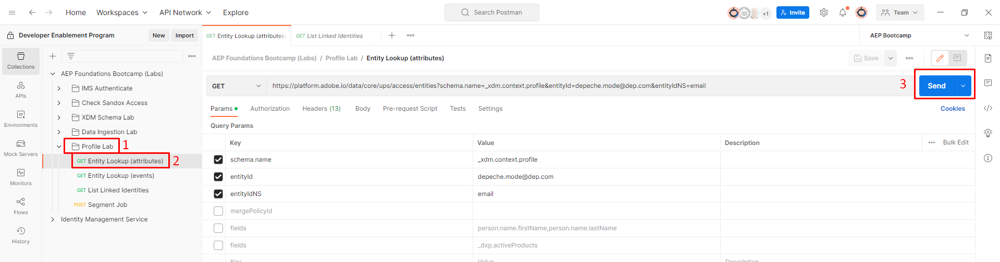
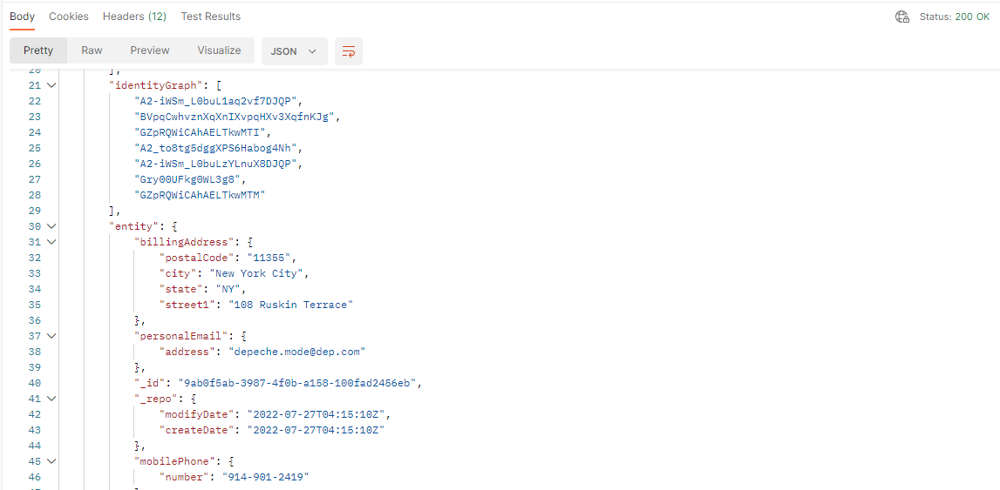
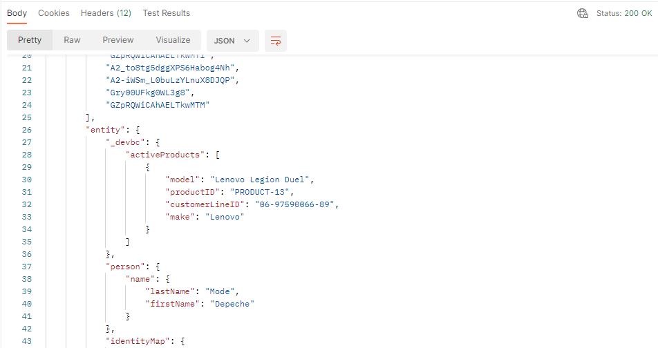

# 設定檔與身分API

## 設定檔實體API

在使用Real-Time Customer Profile時，瞭解如何利用設定檔API至關重要。 它開啟了快速分類與除錯的能力，同時為您提供從呼叫中心到資訊站的無限系統整合可能性。

其中最重要的API是設定檔實體API。  此API可讓您查詢個別設定檔（就像您在UI中看到的一樣），但會使用引數來指定您是否要檢視設定檔的屬性或事件。

以下是設定檔實體API的GET方法的完整規格

## API總覽

以下是呼叫設定檔實體API所需的最低資訊。

`GET https://platform.adobe.io/data/core/ups/access/entities`

### 必要的查詢引數

隨每個請求傳送此引數。 其值取決於您要查詢設定檔的屬性或其事件：

| 引數 | 類型 | 說明 | 範例 |
| ------------- | ------ | ---------------------------------------------------------------------------------------------------------------------------------------------- | ------------------------------ |
| `schema.name` | 字串 | 您要查詢之實體的XDM結構描述類別名稱。 | `_xdm.context.profile` |
| `schema.name` | 字串 | 請改用此值來查閱設定檔的事件。 配對`relatedSchema.name=_xdm.context.profile`以限定事件的範圍為設定檔。 | `_xdm.context.experienceevent` |

### 識別要查閱的實體

大部分要求使用`entityId`和`entityIdNS`以任何已知身分值（例如電子郵件地址、CRM ID或熟客ID）來識別實體，而不是要求您已知道其XID。 XID是Identity Service內部產生和指派的base64編碼識別碼，用來代表身分，並將其名稱空間和ID值合併成單一壓縮權杖（如需詳細資訊，請參閱[原生XID](https://experienceleague.adobe.com/docs/experience-platform/identity/api/list-native-id.html?lang=zh-Hant)）：

| 引數 | 類型 | 說明 | 範例 |
| ------------ | ------ | ---------------------------------------------------------------------------------------------------------------------------------------------- | ---------------------- |
| `entityId` | 字串 | 要查閱的識別碼值。 如果您已經知道實體的XID，請在這裡自行使用並省略`entityIdNS`。 | `depeche.mode@dep.com` |
| `entityIdNS` | 字串 | `entityId`所屬的身分名稱空間程式碼（例如，`email`、`crmid`、`ECID`）。 當`entityId`不是XID時為必要。 | `email` |

>[!NOTE]
>
>此實驗室的Postman要求會依其電子郵件地址(`entityIdNS=email`， `entityId=depeche.mode@dep.com`)而非XID來查詢深層模式設定檔。

### 必要的標頭

每個請求也需要以下標頭：

| 頁首 | 類型 | 說明 | 範例 |
| ----------------- | ------ | ---------------------------------------------- | --------------------- |
| `x-gw-ims-org-id` | 字串 | IMS組織ID。 | `<your IMS org>` |
| `x-api-key` | 字串 | 您註冊的專案/認證的API金鑰。 | `<your API key>` |
| `Authorization` | 字串 | 要求的持有人權杖。 | `Bearer <your token>` |

>[!NOTE]
>
>如需完整的查詢引數清單，請參閱[設定檔實體API參考](https://developer.adobe.com/experience-platform-apis/references/profile#tag/Entities)，包括其他身分查詢選項、事件篩選(`startTime`、`endTime`、`property`、`orderby`、`limit`)、欄位選取和合併原則覆寫。

>[!WARNING]
>
>請記住，所有API要求都是沙箱專屬的，因此使用這些API時，請務必確保每個要求（稱為`x-sandbox-name`）中的標頭引數都正確設定為適當的沙箱。
>
>您已在環境檔案中設定此實驗室的`x-sandbox-name`

## 實體查閱（屬性）

若要感受實體查詢API，請使用上一個實驗室的深度模式設定檔。

1. 開啟&#x200B;**Postman**&#x200B;並導覽至&#x200B;**設定檔實驗室**&#x200B;資料夾
1. 按一下&#x200B;**實體查詢（屬性）**&#x200B;要求以開啟它
1. 按一下&#x200B;**傳送**&#x200B;按鈕以執行呼叫

傳送之前，實體查詢（屬性）呼叫的Postman要求窗格

成功的要求應該會以`200 OK`回應，而且您應該會看到包含Depeche Mode設定檔所有屬性的結果。

>[!NOTE]
>
>根據預設，如果在設定檔實體請求中未指定合併原則，則會使用沙箱中的預設合併原則

使用實體API時，您可以利用許多查詢引數來變更傳回的回應。

1. 在實體查詢（屬性）要求中，按一下要求的&#x200B;**引數**&#x200B;選項
1. 勾選名為&#x200B;**欄位**&#x200B;的&#x200B;**索引鍵**&#x200B;旁的方塊
1. 按一下&#x200B;**傳送**&#x200B;按鈕以執行要求

>[!NOTE]
>
>請注意，也有指定`mergePolicyId`的引數。  您可以利用其他API或使用UI查詢ID來尋找此專案的值。

成功的要求應該會以`200 OK`回應，而且您應該只會看到剛才啟用的引數篩選中指定的欄位：名字、姓氏以及作用中產品的陣列。

&#x200B;> [!TIP]
>
>恭喜！  您已使用設定檔實體API成功查詢設定檔的屬性

## 實體查閱（事件）

若要查詢設定檔的事件，請使用相同的設定檔實體API。  唯一的區別是，您必須告訴設定檔服務您想要變更要在回應中使用的類別型別。

1. 按一下&#x200B;**實體查詢（事件）**&#x200B;要求以開啟
1. 按一下&#x200B;**傳送**&#x200B;按鈕以執行呼叫

傳送前實體查詢（事件）呼叫的

成功的要求應該會以`200 OK`回應，而且您應該會看到包含深度模式設定檔之所有事件的結果。

就像在查詢設定檔屬性時一樣，實體API擁有更多查詢引數，可用來變更傳回的回應內容。

您可以在Params區段中啟用這些引數，然後執行請求，以嘗試其中的一些引數。  請試用並檢視運作方式！

中啟用其他查詢引數

**範例查詢引數定義**

| 索引鍵 | 值 | 說明 |
| ------------- | ------------------------------- | --------------------------------------------------------------------------------------------------------------------------------------------------------- |
| mergePolicyId | \&lt;blank> | 如果提供，您可以切換用於執行查詢的合併原則。 對於實驗室，將其保留為空白表示它將使用沙箱預設合併原則 |
| 欄位 | eventType，timestamp，identityMap | 僅顯示每個事件的這些欄位，無論指定的欄位是否有值 |
| 屬性 | eventType=&quot;order.placed&quot; | 將設定檔的事件篩選為僅限屬於「order.placed」型別的事件 |
| orderby | +timestamp | 以遞減順序排列事件 |
| limit | 5 | 在回應中僅顯示5個事件 |

>[!NOTE]
>
>您可以在這裡深入瞭解所有查詢引數選項 — > [https://developer.adobe.com/experience-platform-apis/references/profile/#tag/Entities/operation/retrieveEntity](https://developer.adobe.com/experience-platform-apis/references/profile/#tag/Entities/operation/retrieveEntity)

## Identity服務叢集API

在某個時候，您可能會對身分圖表中，哪些身分屬於特定設定檔的身分叢集存有疑問。  此API可讓您傳遞單一身分名稱空間/值，而且當回應時，您會收到該設定檔的完整身分叢集。

自己試試看：

1. 按一下&#x200B;**列出連結的身分**&#x200B;要求以開啟
1. 按一下&#x200B;**傳送**&#x200B;按鈕以執行呼叫

>[!NOTE]
>
>請注意，請求中的引數為身分名稱空間和ID （即值）

在傳送前先為List Linked Identities呼叫

成功的回應看起來應該像下面的熒幕擷圖

>[!NOTE]
>
>您注意到回應包含設定檔深層模式的所有身分
