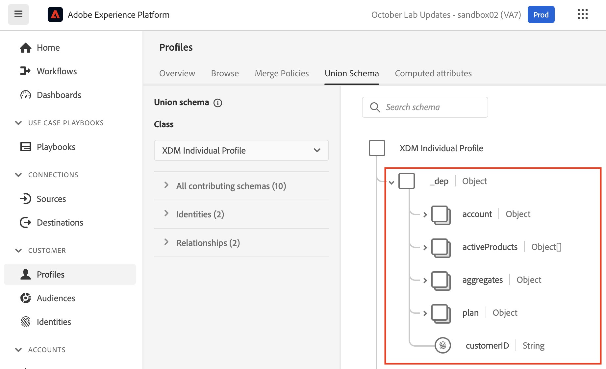

# 設定檔基本知識

## 設定檔聯合結構描述

請記住，任何Real-time Customer Profile的檢視都是使用您為設定檔定義和啟用的結構描述所建置。 這是Adobe所稱的設定檔聯合結構描述。

您可以透過下列方式檢視設定檔的聯合結構描述：

1. 按一下左側邊欄中的&#x200B;**設定檔**
1. 按一下頂端導覽列中的&#x200B;**聯合結構描述**

設定檔頂端導覽列下的

>[!NOTE]
>
>請記住，設定檔會為每個XDM類別建立聯合檢視。 您可以利用這個檢視來檢視哪些結構描述對哪些類別、每個類別內的身分以及任何關聯性有貢獻。

請檢閱XDM個別設定檔類別的聯合結構描述，並展開租使用者名稱空間。 您在這裡應該會看到許多專案，這些專案來自您在&#x200B;**LID方法**&#x200B;和&#x200B;**XDM模型實驗室**&#x200B;中定義的各種結構描述。



按一下&#x200B;**帳戶**&#x200B;物件，並注意熒幕右側邊欄中顯示的內容。 您現在可以看到物件的詳細資料、哪些結構描述和資料集促成了其形成，以及其他相關資訊。


>[!NOTE]
>
>聯合結構描述是瞭解為什麼特定元素存在於設定檔中以及它們來自何處的絕佳工具。
>
>請記住，聯合結構是可觀察的，這表示在檢視實際的即時客戶設定檔時，設定檔將僅顯示包含資料的欄位


## 設定檔查閱

1. 按一下左側邊欄中的&#x200B;**設定檔**，然後在頂端導覽中選取&#x200B;**瀏覽**
1. 選取&#x200B;**電子郵件**&#x200B;的身分名稱空間
1. 輸入&#x200B;**depeche.mode\@dep.com**&#x200B;的識別值
1. 按一下&#x200B;**檢視**&#x200B;按鈕以查閱設定檔
1. 按一下設定檔的&#x200B;**連結**&#x200B;以檢視設定檔的詳細資料

![電子郵件名稱空間和depeche.mode@dep.com輸入的[設定檔檢視器瀏覽]索引標籤](assets/profile-basics-profile-viewer-browse-tab.png "設定檔檢視器（瀏覽）")


您現在應該會看到此訊息！

透過電子郵件查詢後

請檢視頂端導覽中的每個標籤，花一分鐘時間探索設定檔（深層模式）。 以下是您將使用的標籤：

- 詳細資訊 — 顯示可針對特定設定檔顯示不同層面的自訂卡片
- 屬性 — 顯示來自聯合結構描述之指定設定檔的所有關聯屬性
- 事件 — 針對來自聯合結構描述的指定設定檔，顯示所有相關事件
- 對象成員資格 — 顯示設定檔目前所屬的對象

## 檢視屬性

瀏覽至&#x200B;**屬性**&#x200B;標籤，然後按一下&#x200B;**檢視JSON**

![在[屬性]索引標籤上顯示為JSON的深度模式設定檔屬性](assets/profile-basics-depeche-mode-attributes-json.png "深度模式屬性")

檢視欄位如何顯示來自您新增到客戶帳戶結構描述的欄位群組。

- 尋找標題為&#x200B;**實體**&#x200B;的父節點
- 記下子物件&#x200B;**billingAddress** （這來自個人聯絡詳細資料欄位群組）

```json
"billingAddress": {
  "postalCode": "11355",
  "city": "New York City",
  "state": "NY",
  "street1": "108 Ruskin Terrace"
}
```

將此專案與設定檔聯合結構描述進行比較，您應該將觀察到的意義😄標示為燈泡

```json
"billingAddress": {
    "_repo": {
        "createDate": "datetime",
        "modifyDate": "datetime",
    },
    "_schema": {
        "description": "string",
        "elevation": "double",
        "latitude": "double",
        "longitude": "double"
    },
    "_id": "string",
    "city": "string",
    "country": "string",
    "countryCode": "string",
    "createdByBatchID": "string",
    "dmaID": "integer",
    "label": "string",
    "lastVerifiedDate": "date",
    "modifiedByBatchID": "string",
    "msaID": "string",
    "postOfficeBox": "string",
    "postalCode": "string",
    "primary": "boolean"
    "region": "string",
    "repositoryCreatedBy": "string",
    "repositoryLastModifiedBy": "string",
    "state": "string",
    "stateProvince": "string",
    "status": "string",
    "statusReason": "string"
    "street1": "string",
    "street2": "string",
    "street3": "string",
    "street4": "string"
}
```

>[!NOTE]
>
>可觀察結構描述字面意思是隻顯示資料存在的欄位，並隱藏不包含資料的欄位。  與傳統關聯式資料庫非常不同！


下一個尋找&#x200B;**同意**&#x200B;物件（這來自「同意和偏好設定詳細資料」欄位群組）

```json
"consents":{
   "marketing":{
      "sms":{
         "val":"y"
      },
      "email":{
         "val":"y"
      }
   }
}
```


向下捲動至租使用者名稱空間&#x200B;**\_devbc**，並尋找&#x200B;**計畫**&#x200B;物件（這來自名為「dep：計畫詳細資料」的自訂已建立欄位群組）

```json
"plan": {
    "planID": "m3",
    "type": "mobile",
    "name": "pro"
}
```


請注意您為追加銷售使用案例定義的&#x200B;**彙總**&#x200B;物件。 這些欄位也位於租使用者名稱空間\_devbc下。 它們來自不同的結構描述（dep：客戶彙總）和自訂欄位群組（dep：彙總）

```json
"aggregates":{
   "rollingSixMonthAvgMonthlyDataUsage":30,
   "rollingSixMonthTotalDataUsage":200
}
```

## 檢視身分對應

您也能看到設定檔的關聯身分，因為它們儲存在名為&#x200B;**identityMap.**&#x200B;的對應物件中 在JSON檔案底部附近尋找&#x200B;**identityMap**。

無論您是否使用identityMap欄位或使用身分描述項標籤欄位，此元件都會呈現您傳入的所有身分識別。

```json
"identityMap": {
  "ecid": [{
          "id": "34537751351243145301122536487445728054"
      },
      {
          "id": "66385443304271800137026604878870723316"
      },
      {
          "id": "34537751351243145301122536483456723542"
      }
  ],
  "email": [{
          "id": "dave.gahan@dep.com"
      },
      {
          "id": "depeche.mode@dep.com"
      }
  ],
  "customerid": [{
      "id": "266242885"
  }],
  "gaid": [{
          "id": "266242-9013"
      },
      {
          "id": "266242-9012"
      }
  ]
}
```

>[!NOTE]
>
>請注意，identityMap中沒有提及「主要身分」的概念。 原因有兩方面：
>
>1. 您在設定檔屬性中看到的identityMap，是利用Identity Service的圖表為每個設定檔建立的\*
>2. 身分圖表只關心身分之間的關係。 每個身分都會被視為相同。 A與B有關，若是透過主要身分、個人身分等傳遞，則沒有關係。
>
>*\*&#x200B;若未使用任何身分圖表，則identityMap僅由查詢*中要求的身分組成

>[!NOTE]
>
>當您建立客戶帳戶結構時，您只有一個電子郵件欄位標示為身分（即personalEmail.address）。 您是否注意到identityMap有兩個電子郵件地址！
>
>怎麼回事？
>
>- 身分圖表會隨著資料流入其服務，持續記錄新的關係以及這些關係中的值
>- 設定檔的行為是在資料擷取至其服務時，以新值覆寫現有欄位值
>- 當您使用身分描述項標幟欄位時，它仍然是設定檔的欄位


## 身分圖表

導覽回到頂端導覽列中的&#x200B;**詳細資料**&#x200B;標籤，然後按一下在&#x200B;**連結的身分識別**&#x200B;卡片底部找到的&#x200B;**檢視身分圖表**&#x200B;連結

![在[詳細資料]索引標籤上檢視連結的身分卡底部的身分圖表連結](assets/profile-basics-view-identity-graph-link.png "檢視身分圖表")

您現在應該會看到此畫面。


上述檢視是「深度模式」設定檔的「身分圖表」，分為三(3)個主要區域：

**身分圖表視覺化檢視器** — 顯示個人資料身分叢集中的身分及其關聯關係

**身分圖表詳細資料** — 提供有關整體身分圖表名稱空間、值和資料來源的特定詳細資料，這些名稱空間已建立身分圖表視覺化檢視內看到的所有關係

**選取的身分詳細資料** — 顯示所選身分的詳細資訊，以及在關聯中處理該身分的最後五(5)個批次

>[!NOTE]
>
>身分圖表檢視器會顯示所有身分之間的關係，以及上次看到身分關係時以及從哪個資料集看到的相關資訊


改為使用customerID身分檢視深度模式的身分圖表。  執行下列動作：

1. 將&#x200B;**customerID**&#x200B;複製並儲存在某處。
1. 將[身分名稱空間]方塊中的名稱空間值變更為&#x200B;**customerID**
1. 貼上您在上一步中儲存的&#x200B;**customerID**&#x200B;值
1. 按一下&#x200B;**檢視**&#x200B;按鈕，使用新的身分值來檢視包含此身分的身分圖表


>[!NOTE]
>
>請注意您如何看到完全相同的身分圖表！ 您從此圖表使用的任何身分一律會產生相同的結果


## 變更身分

現在使用customerID返回設定檔檢視器並查詢深層模式

1. 將身分名稱空間變更為&#x200B;**customerID**
1. 使用您在上一節中儲存的customerID值更新身分值
1. 按一下&#x200B;**檢視**&#x200B;按鈕


您應該會看到先前檢視過的相同設定檔！


>[!NOTE]
>
>身分圖表可確保您在組合各種設定檔片段時，所使用的任何身分都會產生相同的設定檔
