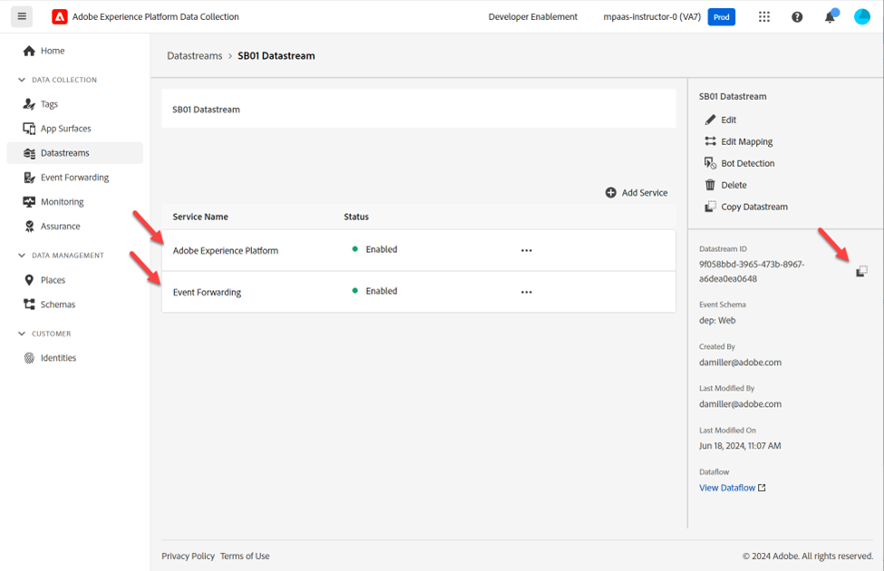

# 建立資料串流

資料流會定義哪些服務將利用它。

- 將資料傳送至Edge時，您可以指定要使用的資料流
- 傳送到這些資料串流的資料隨後可以根據設定的服務採取動作
  - 事件轉送
  - Adobe Experience Platform

## 建立新的資料流

1. 在左側邊欄中&#x200B;**資料彙集**&#x200B;下，按一下&#x200B;**資料串流**
1. 然後按一下「**新增資料流**」以建立一個

![含有[新增資料流]按鈕的[資料流]清單](assets/create-datastream-new-datastream-button.png)

## 設定資料串流

使用下列資訊設定資料流：

1. 名稱 — > **資料流SB + \&lt;沙箱名稱> （亦即Datastream SB01）**
1. 事件結構描述 — > **dep： Web**
1. 切換&#x200B;**開啟** **地理位置和網路查詢**&#x200B;下的所有選項
1. 完成時，按一下&#x200B;**儲存**&#x200B;按鈕

>[!WARNING]
>
>請勿按一下儲存並新增對應。  如果您不小心取消了

儲存資料串流後，您會看到下列畫面：

儲存新的資料流後立即顯示

## 新增事件轉送服務

這可讓您針對此資料流收到的資料使用事件轉送。

1. 按一下&#x200B;**新增服務**

   ![含有[新增服務]按鈕的資料流詳細資訊頁面](assets/create-datastream-add-service-button.png "新增服務")

1. 設定下列專案：

   - 服務 — >事件轉送
   - 屬性 — >選取您在上一步建立的屬性。  其命名方式應如下所示：事件轉送屬性SB + \&lt;您的沙箱編號>
   - 環境 — >開發

1. 完成時，按一下&#x200B;**儲存**

已選取屬性和開發環境的

## 新增Adobe Experience Platform服務

這可讓您將資料傳送至中心，並針對此資料流收到的資料在資料集中著陸。

1. 按一下&#x200B;**新增服務**

   ![反白顯示[新增服務]按鈕的資料流詳細資訊頁面，以新增Adobe Experience Platform服務](assets/create-datastream-add-second-service-button.png "新增服務")

1. 設定下列專案：

   - 服務 — > Adobe Experience Platform
   - 事件資料集 — > dep： Web
   - 設定檔資料集 — > dep：客戶帳戶
   - 選取核取方塊 — > Edge分段
   - 選取核取方塊 — > Personalization目的地

   

1. 完成時，按一下&#x200B;**儲存**。

1. 您的最終畫面應該看起來像下方，並且有兩個服務在場。 **複製**&#x200B;和&#x200B;**儲存** **資料串流ID**&#x200B;至您的本機電腦（稍後在Postman中使用）

