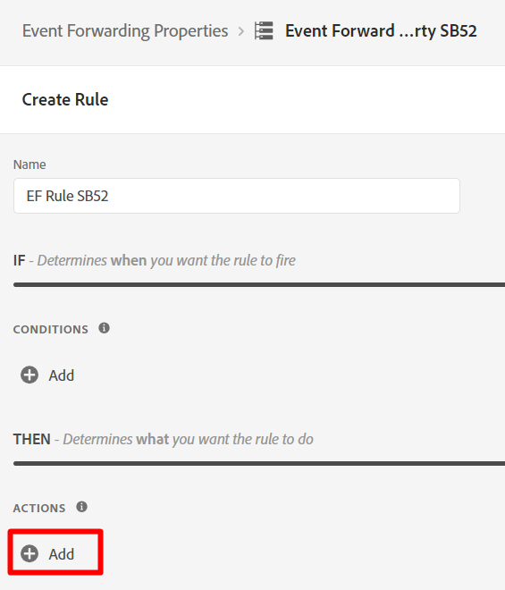
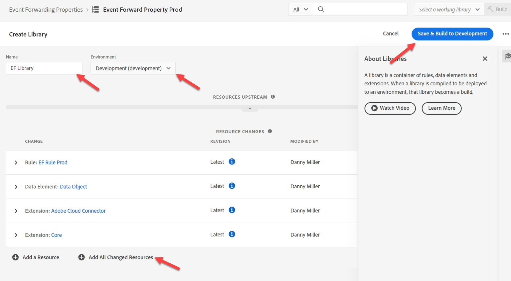

# 建立屬性

我們通常希望將體驗事件轉送給協力廠商（雖然不一定非要如此）。 這通常用於當特定情況下需要即時事件副本以通知協力廠商時（例如將購買事宜通知Google、Meta或TikTok）。

>[!NOTE]
>
>提醒：屬性包含決定要轉送的專案和轉送位置所需的所有擴充功能、資料元素和規則

1. 在左側欄中按一下「事件轉送」
2. 然後按一下新增屬性

![事件轉送區段的[新增屬性]按鈕反白顯示](assets/create-property-new-property-button.png "建立新的事件轉送屬性")

&#x200B;3. 使用下列公式更新屬性名稱： `Event Forward Property SB + [sandbox number]`。 您的最終名稱可能如下： **事件轉寄屬性SB01**

&#x200B;4. 完成時，按一下&#x200B;**儲存**


## 安裝擴充功能

1. 按一下您剛建立的「事件轉送屬性」


&#x200B;2. 您應該會看到類似以下的畫面。  按一下&#x200B;**擴充功能**。

![事件轉送屬性概觀畫面，其中醒目提示[擴充功能]索引標籤](assets/create-property-click-extensions-tab.png)


&#x200B;3. 請執行以下動作來安裝Adobe Cloud Connector擴充功能：

&#x200B;4. 按一下頂端導覽列中的&#x200B;**目錄**
&#x200B;5. 按一下&#x200B;**Adobe Cloud Connector**&#x200B;卡
&#x200B;6. 在右側邊欄中，按一下&#x200B;**安裝**&#x200B;按鈕


按一下「安裝」後，您應該會在已安裝的擴充功能下方看到您屬性的擴充功能，如下所示


## 建立資料元素

>[!NOTE]
>
>資料元素會參考傳入事件，必要時可將其剖析為多個個別元件

1. 在左側邊欄中，按一下&#x200B;**資料元素**


&#x200B;2. 按一下&#x200B;**建立新資料元素**&#x200B;按鈕

![以[建立新資料元素]按鈕反白顯示的資料元素頁面](assets/create-property-create-new-data-element-button.png "建立新資料元素")


&#x200B;3. 使用下列資訊設定新資料元素：

| 元素型別 | 要設定的值 |
| ----------------- | ------------------ |
| 名稱 | 資料物件 |
| 副檔名 | 核心 |
| 資料元素型別 | 自訂程式碼 |


&#x200B;4. 按一下按鈕&#x200B;**開啟編輯器**&#x200B;以新增下列自訂程式碼：

![針對自訂程式碼反白顯示[開啟編輯器]按鈕的資料元素設定](assets/create-property-open-custom-code-editor.png "開啟編輯器")


&#x200B;5. 將自訂程式碼新增到這類編輯器並儲存

```none
var xdm = arc?.event || '';
return xdm;
```


>[!NOTE]
>
>擷取整個xdm物件，而不對裝載進行任何轉譯。  如有需要，我們可以將XDM物件內的每個個別片段（例如頁面名稱、購買量）剖析為每個欄位一個資料元素。  這樣做的原因可能是將結構轉換為不同的結構


&#x200B;6. 按一下&#x200B;**儲存**&#x200B;按鈕以儲存您的資料元素。

![資料元素編輯器的[儲存]按鈕反白顯示](assets/create-property-save-data-element-button.png)


完成後，您應該會看到下列畫面，確認已新增您的資料元素：


## 建立規則

>[!NOTE]
>
>規則包含：
>
>1. 轉寄內容的條件
>2. 可轉換裝載並定義其傳送位置的動作


1. 在左側邊欄中，按一下&#x200B;**規則**


&#x200B;2. 然後按一下&#x200B;**建立新規則**

顯示[建立新規則]按鈕的


&#x200B;3. 使用下列公式更新規則名稱： `"EF Rule SB" + [your sandbox number]` （即EF規則SB01）。 您可在瀏覽器視窗右上角找到您的沙箱編號，如下所示\...


&#x200B;4. 完成時，按一下&#x200B;**儲存**

>[!NOTE]
>
>確定您的規則名稱遵循公式模式`"EF Rule SB" + [sandbox number]`


&#x200B;5. 按一下(+)符號以新增動作，以將動作新增至規則



## 取得webhook URL （用於執行中）

>[!NOTE]
>
>本實驗在此使用webhook，方便您檢視資料是否已到達要傳送的目的地。 在真實世界的情境中，您會登入該目的地，並使用其工具來檢視已到達的專案。


1. 在瀏覽器的新索引標籤中開啟下列連結 — > [https://webhook.site](https://webhook.site/)
2. 複製您看到的唯一URL，並將其儲存在安全的地方


&#x200B;3. 使用下列資訊設定您的動作：

| 設定 | 值 |
| ----------- | ------------------------------------------------------------------------------------------------------------------------------------------------------------------- |
| 副檔名 | Adobe雲端聯結器 |
| 動作型別 | 進行擷取呼叫 |
| 方法 | Post |
| URL | 使用您在設定串流目的地時使用的相同webhook URL。 您可以在瀏覽器中開啟新索引標籤，並導覽至「目的地 — >瀏覽」找到它 |
| 內文 | 原始 |
| 內文資料 | \&lbrace; &quot;data&quot;： \{ &quot;event&quot;： &quot;\{\{資料物件\}\}&quot; } |

>[!NOTE]
>
>這裡參考的\{\{Data Object\}\}是您先前建立的資料元素。 在此處，下游系統的需求是想要使用事件物件將事件包裝在資料物件中。 您可以將任何格式設定放在這裡。
>
>如果我們已將\{\{Data Object\}\}分割為多個欄位（例如頁面名稱、購買等），則可轉換JSON結構並將每個欄位放置在所需位置，讓我們在比對目的地時有更多控制權。


當您完成驗證時，您的畫面看起來類似以下畫面，然後按一下&#x200B;**保留變更**


&#x200B;4. 完成後，您應該會看到動作已新增至規則。 按一下[儲存]以繼續。**&#x200B;**

![規則編輯器顯示已設定動作，並反白顯示[儲存]按鈕](assets/create-property-save-rule-button.png "儲存您的規則")

>[!WARNING]
>
>傳送體驗事件時，您傳送的是事件，而非設定檔，或其任何屬性，包括任何對象資格（即使是Edge對象）。
>
>這是為了達到速度目的。


## 發佈變更

1. 在左側邊欄中按一下&#x200B;**發佈流程**


&#x200B;2. 按一下按鈕&#x200B;**新增資料庫**

![使用[新增程式庫]按鈕反白顯示[發佈流程]頁面](assets/create-property-add-library-button.png "新增程式庫")


&#x200B;3. 使用下列資訊設定程式庫：

- 名稱 — > **EF資料庫**
- 環境 — > **開發**
- 按一下&#x200B;**新增所有變更的資源**


完成時，您的畫面應該看起來類似下列熒幕擷圖。  如果一切正常，請按一下&#x200B;**儲存並建置到開發**&#x200B;按鈕




&#x200B;4. 然後您應該會看到開發組建變成綠色，表示它已準備好使用


