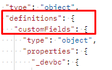

# 建立自訂欄位群組

## 欄位群組結構

欄位群組一律由下列欄位組成。 您會在下一個步驟的請求中看到此訊息。

| 必要值 | 說明 |
| --------------------------- | ---------------------------------------------------------------------------------------------------------------------------------------------------------------------------------------------- |
| 標題 | 您要在結構描述登入中建立的欄位群組名稱。 請注意，名稱必須是唯一的。 |
| 說明 | 有關欄位群組用途的簡短說明 |
| type | 永遠是物件 |
| meta\：intendedToExtend | 定義欄位群組可以搭配使用的類別。 類別一律由其`$id`值參考 |
| allOf | 說明可包含在欄位群組中的資源。 對於自訂已定義的欄位，路徑一律為`#/definitions/customFields` |
| definitions.customFields... | 這是建立自訂欄位群組所需的預設JSON結構描述結構。 它必須符合上面的`allOf` |
| \&lt;租使用者\_名稱> | 租使用者名稱稱（即唯一名稱）會在布建流程中建立。 這可確保所做的任何自訂都不會與現有或未來Adobe結構描述登入變更發生衝突 |

## 建立客戶帳戶詳細資料欄位群組

1. 按一下`XDM Schema Lab -> Create Schema`資料夾中的請求`Step 2 - Create Customer Account Details Field Group` API呼叫

執行前先檢閱要求內文。 請注意，「欄位群組結構」區段中提及的必要欄位會顯示如下：

>[!NOTE]
>
>請注意，`allOf`右上方的影像如何參照「/definitions/customFields」的路徑。  這必須符合結構描述中定義的結構（左側的影像），因為它會告訴XDM系統到哪裡尋找自訂建立的物件。
>
>

也請注意對應表中的每個特定欄位如何在XDM JSON結構中具現化。

&#x200B;2. 使用以下格式更新欄位群組的`title`和`description`： `Customer Account Details - Sandbox <your number here>`

   

&#x200B;3. 按一下`Send`按鈕以執行。  您應該會看到類似下列熒幕擷圖的回應。

&#x200B;4. 複製您新建立的客戶帳戶詳細資料欄位群組的`$id`值。

建立自訂欄位群組後

>[!WARNING]
>
>在您將`$id`儲存到某處之前，請勿繼續。  稍後需要建立客戶帳戶結構描述
>
>
