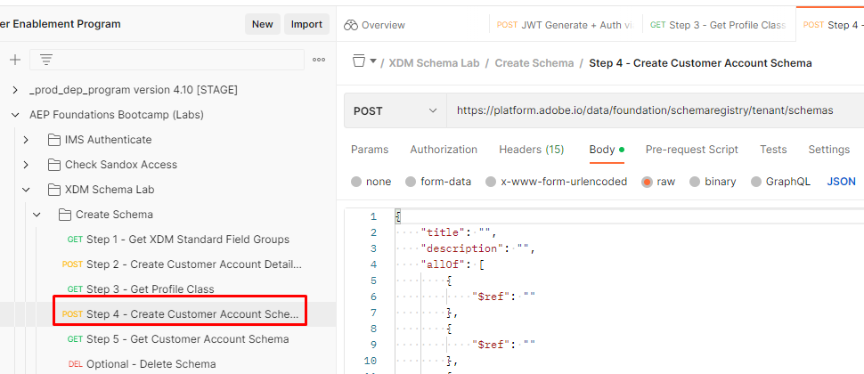
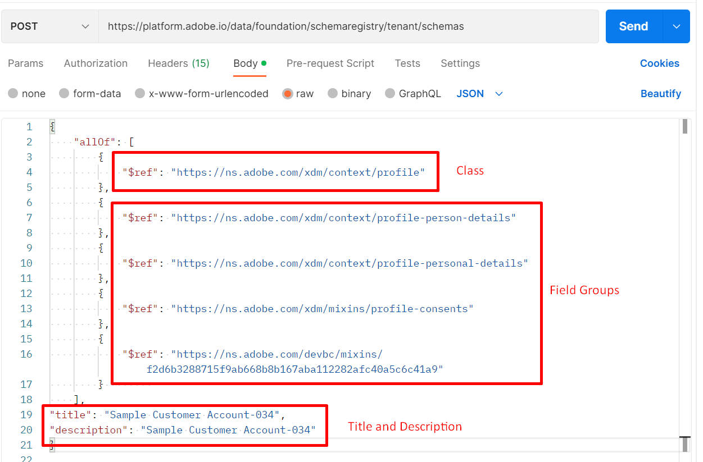

# 建立結構描述

## 修改API內文

>[!CAUTION]
>
>**尚未執行呼叫……1&rbrace;**

1. 按一下`XDM Schema Lab -> Create Schema`資料夾中的`Step 4 - Create Customer Account Schema` API呼叫。

   

2. 開啟呼叫的正文並檢視結構描述的定義結構。 記住結構描述一律只由一(1)個類別和一個或多個欄位群組組成。

3. 使用下列專案填入結構描述內文中的`title`和`description`欄位：

   - 標題 — > `Sample Customer Schema - <your sandbox number>`
   - 說明 — > `Sample Customer Schema - <your sandbox number>`

4. 以您從先前完成的實驗室區段儲存的`$ids`填入`$ref`欄位： [建立自訂欄位群組](./create-custom-field-groups.md)和[取得設定檔類別](./get-profile-class.md)。 您應該對下列每個專案都有$id：

   - 類別 — > XDM個別設定檔
   - 欄位群組 — >人口統計細節
   - 欄位群組 — >個人聯絡詳細資訊
   - 欄位群組 — >同意和偏好設定詳細資料
   - 欄位群組（自訂） ->客戶帳戶詳細資料

   在新增類別和欄位群組參考之前

5. 請檢閱您的最終內文，並確定其外觀類似於以下內容

>[!NOTE]
>
>`$refs`的順序無關緊要，`title`和`description`在本體中的位置也不重要。

## 執行API

1. 請先儲存對API請求所做的修改，然後再繼續。
1. 按一下`Send`按鈕執行API

建立結構描述的成功回應應該會產生`201 Created`狀態，而且看起來應該像下面的影像

>[!WARNING]
>
>如果成功，請勿再次執行要求

## 找到並儲存結構描述$id

1. 在您執行API要求之後，從回應中複製`$id`和`$meta:altId`
1. 將值儲存到某處，以便稍後重複使用

>[!WARNING]
>
>在您將`$id`和`$meta:altId`儲存到某處之前，請勿繼續。  在未來的實驗室步驟中需要用到這些引數

>[!TIP]
>
>**恭喜！ 您剛才已僅使用API建立結構描述**
