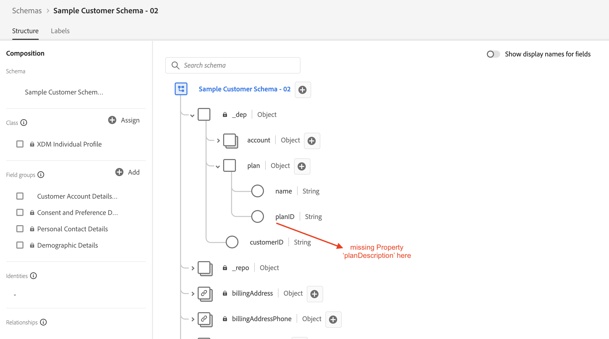
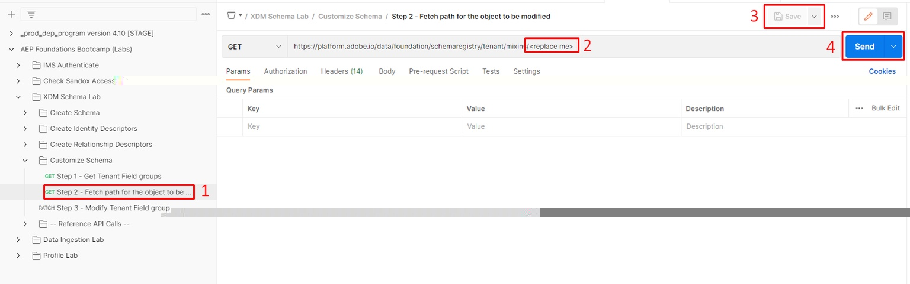
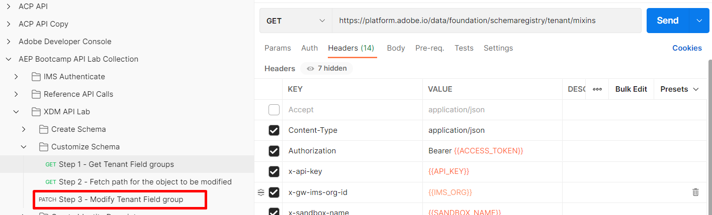
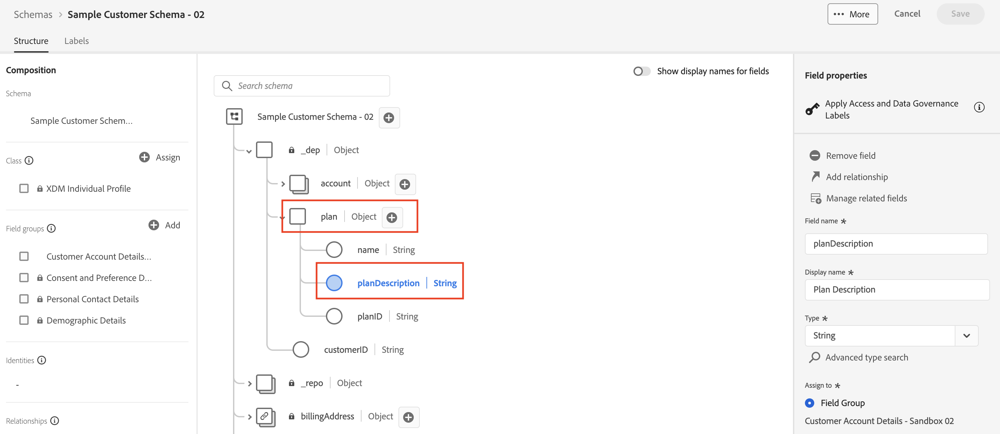

# 修改結構 — JSON修補程式

## 概觀

假設在建置結構描述後，您需要回來並將一個額外的欄位新增到`plan`物件（稱為`planDescription`），因為您在建立時忘記新增該欄位，或它是幾個月後收到的請求。  若要執行此工作，您只需執行`PATCH`作業即可使用新欄位更新結構描述。

若要深入瞭解JSON PATCH，請前往下列連結，但在本實驗中，假設您對此運作方式有一些概念😄

- [https://jsonpatch.com/](https://jsonpatch.com/)
- [Experience League API基礎知識](https://experienceleague.adobe.com/docs/experience-platform/landing/platform-apis/api-fundamentals.html?lang=zh-Hant#json-patch)



>[!NOTE]
>
>請記住以下要點：
>
>- 結構描述由一(1)個類別和一(1)個或多個欄位群組組成
>- 您必須先新增至欄位群組，才能直接新增欄位至結構描述。 這可確保在使用該欄位群組的任何結構描述中欄位的重複使用性。


若要將新欄位新增到結構描述，您必須依序執行下列操作。  這就是您在下列實驗步驟中所執行的操作。

- 識別您要新增屬性的欄位群組
- 建構JSON PATCH呼叫以更新欄位群組
- 執行JSON PATCH呼叫以更新欄位群組（結構描述將繼承）


## 找到並識別要更新的欄位群組

1. 選取位於`XDM Schema Lab -> Customize Schema`資料夾中的`Step 1 - Get Tenant Field groups` API呼叫
1. 按一下`Send`按鈕以執行要求

   

   >[!NOTE]
   >
   >請記得您在自訂欄位群組中建立`plan`物件。 在XDM結構描述登入中自訂建立的物件稱為「租使用者」，因此使用`/schemaregistry/tenant/mixins/`路徑的API呼叫。


1. 在您先前建立且標題為`Customer Account Details - Sandbox <your number here> `的自訂欄位群組的結構描述ID回應搜尋中

1. 複製`$meta:altId`並將其儲存到安全的位置，因為下一個步驟會需要它


>[!CAUTION]
>
>請確定您選取要複製的正確欄位群組！  有一個名稱與`dep: Customer Account Details`類似，您應該&#x200B;**不應**&#x200B;使用的名稱

>[!WARNING]
>
>在您將`$meta:altId `儲存到某處之前，請勿繼續。  這在未來的實驗室步驟中是必要的


## 依據$meta\：altId查詢欄位群組

1. 在`XDM Schema Lab -> Customize Schema`資料夾中選取`Step 2 - Fetch path for the object to be modified` API呼叫
1. 在要求的URL中，將`<replace me>`取代為您從上一個區段步驟儲存到呼叫結尾的`$meta:altId`，如下所示
1. 儲存您對請求所做的編輯
1. 按一下`Send`按鈕以執行要求




請檢閱回應，並注意&#x200B;**計畫**&#x200B;物件的JSON指標路徑是使用下列醒目提示的每個屬性所建構。


完整構成的路徑看起來就像您在下方看到的內容。  複製此路徑並儲存在某處以供參考

```none
/definitions/customFields/properties/_devbc/properties/plan/properties
```

>[!NOTE]
>
>請記得使用您自己的名稱更新上述租使用者名稱稱(\_devbc)


## PATCH欄位群組

### JSON PATCH API內文範例

```none
[
    {
        "op": "",
        "path": "",
        "value": {
            "title": "",
            "type": "",
            "description": ""
        }
    }
]
```

- **op （作業）** ->這會提供PATCH應該執行之動作的指示
- **路徑** ->這是您要建立、更新或刪除的路徑（亦即這是新欄位位置的JSON指標）
- **Value** ->這是選擇性欄位，只在建立或取代現有欄位時使用


### 執行API要求

1. 按一下`XDM Schema Lab -> Customize Schema`資料夾中的`Step 3 - Modify Tenant Field group` API呼叫

   


2. 使用以下資訊更新請求內文

   - **op** ->` add`
   - **路徑** -> `path from previous step +`&#x200B;` the new field name`
   - **值** ->
     - **標題** -> `Plan Description`
     - **型別** -> `string`
     - **描述** -> `High-level details about the plan`

   完成後，您的API要求應該看起來像這樣

   

   >[!WARNING]
   >
   >請確定您的路徑中包含新的欄位名稱&#x200B;**planDescription，**


3. 如果一切正常，請`Save`您的電話

4. `Execute`呼叫以執行PATCH

您應該會看到`200 OK `回應，而現在應該會看到欄位群組中的`planDescription`欄位，如下所示：

使用planDescription成功修補欄位群組後有

>[!TIP]
>
>恭喜！ 您已成功使用JSON PATCH更新欄位群組/結構描述


## 在UI中檢視變更

透過UI瀏覽您的結構描述，並檢視您新新增的欄位。  很酷吧？

在Experience Platform UI中使用JSON修補程式之後，可在結構描述中看到
