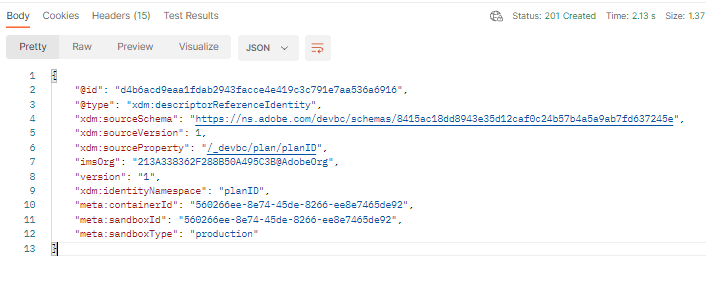

# 建立計畫參考身分

1. 按一下`XDM Schema Lab -> Create Relationship Descriptors`資料夾中的`Step 3 - Reference Descriptor for Plan` API要求

>[!CAUTION]
>
>尚未執行要求


&#x200B;2. 更新API呼叫內文中的下列屬性。

- 將`xdm:sourceSchema`屬性的值更新為您從[建立結構描述](../build-schema/create-schema.md)步驟中儲存的`Customer Account`結構描述的`$id`
- 從`Customer Account`結構描述中將`xdm:sourceProperty`的值更新為`planID`欄位的路徑

>[!NOTE]
>
>使用`dep: Lookup Plan`結構描述中`planId`欄位的點標籤法值，並將`.`取代為`/`
>
>別忘了前置`/` 😄

僅限範例

```json
{
  "@type": "xdm:descriptorReferenceIdentity",
  "xdm:sourceSchema": "https://ns.adobe.com/devbc/schemas/8415ac18dd8943e35d12caf0c24b57b4a5a9ab7fd637245e",
  "xdm:sourceVersion": 1,
  "xdm:sourceProperty": "/_devbc/plan/planID",
  "xdm:identityNamespace": "planID"
}
```

>[!NOTE]
>
>請記得使用您自己的名稱更新上述租使用者名稱稱(\_devbc)


&#x200B;3. 繼續使用`Save`按鈕前請先儲存您的請求

&#x200B;4. 按一下`Send`按鈕執行API

您現在應該會看到如下的`201 Created`回應



>[!NOTE]
>
>一律會在查詢結構描述（即sourceSchema）上定義參考身分描述項

>[!NOTE]
>
>從結構描述UI建立關係時，會在後端自動建立參考身分描述項。 **您只需在使用API建立結構描述時明確建立它們**

>[!TIP]
>
>棒極了！ 您剛才已建立將`dep: Lookup Plan`結構描述與`Customer Account`結構描述建立關聯的所有必要描述項，並啟用它以在批次細分期間參考
