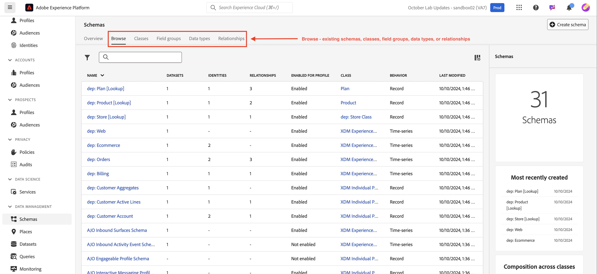

# 登入和瀏覽

## 透過UI登入

1. 瀏覽至瀏覽器中的[https://experience.adobe.com](https://experience.adobe.com/)。
1. 使用Adobe ID登入，該使用者擁有您沙箱的開發人員存取權 — 與您用來完成[Developer Console設定](../../sandbox-setup/developer-console-setup.md)的沙箱相同。
1. 在&#x200B;**選取帳戶**&#x200B;畫面上，選擇&#x200B;**公司或學校帳戶**。

用於進入Adobe的

## 啟動Experience Platform

從快速存取面板按一下Experience Platform圖示以存取您的Bootcamp沙箱

>[!NOTE]
>
>您可能無法看見此畫面，且會直接啟動至Experience Platform。  如果是，請略過此步驟。

## 導覽至結構描述

1. 按一下左側邊欄中的&#x200B;**結構描述**&#x200B;索引標籤

   左側邊欄導覽中的

1. 在上方導覽列中，您會看到瀏覽現有結構描述的選項，以及檢視目前位於XDM登入中的欄位群組和資料型別的選項。

>[!NOTE]
>
>您注意到在您的沙箱中已經預先建立方案。 這些包括在此啟動營預先建立的結構描述（其前置詞為`dep`），以及系統為Adobe Real-Time CDP和Adobe Journey Optimizer產生的結構描述。

>[!TIP]
>
>開始建立一些結構描述！
