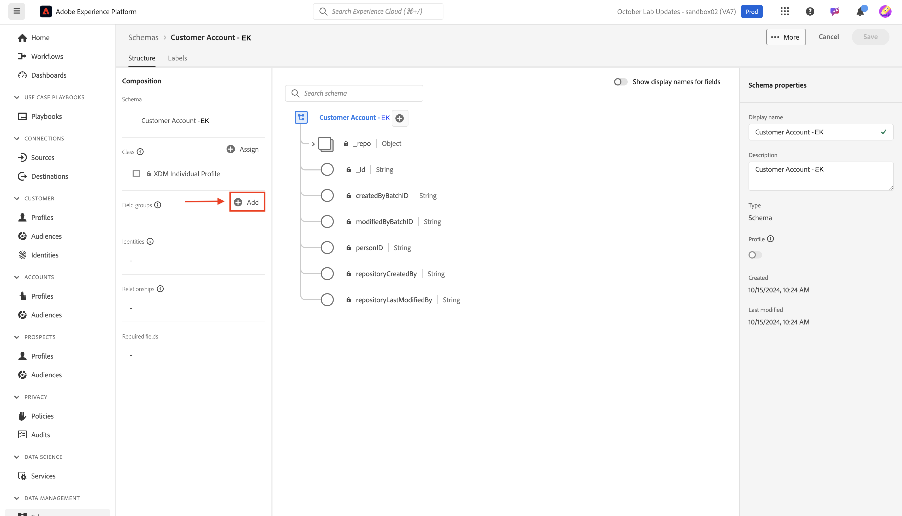
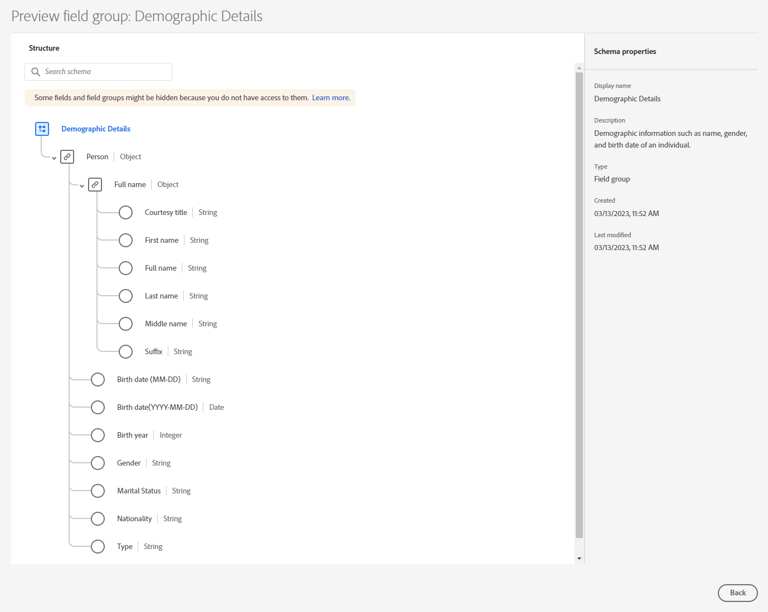

# 模型標準物件

## 導覽至結構描述

1. 按一下左側邊欄中的&#x200B;**結構描述**&#x200B;索引標籤

   左側邊欄導覽中的

1. 在上方導覽列中，您會看到瀏覽現有結構描述的選項，以及檢視目前XDM登入中的欄位群組和資料型別。

>[!NOTE]
>
>您注意到在您的沙箱中已經預先建立方案。 這些包括在此啟動營預先建立的結構描述（其前置詞為`dep`），以及系統為Adobe Real-Time CDP和Adobe Journey Optimizer產生的結構描述。

## 建立個別設定檔結構描述

1. 按一下&#x200B;**建立結構描述**&#x200B;以開始

   

1. 選取&#x200B;**手動**

   

1. 選取&#x200B;**個別設定檔**

## 為您的結構描述命名

XDM個別設定檔類別型結構描述可讓您收集將連結至設定檔之個人的相關屬性。 類別本身包含無法編輯的欄位，例如&#x200B;*modifiedByBatchID*、*PersonID*&#x200B;等。

1. 為您的結構描述命名並輸入說明。
   - **結構描述顯示名稱** —> *客戶帳戶 — \[您的縮寫]*
   - **描述** —>此結構描述會收集個人的身分、計畫資訊、人口統計詳細資料和連絡人詳細資訊。
1. 使用右上方的&#x200B;**完成**&#x200B;按鈕儲存您的結構描述。

## 新增人口統計詳細資料欄位群組

Adobe Experience Platform中有許多欄位群組是以標準XDM的形式存在，可供您新增至結構描述及自訂。

1. 按一下欄位群組區段左側邊欄上的&#x200B;**+ （新增）**。

   

1. 搜尋&#x200B;**人口統計詳細資料**，或瀏覽清單來尋找它。

   - 當您找到欄位群組時，請按一下欄位群組右側的放大鏡來檢視其結構。  這是預覽您即將新增至結構描述的內容而不實際新增的實用方式。
   - 檢閱完成時關閉預覽

   

   

3. **核取**&#x200B;欄位群組旁的核取方塊，然後按一下&#x200B;**新增欄位群組**&#x200B;按鈕

![選取[人口統計詳細資料]欄位群組以將其新增至您的結構描述](assets/model-standard-objects-select-demographic-details-field-group.png "選取[人口統計詳細資料]欄位群組以將其新增至您的結構描述")

## 新增其他標準欄位群組

您需要將其他標準欄位群組新增到結構描述。 重複上述步驟，將兩個額外的欄位群組新增至您的結構描述：

- 個人聯絡詳細資訊
- 同意和偏好設定詳細資料

完成時，您的結構描述應該看起來像下面的影像。 請務必按一下「**儲存**」按鈕並儲存您的工作！

新增人口統計詳細資料、個人聯絡詳細資料以及同意和偏好設定詳細資料欄位群組後後的最終結構描述

>[!NOTE]
>
>請注意，您選取並新增的欄位群組現在會出現在結構描述中，並顯示在左側邊欄中。 請注意，您新增的每個欄位群組並非都一定需要所有欄位。  下一個步驟會移除多餘的欄位。

>[!WARNING]
>
>繼續之前，請務必儲存您的結構描述！

## 自訂標準欄位群組

### 人口統計詳細資料欄位群組

人口統計詳細資料欄位群組帶來了許多欄位，但根據您從LID方法的結構描述設計，您只需要以下欄位：

- person.name.firstName
- person.name.lastName
- person.birthDayAndMonth
- person.birthYear

若要從任何Adobe標準欄位群組中移除欄位，您可以使用&#x200B;**管理相關欄位**&#x200B;選項。 管理相關欄位可讓您從結構描述中移除標準欄位，因此您只剩下所需的欄位。

1. 選取結構描述中的&#x200B;**人員**&#x200B;物件
1. 按一下右側邊欄中的&#x200B;**管理相關欄位**

   

1. 按一下人員左側的>形箭號來展開人員物件，並按一下name物件左側的>形箭號來展開全名物件。 僅保留以下欄位：

   - person.name.firstName
   - person.name.lastName
   - person.birthDayAndMonth
   - person.birthYear

   完成後，請按一下右上角的&#x200B;**確認**&#x200B;按鈕。

   

   >[!NOTE]
   >
   >您可以按一下&#x200B;**人口統計詳細資料**&#x200B;最上方的核取方塊，自動取消選取所有子物件，然後只重新選取您需要的子物件！

1. 完成後，您應該會在結構描述中看到人員物件，如下所示。 如果一切正常，請按一下&#x200B;**儲存**&#x200B;按鈕，儲存您的結構描述。

### 同意和偏好設定欄位群組

執行與先前相同的步驟集，但這次是針對同意和偏好設定欄位群組。

1. 按一下左側邊欄中的&#x200B;**同意和偏好設定**&#x200B;欄位群組名稱，以反白顯示結構描述中的欄位。
1. 選取&#x200B;**同意**&#x200B;物件，然後使用&#x200B;**管理相關欄位**&#x200B;程式從同意物件移除不需要的欄位。 僅保留以下欄位：

- consents.marketing.email.val
- consents.marketing.sms.val

>[!NOTE]
>
>請確定您已關閉結構描述工作區右上角&#x200B;**顯示欄位**&#x200B;的顯示名稱的切換
>
>

完成後，您的最終結構描述現在看起來應該像這樣。  繼續之前，請務必按一下&#x200B;**儲存**。

>[!TIP]
>
>您現在已完成將標準元件新增至結構描述的工作。 做得好！ 繼續為您的結構描述建置一些自訂屬性。
