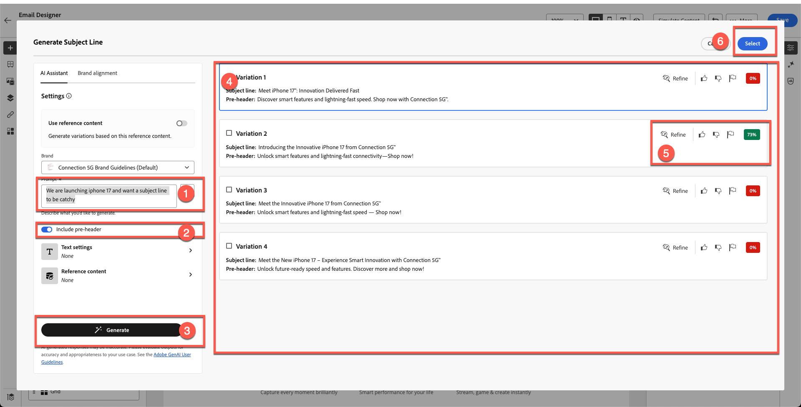
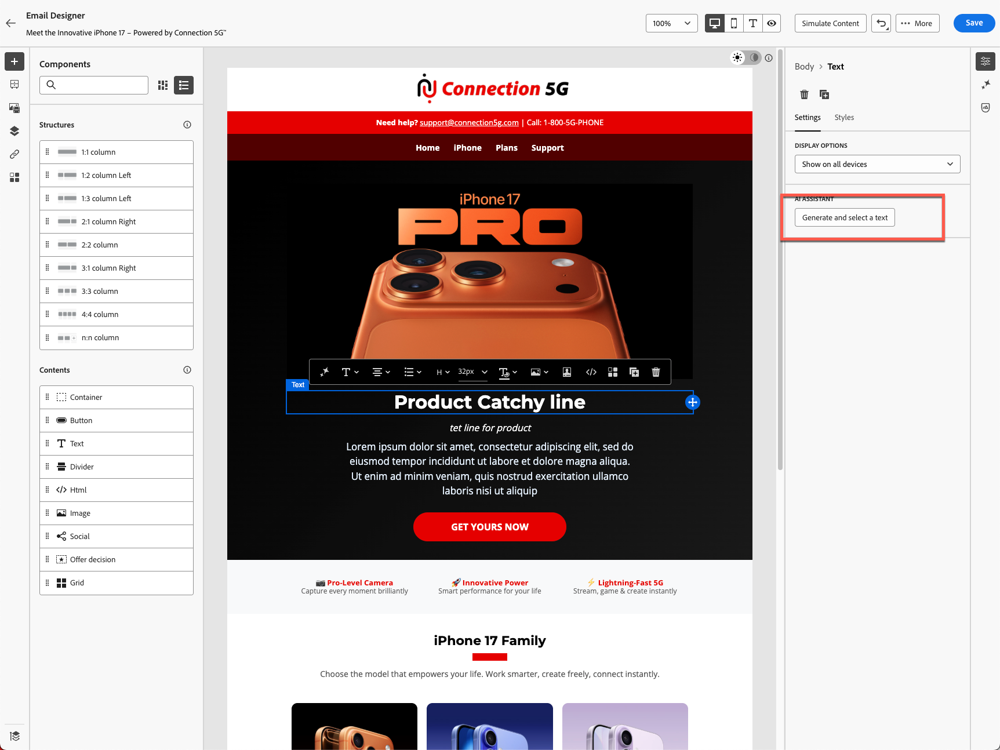
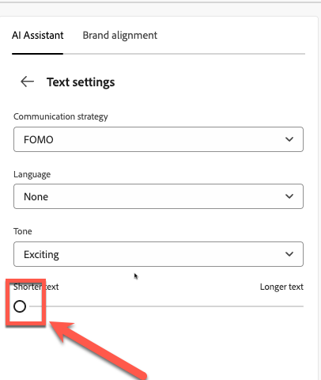

# AI助理與內容個人化

**用途：**&#x200B;瞭解如何使用Adobe Journey Optimizer的AI助理產生主旨列、調整電子郵件文字、調整色調，以及直接在電子郵件設計工具中建立品牌內Firefly影像。

## 學習目標

在本單元結束時，您將能夠：

1. 使用AI助理產生主旨行和預先標題。
1. 精簡主圖文字、說明、語調和訊息。
1. 套用AI驅動的重述、摘要和色調調整。
1. 使用Adobe Firefly搭配參考樣式和品牌設定來產生影像。
1. 將預留位置替換為電子郵件設計內產生的影像。

## 簡介

AJO中的AI助理可幫助您建置更聰明、符合品牌規範的內容。
它可以：

- 產生主旨列
- 改善現有文字
- 調整語調和清晰度
- 使用Firefly建立品牌影像
- 確保一切符合Connection 5G准則

在本練習中，您將改善使用AI助理所建立的電子郵件。

&#x200B;> [!NOTE]
>
>AI助理是&#x200B;**非決定性的**，這表示它每次使用時可能會產生稍微不同的內容。 您在練習中所看到的內容，可能與本指南中的熒幕擷取畫面或範例不完全相符。 沒關係 — 專注於學習流程和概念，而不是期望相同的結果。

## 使用AI助理建立電子郵件主旨列

1. 按一下「上一步」按鈕，或編輯您在上一個模組中建立的電子郵件，以返回Campaign。 在上一步中，您可以按一下右側的&#x200B;**設定**&#x200B;標籤。
2. 按一下電子郵件容器>按一下「編輯電子郵件」按鈕。
3. 按一下「內容」標籤，然後按一下「電子郵件內文」
4. 選取&#x200B;**主旨列**&#x200B;欄位。
5. 按一下&#x200B;**AI助理圖示**。 （請參閱下文）

主旨列欄位工具列中的

&#x200B;6. 您會注意到，「品牌指引」預設為選取。
&#x200B;7. 輸入提示：

>我們將推出iPhone 17，並希望主旨列朗朗上口

&#x200B;8. 按&#x200B;**產生**。
&#x200B;9. 檢閱產生的四個變體。
&#x200B;10. 選擇具有最佳對齊分數的變體，然後按一下&#x200B;**選取**。

&#x200B;> [!NOTE]
>
>您的結果與實驗指南可能完全不同，因此您不必擔心。 選取您認為正確的標題，並繼續實驗。

## 改善主圖示題和說明

1. 按一下[編輯電子郵件內文]按鈕以開啟電子郵件。

&#x200B;2. 按一下&#x200B;**產品朗讀行**&#x200B;標題。
&#x200B;3. 按一下&#x200B;**產生並選取文字**&#x200B;以開啟AI小幫手

&#x200B;4. 從下拉式清單中選取&#x200B;**連線5G品牌指南**。

在AI助理下拉式清單中選取

&#x200B;5. 提示：

>*為iPhone 17上市撰寫醒目的大標題。 將其保留在10個字以內*

&#x200B;6. 按一下「文字設定」以變更色調和通訊策略。 將通訊策略變更為&#x200B;**FOMO （害怕遺漏）**，語言變更為&#x200B;**英文**，音調變更為&#x200B;**令人興奮**。 縮小撥號，使用較短的版本。

&#x200B;7. 按一下&#x200B;**產生**&#x200B;按鈕
&#x200B;8. 檢閱並選取最佳版本，
&#x200B;9. 如果您的文字很長，請使用滑桿來&#x200B;**「較短文字」**&#x200B;並重新產生文字。

&#x200B;10. 在您滿意文字後，請按一下&#x200B;**選取**

## 說明提示

這一次，您將測試AI如何協助尋找問題。

1. 選取下面是範本化文字且沒有意義的文字。

&#x200B;2. 按一下評估按鈕，如下所示。

&#x200B;3. 系統會自動選取您的原始內容與您的品牌，如下面的步驟1和2所示。 按一下&#x200B;**評估**&#x200B;按鈕以繼續。

&#x200B;4. 如預期，您會注意到許多違反品牌指引的錯誤。 雖然可以使用AI來更正這些問題，但在此情況下，您不會修訂現有材料。 反之，您可以原樣保留內容，並從頭開始建立完全符合品牌標準的新內容。

&#x200B;5. 使用為您使用AI產生的新段落，並出現以下提示。 您可以使用以下提示對說明文字使用相同的方法。

提示：

>*為新的iPhone 17撰寫引人入勝的產品說明。 強調最令人印象深刻的功能，例如進階攝影機、電池續航力及效能。 基調應該是優質、令人興奮、且易於讓廣大觀眾理解的。 將其保留在3個句子以下。*

為了節省時間，已為您建立文字。 複製並貼到下方以取得您的文字。

>探索iPhone 17™ — 配備進階攝影機，提供令人驚豔的像片、持續一整天的電池供電時間，以及超快效能，讓您保持領先地位。 不要錯過這種創新的體驗。

您的電子郵件看起來像下面的範例。

## 新增Firefly產生的影像

到目前為止，我們已在主旨行和文字上測試AI助理。 影像呢？

在深入探討AI影像產生之前，請先瞭解您可以建立的體驗型別。

我們瞭解我們有設定檔的出生年份。 我們可以做的其中一項體驗就是建立具有不同變體的區塊。 有了Adobe Journey Optimizer，這是可行的，也是以Adobe Experience Platform為基礎的最大優勢之一。 我們將在下一個模組中介紹實驗，但首先，請準備下方的區塊。

1. 將&#x200B;**Image**&#x200B;元件拖曳至iphone 17系列區塊下方的左側欄。

&#x200B;2. 按一下外部，然後選取影像預留位置。 （請務必按一下影像，否則您將看不到Firefly選項）。

&#x200B;3. 在&#x200B;**Firefly**&#x200B;下，按一下&#x200B;**產生並選取影像**。

## 上傳參考影像

1. 開啟&#x200B;**參考樣式**。
2. 在品牌選擇上選取&#x200B;**連線5G品牌指引**

已針對影像參考樣式選取

&#x200B;3. 按一下上傳影像

&#x200B;4. 從toolkit資料夾中選取reference.jpg

&#x200B;5. 新增影像提示
   `Portrait-oriented image of a confident man in his early to mid-40s, standing alone at night in a neon-lit urban street, focused on his smartphone. Cinematic cyberpunk-inspired city atmosphere with colorful LED signs, cool blue and warm orange lighting, shallow depth of field, soft bokeh lights in the background. Modern lifestyle, tech-savvy mood, realistic skin tones, high contrast, photorealistic, professional lighting, ultra-detailed`.

## 選擇影像設定

選擇您的&#x200B;**影像設定**：

1. 選擇下列設定：
   - **比例：**&#x200B;橫向(4:3)
   - **內容型別：**&#x200B;像片
   - **色彩和色調：**&#x200B;冷色調
   - **照明：**&#x200B;戲劇性的照明
1. 按&#x200B;**產生**&#x200B;按鈕

## 選取並插入產生的影像

1. 檢查產生的所有影像，以檢閱Firefly結果。

&#x200B;2. 按一下&#x200B;**選取**&#x200B;您想要的選取影像。

&#x200B;3. 如果以上傳模式提示，請按一下&#x200B;**下一步**。

![上傳模組提示以按[下一步]](assets/ai-assistant-and-content-personalization-upload-modal-next.png)

&#x200B;4. 然後按一下&#x200B;**匯入**。

## 完成區塊設計

套用圓角邊框半徑10，只要您有時間就可以顯得新潮。

經過幾次反複和變異後，您便擁有最終設計。 您的最終版面配置類似於範例。

此時，您應該對使用AI加速及提升內容建立速度感到有信心。

## 重述

您已成功使用AI助理來：

- 產生主旨列
- 精簡主圖文字
- 改寫段落
- 變更訊息的語調
- 使用參考樣式建立品牌化Firefly影像
- 將產生的影像插入您的電子郵件

您現在已準備好進行下一個模組 — **Personalization與內容實驗**，您將在此建立設定檔導向的變體與測試。
