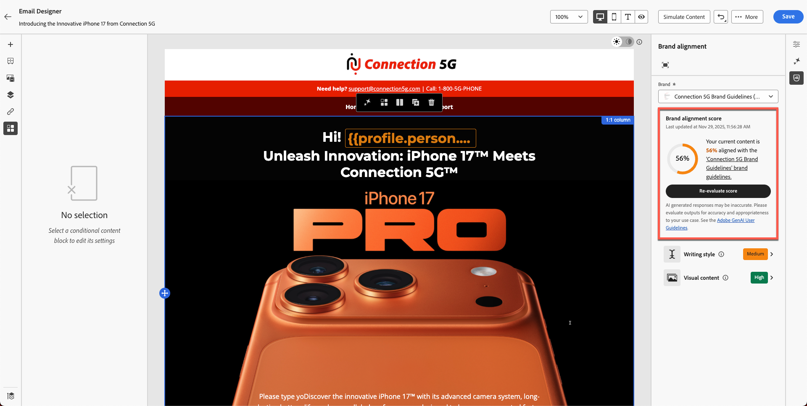
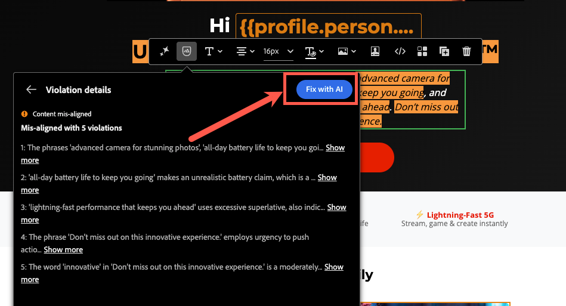

# 品牌一致性

**用途：**&#x200B;瞭解如何使用Adobe Journey Optimizer的品牌對齊功能來評估電子郵件內容、識別指引違規，以及套用AI支援的建議來改善品牌法規遵循。

## 學習目標

在本單元結束時，您將能夠：

1. 存取和解讀「品牌一致性」面板。
1. 根據品牌准則評估電子郵件內容。
1. 識別AI標幟的問題。
1. 套用建議以改善品牌一致性。
1. 重新評估分數以追蹤改善情況。

## 簡介

Adobe Journey Optimizer包含&#x200B;**AI導向的Brand Alignment分數**，可根據&#x200B;**Connection 5G**&#x200B;的已發佈品牌准則檢查您的內容。

這可確保：

- 語調、風格和訊息符合您的品牌
- 符合法律規定
- 影像遵循視覺規則
- 內容建立者可維持規模的一致性

此單元會教導您使用AI執行評估、解讀結果並改善內容。

## 開啟品牌對齊面板

1. 開啟您在先前模組中建立的電子郵件。
2. 在右側邊欄中找到&#x200B;**品牌一致性**&#x200B;索引標籤，或在側邊欄中找到&#x200B;**%圖示**。
3. 按一下以開啟面板。

在側邊欄中

&#x200B;4. 確定已套用正確的品牌：
   - **連線5G** （預設）。
&#x200B;5. 按一下&#x200B;**評估分數**。

**解讀品牌分數和意見反應：**&#x200B;稍後您會看到內容的品牌相容分數。 此分數可以呈現為評等（例如高、Medium或低）或百分比，以及顏色指標（綠色、黃色、紅色）和評估時間。 高分數表示您的內容與品牌指引高度一致，而中或低分數表示中度或不良一致。

檢閱面板中針對每個准則類別提供的詳細意見回饋。

意見反應通常會依指引類別（例如色調、風格、影像等）組織，顯示已通過的規則以及可能需要注意的規則。

記下任何特定訊息或醒目提示，例如，面板可能會說某些字詞或短語不符合規定的色調，或影像不符合視覺標準。 這是您改善的秘訣。

>[!NOTE]
>
>請注意，您的分數與下方畫面不同。 您的目標是使用品牌指引和AI來改善分數。

## 檢閱一致性分數

評估後，AJO會顯示：

- 品牌一致性分數
- 評等（高/Medium/低）
- 顏色指示器（綠色/黃色/紅色）
- 時間戳記
- 指引類別（色調、風格、影像等）

解讀結果以瞭解您的電子郵件與Connection 5G指引的符合程度。

## 檢查詳細的意見反應

1. 捲動瀏覽指引類別。
1. 尋找警告或紅色指示器。
1. 按一下每個已標幟的指引，開啟詳細的AI意見回饋。
1. 檢閱建議，例如：
   - 音調不符
   - 措辭不正確
   - 禁止的字詞
   - 遺失商標使用方式
   - 影像樣式違規

## 套用AI建議

1. 按一下進入電子郵件中標幟的文字區塊或影像。
2. 使用您在上一個練習中貼上的段落，如下所示。

&#x200B;3. 使用AI提供的建議修改。 按一下圖示，如下所示。

&#x200B;4. 按一下&#x200B;**使用AI修正**&#x200B;按鈕，如下所示。

針對已標幟的指引使用

&#x200B;5. 您會看到以綠色反白顯示的建議變更，以及移除以紅色顯示並帶有刪除線的文字，如下圖所示。 您也會注意到分數已更新（在此案例中為80%）。 按一下&#x200B;**套用**&#x200B;按鈕讓變更生效。

&#x200B;6. 變更會套用新文字。
&#x200B;7. 檢閱所有醒目提示的區域並進行必要的更新，以更正內容（使用AI或手動編輯）。 在繼續之前，請確定已完成所有必要的變更。
&#x200B;8. 儲存變更。

## 重新評估品牌分數

1. 變更所有位置以使用AI或手動修正內容。
2. 返回「品牌一致性」面板。
3. 按一下&#x200B;**重新評估分數**。
4. 比較新分數與先前分數。

例如：

- 原始分數： **56%**
- 更新分數： **90%**

這表示您的更新已成功使電子郵件符合品牌標準。

&#x200B;5. 按一下&#x200B;**儲存**，完成您的電子郵件。

## 重述

在本模式中，您已學習：

- 使用品牌一致性分數評估電子郵件
- 解讀類別層級的意見回饋
- 識別寫入、色調和版面配置問題
- 套用AI建議的更正
- 提升溝通的品牌一致性

您的內容現已通過驗證，並準備好在下一個模組中進行測試 — **測試電子郵件**。
