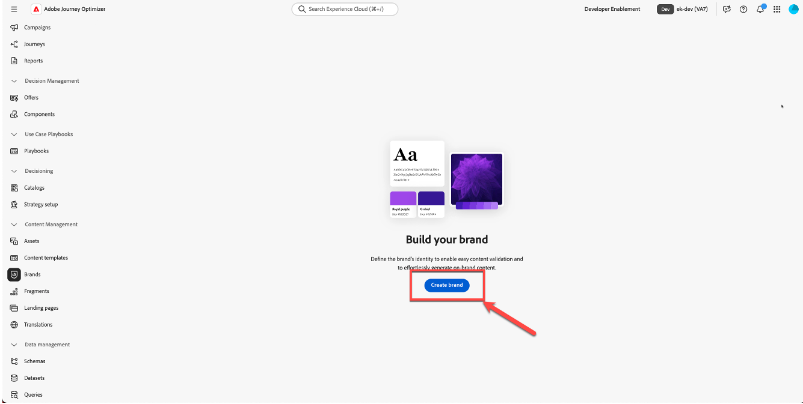
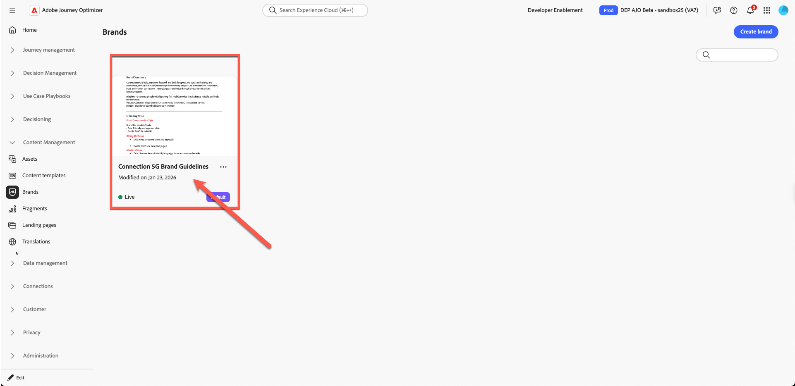
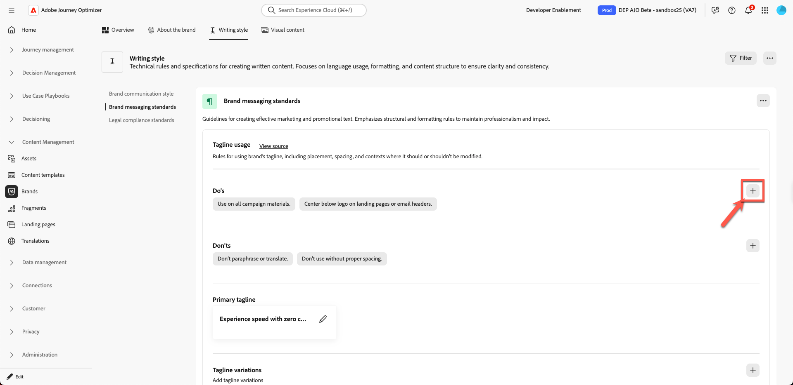

# 品牌管理

**用途：**&#x200B;在Adobe Journey Optimizer (AJO)中設定、調整及發佈Connection 5G Brand Guidelines，讓所有內容和AI功能都保持與品牌一致。

## 學習目標

在本單元結束時，您將能夠：

- 在Adobe Journey Optimizer中建立新品牌。
- 從PDF上傳並擷取品牌指引資訊。
- 在「關於品牌」、「寫作風格」和「視覺內容」索引標籤中，檢閱並調整品牌詳細資訊。
- 新增排除規則，以避免倉促的電子郵件按鈕複製。
- 發佈品牌，以便用於範本、片段、AI Assistant和Brand Alignment。

下載檔案 — [toolkit.zip](assets/toolkit.zip)

>[!NOTE]
>
>開始實作實驗室前，請務必下載工具組檔案（請參閱下列toolkit.zip）。 解壓縮檔案以存取練習所需的影像和支援檔案。 將這些資產儲存在易於存取的位置，因為您將在整個實驗室中參考這些資產。

## 簡介

在此單元中，您將使用準備好的品牌指引PDF在AJO中建置&#x200B;**Connection 5G**&#x200B;品牌。

Adobe Journey Optimizer的&#x200B;**品牌**&#x200B;功能可協助您定義並維護所有行銷工作中一致的身分。 從標誌和色彩到語音和訊息風格，建立品牌可確保每封電子郵件、行銷活動和內容都反映統一的個性。

我們將在本實驗室使用講座中的模式1 （僅限AJO）。 請注意，資產是使用&#x200B;**Assets Essentials**&#x200B;儲存。

您將從Connection 5G品牌指引檔案開始，將其上傳，讓AJO擷取關鍵資訊，然後調整並發佈結果。

## 準備品牌指引

1. 從Toolkit資料夾開啟&#x200B;**Connection 5G Brand Guidelinate** PDF （請先解壓縮）。

   

2. 請檢閱檔案以瞭解Connection 5G使用的內容：
   - 語調
   - 色彩和視覺樣式
   - 撰寫風格和傳訊範例
   - 影像指南
   - 法律與法規注意事項

## 在AJO中建立新品牌

1. 在Adobe Journey Optimizer中，前往左側導覽並按一下&#x200B;**品牌**。
2. 按一下&#x200B;**建立品牌**。

   在[品牌]區段中

3. 在&#x200B;**名稱**&#x200B;欄位中，輸入`Connection 5G Brand Guidelines`
4. 在上傳區域中，拖放&#x200B;**Connection5g Brand Guidelines.pdf**&#x200B;檔案（或按一下&#x200B;**選取檔案**&#x200B;並從您的電腦中選擇它）。

   

5. 按一下&#x200B;**建立品牌**&#x200B;開始擷取。

   AJO分析檔案時，畫面會隨即顯示進度。 視檔案大小而定，這可能需要幾分鐘的時間。

   AJO分析品牌指引檔案時顯示的

6. 擷取一旦完成：
   - 上方會出現綠色的確認列。
   - 系統會自動將您重新導向至品牌設定畫面。
   - 內容和視覺化建立標準現在會根據上傳的品牌指引檔案自動填入。

   擷取完成後已填入

7. 按一下「**發佈**」按鈕以發佈品牌指引。

   品牌指引的

8. 按下「發佈」按鈕進行確認。

   

   頁面底部會顯示綠色確認列，指出您的品牌已成功發佈。

9. 按一下回到主要品牌頁面，您會看到您的品牌現在已上線（這應該以綠色圓點顯示，標籤為&#x200B;**&quot;Live&quot;**）。

## 檢閱品牌標籤

您現在將檢閱並瞭解已針對Connection 5G填入的三個主要標籤。

### 關於品牌

此索引標籤會以高層級定義品牌識別。 它通常包括：

- 品牌名稱
- 核心值
- 指導原則
- 品牌目標與承諾
- 品牌想要建立的感覺

系統中的其他一切都是以此為基礎建立的，因此此標籤必須反映Connection 5G的真實DNA。

![關於顯示已擷取品牌識別欄位的[品牌]索引標籤](assets/brand-management-about-the-brand-tab.png)

花點時間瀏覽擷取的欄位，並檢查它們是否符合原始PDF。

### 寫作風格

**寫入樣式**&#x200B;索引標籤定義品牌通訊的方式。 內容包括：

- 色調指南
- 做和不做
- 範例短語和重要訊息
- 標語和口號
- 法律規則，例如何時應包含商標

您可以新增和調整自然語言的規則，甚至只套用至特定管道，例如電子郵件或簡訊。 這可讓您靈活而精確地控制AI Assistant和內容作者的撰寫方式。

### 視覺內容

**視覺內容**&#x200B;標籤概述品牌的外觀。 內容涵蓋：

- 攝影標準
- 插圖樣式
- 肖像畫規則
- 視覺Dos與否

這可確保影像、圖示等一切內容都能保持一致，並符合Connection 5G的核心價值。

## 新增缺少的願景和市場定位

在擷取的內容中，某些指導原則可能不完整。 現在請使用PDF的官方措辭填寫這些檔案。

1. 按一下您剛建立的品牌

   

2. 按一下&#x200B;**編輯品牌**。 出現確認標籤；再按一下&#x200B;**編輯品牌**&#x200B;以進行確認。

   

3. 移至&#x200B;**關於品牌**&#x200B;標籤。

   ![編輯時瀏覽至[關於品牌]索引標籤](assets/brand-management-about-the-brand-tab-edit.png)

4. 尋找&#x200B;**指導原則**、**願景**&#x200B;或類似高階說明的區段。

   

5. 新增下列文字：

   **願景：**

   >讓每個人都擁有即時、可靠的連線能力，不論身在何處，都能提升生活、工作和娛樂品質。

   **市場定位：**

   >Connection 5G提供專為數位生活方式設計的高階速度行動服務，以無可比擬的可靠性、簡易性和未來創新能力脫穎而出。

   

6. 按一下&#x200B;**保存**。 （如果您沒有看到&#x200B;**儲存**&#x200B;按鈕，請先按一下&#x200B;**總覽**&#x200B;標籤，然後按一下&#x200B;**儲存**。）

>[!TIP]
>
>現在，您已確保品牌的目的、願景和市場定位在AJO中都有清晰的呈現。

## 新增電子郵件按鈕排除規則

接下來，新增規則來增強品牌，確保電子郵件按鈕的撰寫絕不會咄咄逼人。

1. 移至&#x200B;**寫入樣式**&#x200B;標籤。

   

2. 確定您位於&#x200B;**品牌通訊樣式**&#x200B;區段。

   在[寫入樣式]索引標籤中的

3. 在&#x200B;**不要**&#x200B;區域下，按一下&#x200B;**加上**&#x200B;圖示以新增規則。

   在[不使用]區域下的

4. 依照以下方式設定規則：
   - **排除：** `Be pushy`

   >[!NOTE]
   >
   >此專案新增為「不要」規則，表示品牌不需要CTA

   **頻道：**&#x200B;電子郵件

   **元素：**&#x200B;按鈕

5. 按一下&#x200B;**新增**。

   Be pushy排除規則的

6. 確認新的「不要規則」在清單中顯示為`Be pushy`。

   要強調不要確認規則

7. 按一下&#x200B;**保存**。

此規則適用於AI助理或作者處理電子郵件按鈕副本的任何位置，使CTA與Connection 5G色調一致。

>[!NOTE]
>
>您可能會看到其他列出的「不」規則與熒幕擷圖不完全相符。 忽略此動作，因為這是預期行為。

## 發佈品牌指引

在您滿意設定後：

1. 返回&#x200B;**概觀**&#x200B;標籤。 按一下&#x200B;**保存**。
2. 按一下右上角的&#x200B;**發佈**。

   右上角的

3. 將會出現確認對話方塊，說明您即將發佈Connection 5G的更新品牌指南。 再按一下&#x200B;**發佈**&#x200B;以進行確認。

   

4. 等待綠色確認列出現。
5. 按一下&#x200B;**上一步**&#x200B;以返回品牌清單。
6. 驗證&#x200B;**Connection 5G品牌指南**&#x200B;的新卡片是否顯示，且狀態顯示為「即時」且可用。

您的品牌現在已上線，並準備好在整個Adobe Journey Optimizer中使用。

## 重述

在本單元中，您：

- 已檢閱Connection 5G Brand Guideline PDF。
- 為Adobe Journey Optimizer內的Connection 5G建立新品牌。
- 已上傳品牌指引檔案，並允許AJO擷取關鍵資訊。
- 檢閱並完善有關品牌、寫作風格和視覺內容索引標籤。
- 新增特定排除規則，讓電子郵件按鈕絕不會突顯。
- 已發佈品牌，以便支援AI助理、品牌整合、範本和片段。

您現在已完整設定並發佈&#x200B;**Connection 5G**&#x200B;品牌設定檔，實驗室的其他部分都會使用這些設定檔，將所有內容維持在品牌上。
