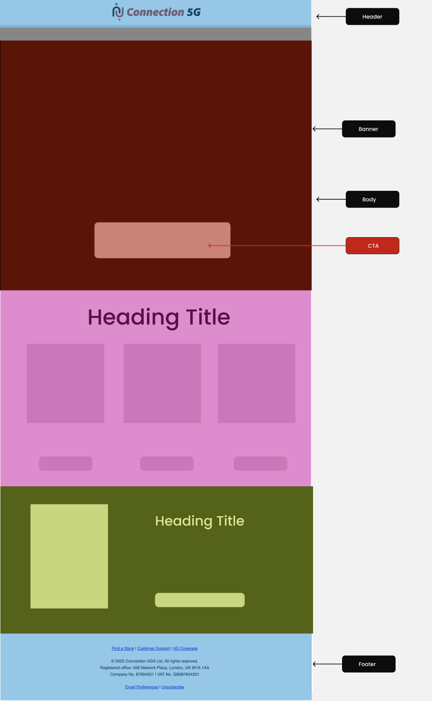
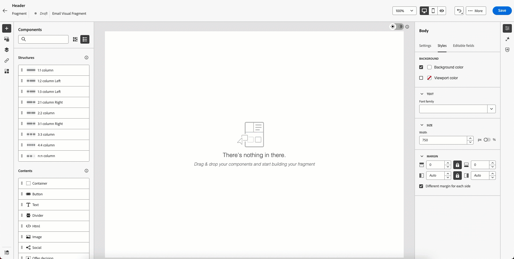
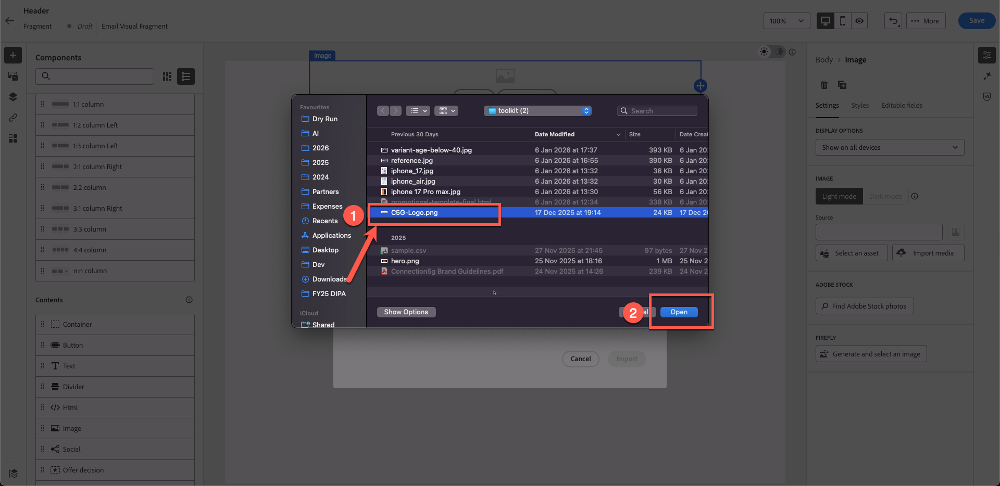

# 建立內容片段

## 使用範本和片段建立內容

**用途：**&#x200B;瞭解如何在Adobe Journey Optimizer中建立可重複使用的片段，然後在歷程中的真實電子郵件中套用這些片段。

## 學習目標

在本單元結束時，您將能夠：

1. 將電子郵件設計劃分為可重複使用的片段。
1. 建立頁首、頁尾、橫幅、本文和CTA片段。

## 為什麼片段很重要

片段可讓您建立可在電子郵件、行銷活動和歷程中重複使用的一致、品牌一致內容。

### 片段

可重複使用的建置區塊，例如：

- 標頭
- 頁尾
- CTA
- 橫幅
- 法律宣告

每當更新片段時，所有使用該片段的電子郵件都會自動更新。

## 這如何適合電子郵件建立

- **為很少變更的元素建立片段**。
- **建立使用這些片段的範本**。
- **在行銷活動電子郵件中使用範本**&#x200B;並自訂其內容。

以下是您將從此實驗室建立的最後一封電子郵件。

但設計團隊通常會為您提供如下的範本：

## 步驟1：建立內容片段

以下範本是通用的設計範本，我們的目標是將此範本劃分為可重複的內容區塊。 在Adobe journey optimizer中，這稱為&#x200B;**片段**。

第一步是確定我們需要建立多少片段。 在此範本中使用5個片段是可行的做法，如下所示。

我們已確定範本需要5個片段，如下所示。

- 頁首
- 橫幅
- CTA
- 內文
- 頁尾

>[!NOTE]
>
>在本練習中，您只會建立一個標頭片段來節省時間。

建立開頭為的標頭片段。 不過，在建立片段之前，請設定資產資料夾，因為資產環境已共用。 若要這麼做，請先建立您自己的資料夾。

1. 從左側導覽列中找出&#x200B;**內容管理**&#x200B;區段，然後按一下&#x200B;**Assets**。

   在左側導覽中使用Assets選項的

2. 按一下「Assets管理」區段下的&#x200B;**Assets**。

   Assets管理區段下的

3. 按一下&#x200B;**「建立資料夾」**&#x200B;按鈕以建立資料夾。

   在Assets區域中

4. 提供名字和姓氏之類的名稱。 例如： Nish\_Pithia\_LabAssets （您可以記住的資訊）

   

5. **建立新片段：**&#x200B;在[內容管理]下按一下&#x200B;**片段**&#x200B;並建立新片段。

   內容管理下的

   提供易記名稱，如下所示。 新增所有詳細資訊，如下所示：

   **名稱：**&#x200B;標頭

   **描述：**&#x200B;範本的片段標頭

   **型別：**&#x200B;選取視覺片段

   

6. 按一下右上角的&#x200B;**建立按鈕**。

   在新片段對話方塊右上角的

   如此將可開啟空白的片段建立者畫面。

7. 按一下「結構」下的1:1欄，然後在畫布上拖曳，如下所示。 （請按一下下方影像檢視動畫圖形）

   

8. 接下來，將&quot;**image**&quot;拖曳到我們剛才新增的1:1列

   

9. 上傳已提供的標誌影像。 按一下&#x200B;**「匯入媒體」按鈕**

   

10. **上傳標誌：**&#x200B;從影像的Toolkit資料夾上傳標誌(*C5G-Logo.png*)，然後按[下一步]。

![選取標誌上傳後按[下一步]](assets/building-content-fragments-upload-logo-click-next.png)

11. 選取您已建立的&#x200B;**資產資料夾**，然後按一下&#x200B;**匯入**。 檔案會儲存在您的資料夾中。

![選取建立的資產資料夾並按一下[匯入]](assets/building-content-fragments-select-asset-folder-import.png)

12. 標誌已正確放置，但太大，需要重新調整大小。 若要調整標誌大小，請更新其屬性。 按一下&#x200B;**樣式標籤**，然後拖曳滑桿將寬度設定為40%，如下所示。

>[!NOTE]
>
>請注意，當切換按鈕開啟時，40數字代表%，而非畫素。 如果您想要絕對的畫素完美值，請將按鈕切換為px。

13. 按一下&#x200B;**「儲存」**，您的片段就會儲存。 您會在確認時收到綠色列通知。

儲存片段後

14. 儲存的片段處於草稿模式。 您必須先發佈它才能使用。 按一下&#x200B;**上一步**&#x200B;按鈕。

15. 按一下&#x200B;**發佈**&#x200B;按鈕。 您看到訊息「正在發佈片段，這可能需要一些時間。 我們會在完成後通知。」 確認時。 您的片段已準備好用於建立範本。

您看到狀態變更為&#x200B;**「即時」**。 此時，您已完成建置標題片段，此片段將用於下一個步驟。

>[!NOTE]
>
>請注意，在此練習中，您僅建立一個片段。 實際上，架構師可以選擇建立多個片段，例如頁首、頁尾或其他可重複使用的元件。

## 重述

在本模式中，您成功：

- 將電子郵件劃分為可重複使用的標頭片段
- 已建立標頭內容區塊

您現在已準備好繼續下一個模組 — **建置內容範本**，您將使用您建立的片段來產生新範本。
