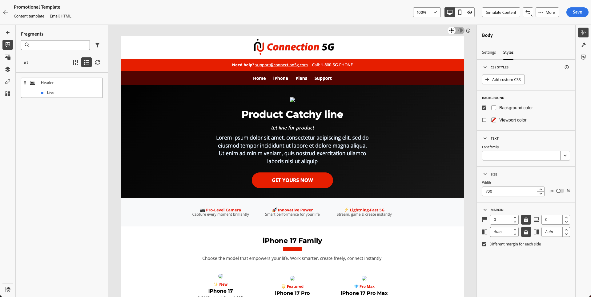

# 建立內容範本

## 使用範本和片段建立內容

**用途：**&#x200B;瞭解如何在Adobe Journey Optimizer中建立可重複使用的範本

## 學習目標

在本單元結束時，您將能夠：

1. 使用匯入的HTML和片段建置完整的電子郵件範本。

## 範本為何重要

範本可讓您建立可在電子郵件、行銷活動和歷程中重複使用的一致性品牌校準內容。

### 範本

該結構的Blueprint：

- 頁首位置
- 內文內容區域
- 頁尾區域
- 標準版面樣式

範本可確保跨團隊的品牌一致性，並節省大量的建立時間。

## 使用片段建立新範本

範本可協助使用者重複使用各行銷活動的完整版面配置。 Adobe Journey Optimizer中的內容範本是功能強大的工具，旨在簡化和簡化您為行銷活動和歷程建立可重複使用內容的方式。 無論您是製作電子郵件、簡訊或推播通知，範本都能提供預先設計的結構，讓您輕鬆自訂並在專案之間共用，協助您節省時間。

為了加快並改善設計流程，請建立獨立範本，以便在各個Journey Optimizer促銷活動和歷程中輕鬆重複使用自訂內容。

此功能可讓內容導向的使用者使用行銷活動或歷程以外的範本。 行銷使用者可在自己的歷程或行銷活動中重複使用並調整這些獨立內容範本。

## 建立範本

1. 移至&#x200B;**內容管理→內容範本**。

2. 按一下&#x200B;**建立範本**，然後填寫下列內容：
   - **名稱：** `Promotional Template`
   - **描述：** `Promotional Template for phone products`
   - **頻道：** `Email`

3. 按一下&#x200B;**建立**。

## 新增主旨行並開啟電子郵件設計工具

1. 新增主旨列： `Promotional Template`並按一下電子郵件內文&#x200B;**上的**&#x200B;以開啟它進行編輯

2. 您會看到三個選項：
   1. 從頭開始設計
   2. 自行撰寫程式碼
   3. 匯入HTML

選取第三個選項。 按一下&#x200B;**匯入HTML**

![從三個設計選項中選取[匯入HTML]選項](assets/building-content-template-select-import-html-option.png)

## 匯入提供的HTML範本

1. 從Toolkit資料夾`promotional-template-final.html`上傳範本html檔案

2. 按一下[匯入]按鈕以&#x200B;**匯入**&#x200B;範本。

3. 等待配置呈現。 您會注意到影像連結中斷和品牌遺失等問題。 （這是正常行為，因為我們有預留位置資產）

## 探索範本結構

### 左側面板

Adobe Journey Optimizer (AJO)中的「**結構**」和「**內容**」元件是設計電子郵件、登陸頁面和內容片段時所使用的基本元素。 結構會定義版面配置架構，而「內容」則會提供置於這些版面配置內的實際建置區塊。

Adobe Journey Optimizer中的內文區段是您的電子郵件或頁面內容的主要容器。 它是視覺設計空間的根目錄，其中所有結構元件（欄、版面）和內容元件（文字、影像、按鈕等） 是巢狀的。

### 右側面板

Adobe Journey Optimizer內文區段底下的&quot;**設定**&quot;和&quot;**樣式**&quot;選項可讓您定義電子郵件或頁面的基本外觀和配置。 這些控制項會影響整個設計，因為主體是所有元件的父件。

在左側邊欄上，您可以找到下列區段：

- 片段
- 檔案
- 內文結構
- 已追蹤的URL

您會看到在上一個練習中建立的標頭片段顯示在這裡，如下所示。 確定您的頁首片段以藍點顯示為即時，而不是在草稿模式下。 請花點時間檢查其餘章節。

> [!NOTE]
>
>如果您在此處看不到您的片段，則表示您未正確儲存該片段，需要重新上傳。

## 插入標題片段

現在改善範本。 您已建立頁首和頁尾。

1. 將&#x200B;**1:1資料行**&#x200B;拖曳到現有內容上方。

您會看到類似這樣的內容。

在內容上方新增欄之後

2. 您的背景使用範本背景顏色，目前為黑色。 將其&#x200B;**背景顏色設定為白色。 按一下右側邊欄上[樣式]索引標籤中的**，並使用檢色器中的白色。

3. 開啟&#x200B;**片段**&#x200B;並拖曳您的&#x200B;**標頭**&#x200B;片段。

4. 請注意，標題片段已整齊對齊您的範本，如下所示。

5. 按一下&#x200B;**儲存**&#x200B;按鈕以儲存您的範本，然後按一下&#x200B;**上一步**。

![按一下[上一步]之前儲存範本的儲存按鈕](assets/building-content-template-click-save-button-template.png)

>[!NOTE]
>
>請注意，您可能會看到某些損毀的影像。 我們稍後會修正此問題。

## 重述

在本模式中，您成功：

- 已匯入HTML以建立完整的促銷範本

您現在已準備好移至下一個模組 — **建立電子郵件**
