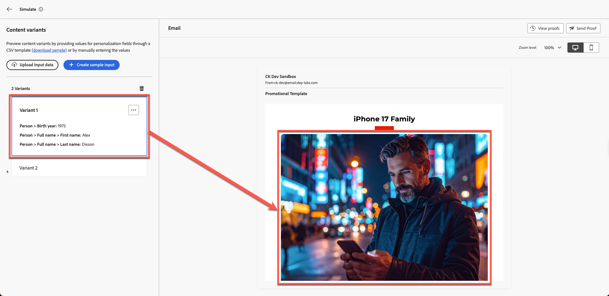

# 內容模擬

**用途：**&#x200B;使用Adobe Journey Optimizer的模擬和校樣工具來驗證個人化、條件邏輯和內容變體。

## 學習目標

在本單元結束時，您將能夠：

1. 上傳並使用測試設定檔資料進行模擬。
1. 驗證個人化欄位和變體邏輯。
1. 測試遺失或不相符資料的遞補行為。

## 簡介

在這個最終模組中，您將使用Adobe Journey Optimizer中的模擬工具，以&#x200B;**兩個條件式變體**&#x200B;測試您的電子郵件。
這可讓您預覽不同客戶將會如何體驗您的個人化訊息，在啟動行銷活動之前確保準確性。

您將會使用工具組中的範例測試設定檔檔案&#x200B;**sample.csv**。

中的測試設定檔檔案sample.csv範例

## 開啟模擬工具

1. 開啟您已完成的電子郵件。
1. 按一下&#x200B;**模擬內容**。
1. 選取&#x200B;**模擬內容變化**。

![按一下[模擬內容]並選取[模擬內容變數]](assets/content-simulation-click-simulate-content-variation.png)

幾秒後會開啟模擬面板。

## 上傳測試設定檔資料

1. 從您的Toolkit資料夾開啟&#x200B;**sample.csv**。
   - **Alex** → 40歲以上
   - **Jason**→40歲以下
2. 按一下&#x200B;**上傳輸入資料**。

&#x200B;3. 選擇&#x200B;**sample.csv**&#x200B;並按一下&#x200B;**繼續**。

![選擇sample.csv並按一下[繼續]](assets/content-simulation-choose-sample-csv-continue.png)

AJO會處理檔案並準備預覽。

## 檢閱變體演算

AJO會根據上傳的設定檔，並排顯示這兩個變體。

**預期結果：**

- **Alex**→看到&#x200B;**變體1** （年齡超過40歲）

歲的Alex設定檔轉譯Variant 1

如果您向上捲動，現在也會看到具有名稱的個人化欄位，如下所述。

變體1中為Alex顯示的個人化名稱欄位

- **Jason** →看到&#x200B;**變體2** （年齡低於40歲）

歲的Jason設定檔轉譯Variant 2

還有Jason的全名。 太酷了！

中為Jason顯示的個人化全名欄位

## 驗證遞補行為

**遞補和預設值：**&#x200B;檢查您的電子郵件是否妥善處理任何遺失資料或不相符的情況。 例如，模擬具有空白出生年欄位的設定檔，或不符合任何目標優惠方案資格的設定檔。 預覽應顯示預設內容區塊或合理的預留位置，而非損壞或空白內容。 如果您的模擬顯示內容應位於的空白區段，這表示您可能需要在設計中設定遞補優惠或預設文字。

## 重述

在本模式中，您成功：

- 使用範例設定檔的模擬個人化內容
- 已驗證的變體切換邏輯
- 已確認的個人化欄位會正確填入

您現在已準備好進行下一個模組 — **品牌一致性**，
您將使用AI根據Connection 5G品牌准則評估電子郵件。
