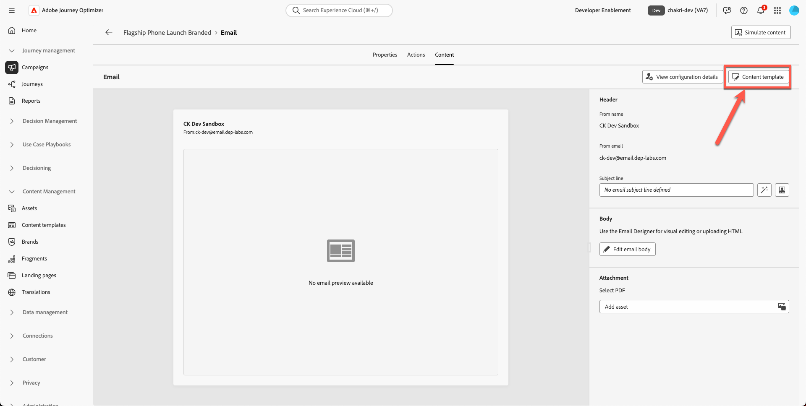

# 建立電子郵件

## 使用範本建立內容

**用途：**&#x200B;瞭解如何在Adobe Journey Optimizer中建立可重複使用的範本，然後將其套用至行銷活動內的實際電子郵件中。

## 學習目標

在本單元結束時，您將能夠：

1. 建立新的行銷活動，並使用您的新品牌範本。
1. 更新主圖影像、產品影像、按鈕和版面樣式。

## 在行銷活動中建立和更新電子郵件

### 目標

在本練習中，我們將瞭解如何將您建立的範本套用至歷程中的電子郵件。 在理想情況下，您可以使用任何現有的歷程或行銷活動，並將其電子郵件內容取代為標準化範本，以確保品牌一致性及更快速地執行。

此步驟會示範如何跨歷程重複使用範本，讓團隊可更新設計，而不需從頭重建電子郵件。

## 建立新的電子郵件行銷活動

1. 返回主畫面，然後按一下&#x200B;**Journeys Management → Campaigns**。
2. 按一下&#x200B;**建立行銷活動**

&#x200B;3. 選取「**協調流程 — 行銷**」並按一下&#x200B;**確認**

&#x200B;4. 為您的行銷活動命名`Flagship Phone Launch Branded`。 按下&#x200B;**儲存**&#x200B;按鈕。

![為行銷活動旗艦手機上市品牌命名，然後按一下[儲存]](assets/creating-the-email-name-campaign-save.png)

&#x200B;5. 按一下&#x200B;**+符號**&#x200B;並選取&#x200B;**讀取對象**&#x200B;活動

&#x200B;6. 下一步是選取&#x200B;**「讀取對象」**&#x200B;方塊，然後按一下&#x200B;**對象資料夾圖示**

&#x200B;7. 選取&#x200B;**dep：對iPhone 17**&#x200B;對象感興趣並按一下「**新增對象**」按鈕

![選取對iPhone 17對象感興趣並按一下[新增對象]](assets/creating-the-email-select-audience-add-button.png)

&#x200B;8. 選取實體 — **dep-rel：客戶帳戶 — customer\_id** （或任何與此部分無關的專案）
&#x200B;9. 按一下&#x200B;**+符號**&#x200B;以新增&#x200B;**電子郵件活動**，然後從頻道活動中選取&#x200B;**電子郵件**。

&#x200B;10. 按一下&#x200B;**編輯電子郵件**。

&#x200B;11. 按一下&#x200B;**動作標籤**&#x200B;並選取&#x200B;**您的**&#x200B;電子郵件設定。 您的沙箱可能會將此顯示為關聯式電子郵件。 （選取任一）

已選取電子郵件設定的

&#x200B;12. 按一下&#x200B;**內容標籤**

電子郵件編輯器中的

&#x200B;13. 按一下&#x200B;**套用內容範本**

在電子郵件編輯器中

&#x200B;14. 選取您建立的範本&#x200B;**「促銷範本」**，然後按一下&#x200B;**確認**

![選取促銷範本並按一下[確認]](assets/creating-the-email-select-promotional-template-confirm.png)

&#x200B;15. 按一下&#x200B;**編輯電子郵件內文**

套用範本後

&#x200B;16. 確認新的頁首、主圖、頁尾和內容區塊顯示正確。

## 取代主圖影像和產品影像

變更主圖與手機影像。 您必須從Toolkit資料夾上傳內容至資產。 目前您的產品主圖橫幅影像是預留位置。

1. 按一下損壞的主圖橫幅影像。

&#x200B;2. 移除暫存來源URL。

&#x200B;3. 按一下&#x200B;**匯入媒體**

主圖影像的

&#x200B;4. 從您的工具組上傳`hero.png`。 （您可以拖曳檔案）

&#x200B;5. 按[下一步]，**選取**&#x200B;您資產資料夾&#x200B;**，然後按[匯入]**&#x200B;**&#x200B;**

&#x200B;6. 您的電子郵件範本即將推出。 其外觀如下。 按一下&#x200B;**「儲存」**&#x200B;以儲存您的工作。

## 選擇性練習

### 取代產品影像

請更新所有的產品影像（toolkit資料夾中提供的影像），並為您的喜好新增圓框線。 您的電子郵件看起來比較好，沒有任何損毀的連結，如下所示。 對所有產品卡片重複此程式。

## 重述

在本模式中，您成功：

- 使用您的品牌範本，以電子郵件建立新的行銷活動
- 更新主圖與產品影像
- 增強的樣式

您現在已準備好進入下一個模組 — **AI助理與內容個人化**，您將在其中使用AI精簡文字並自動產生影像。
