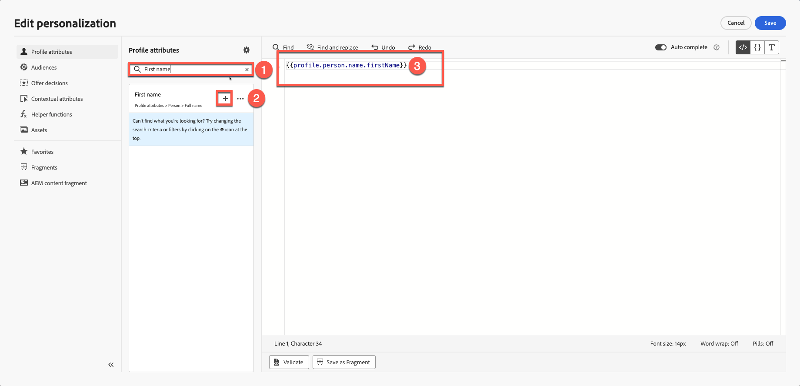
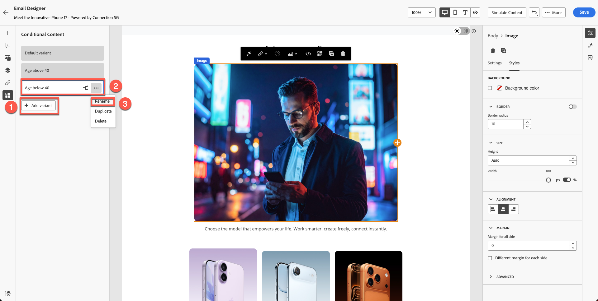

# Personalization與內容實驗

**用途：**&#x200B;瞭解如何使用設定檔屬性個人化電子郵件內容、建立動態內容變體，以及在Adobe Journey Optimizer中套用條件式邏輯。

## 學習目標

在本單元結束時，您將能夠：

1. 使用設定檔屬性新增個人化欄位。
1. 使用個人化編輯器和把手語法。
1. 根據設定檔邏輯建置動態內容變體。
1. 為個人化內容區塊建立條件式規則。
1. 根據出生年份等屬性切換的測試變體。

## 簡介

Adobe Journey Optimizer中的個人化可啟用大規模的一對一體驗。
在本單元中，您將會：

- 插入個人化文字（名字和姓氏）
- 建立以年齡為基礎的內容變體
- 使用設定檔屬性套用條件式邏輯
- 準備要在模組7中模擬的內容

Adobe Journey Optimizer中的Personalization可讓您根據個別設定檔、行為和內容資料，動態自訂內容，以製作量身打造且具影響力的客戶體驗。 無論您是建立個人化電子郵件、通知或優惠方案，提供的工具和技巧可讓您輕鬆地在正確的時間將正確的訊息連結到正確的人。 瞭解Personalization編輯器、Handlebars語法和Adobe Experience Platform資料如何搭配運作，將您的想法化為現實，探索具有運算式片段的可重複使用內容區塊，並探索進階協助程式函式，以解鎖更深入的可能性。 每個主題都會逐步建置您的技能，確保您已準備好充滿信心地設計個人化歷程。

## 新增基本個人化

此部分練習可讓個人化保持簡單。 根據設定檔將名字和姓氏新增至電子郵件。 Personalization是以您定義的XDM個別設定檔結構描述所管理的設定檔資料為基礎。 XDM Individual Profile結構描述是您唯一可用來個人化Journey Optimizer內容的結構描述。

1. 開啟在舊版模組中建立的電子郵件。
2. 在主圖示題上方新增文字區塊，內容為： **嗨，**
3. 按一下&#x200B;**個人化**&#x200B;圖示。

   電子郵件文字工具列中的

4. 搜尋&#x200B;**第一個名******。

   

5. 按一下&#x200B;**+**&#x200B;以將其加入運算式區域。
6. 在&#x200B;**名字**&#x200B;欄位後新增&#x200B;**空間**。

   ![在運算式區域的[名字]欄位後面新增空格](assets/personalization-and-content-experimentation-add-space-after-first-name.png)

7. 重複上述程式，但這次搜尋並新增&#x200B;**姓氏**。

   您的最終語法會顯示名字和姓氏變數，兩者之間有清楚的區隔。

   

8. 驗證片段。 請注意，您可以選擇將內容另存為片段。 如果您使用完整名稱來建立其他電子郵件內容，這是一個絕佳機會。 請略過此步驟並前往下一個步驟。
9. 按一下&#x200B;**儲存**

您的檢視如下所示。 大括弧由變陣列成，每個個人都會收到含有其名稱的電子郵件。

此時，您已瞭解如何為個別設定檔新增個人化。

## 動態內容簡介

Adobe Journey Optimizer中的動態內容可讓您建立順暢地因應對象需求的個人化訊息。 透過使用條件規則，您可以根據設定檔屬性、對象成員資格或即時事件來量身打造電子郵件、簡訊和推播通知。 無論您是要針對不符合特定條件的情況建立遞補訊息，還是要儲存可重複使用的規則以維持一致性，個人化編輯器和電子郵件Designer都能提供直覺式的工具，將您的想法化為現實。

這是將部分條件式內容新增至電子郵件，並根據使用者年齡進行個人化的完美使用案例。

請參考您的結構描述：您有&#x200B;**&quot;person.birthYear&quot;**&#x200B;作為出生年。 此屬性會派上用場。 根據年齡鎖定目標並設定行銷活動。

在本練習中，您將根據年齡建立兩個變體。 一種變體會鎖定在40歲以上的使用者，另一種則鎖定在40歲以下的使用者（或許20到30歲之間）。 在1986年以前出生的人被認為是40歲以上，而在1986年或以後出生的人被認為是40歲以下。

**年齡邏輯**

您將使用設定檔屬性`person.birthYear`。

| 目標群組 | 條件 |
| ------------ | ----------------- |
| 40以上 | birthYear \&lt; 1986 |
| 40以下 | birthyear >= 1986 |

## 建立兩個影像變體

是否記得我們在先前的模組中建立的這個區塊？ 您的影像與我的不同。

為40歲以下的人建立另一個影像（請記住，您為40多歲的人建立了Firefly影像），並將其用於此練習。

1. 選取現有的影像區塊。 （按一下影像）並按一下&#x200B;**條件式區塊**。
2. 按一下&#x200B;**新增變體**。

   在條件影像區塊上新增

3. 將第一個變體重新命名為&#x200B;**年齡超過40**&#x200B;歲。

   以上的年齡

4. 按一下&#x200B;**「新增變體」**&#x200B;按鈕以建立新的變體，並將其重新命名為&#x200B;**年齡低於40歲。**

   

5. 您可能可以使用「20年前Firefly」之類的提示來建立影像。 但是，為了節省時間，我們的工具箱中已經有名為&quot;**variant-age-below-40.jpg**.
6. 按一下影像並匯入媒體。

   

7. 選取&#x200B;**variant-age-below-40.jpg**&#x200B;影像。 按一下[下一步] ****&#x200B;匯入它，最後再按資料夾中的[匯入] **** （預設應該已在資料夾中）。

   

8. 嘗試在變體之間切換，您會看到套用的不同影像。

到目前為止，您已建立設計，但尚未套用邏輯。 下一個步驟會套用邏輯。

## 將條件式邏輯套用至變數

這兩個變體都已就緒，但您尚未套用條件式邏輯。

## 「40歲以上」的邏輯

1. 選取並將&#x200B;**年齡暫留在40**&#x200B;個變體以上。
2. 按一下&#x200B;**條件式邏輯**&#x200B;圖示。

   40歲以上變體的

3. 建立新條件。

   

4. 在屬性清單中搜尋&#x200B;**年**。
5. 將&#x200B;**出生年份**&#x200B;拖曳到畫布中。
6. 將條件設為：
   - **birthYear \&lt; 1986**

   

7. 為條件命名： **年齡超過40**
8. 新增說明 — &quot;**40**&#x200B;歲以上人員的影像變體&quot;
9. 按一下&#x200B;**新增→選取**。

![按一下[新增]，然後選取40歲以上的年齡條件](assets/personalization-and-content-experimentation-click-add-select-age-above-40.png)

## 「40歲以下」的邏輯

1. 選取並暫留&#x200B;**40**&#x200B;區段以下的年齡。
2. 重複這些步驟，但將邏輯變更為：
   - **birthYear >= 1986**

   

3. 為條件命名： **年齡低於40**
4. 新增說明。 &quot;**低於40**&#x200B;的人員的影像變體&quot;
5. 按一下&#x200B;**新增→選取**。

![按一下[新增]，然後選取40歲以下的年齡條件](assets/personalization-and-content-experimentation-click-add-select-age-below-40.png)

## 驗證變體切換

在兩個變體之間切換以確保：

- 出現正確的影像
- 邏輯已正確套用
- 沒有變體顯示為「未套用條件」

變體： **年齡超過40**

變體： **年齡低於40**

按一下[**儲存**]按鈕以儲存電子郵件。

## 重述

在本模式中，您已成功學習如何：

- 新增一對一訊息的個人化欄位
- 建立動態影像變體
- 根據年齡套用條件規則

您現在已準備好進行下一個模組 — **內容模擬**，以測試這兩個變體。
