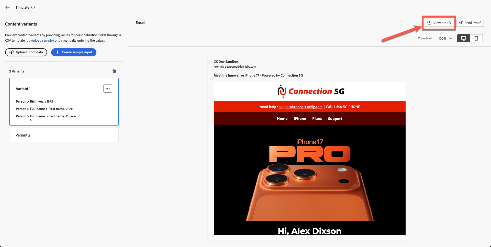

# 測試電子郵件

## 學習目標

在本單元結束時，您將能夠：

- 從Adobe Journey Optimizer電子郵件編輯器傳送校樣電子郵件。
- 使用校樣電子郵件驗證個人化內容和條件變體。
- 驗證收件匣中的證明電子郵件傳遞，包括處理垃圾郵件和已剪裁的訊息。
- 檢閱Adobe Journey Optimizer中的證明傳遞記錄、時間戳記和變體。
- 確認電子郵件內容正確無誤、個人化且已準備好啟用。

## 傳送證明電子郵件（選填，但建議使用）

此時，您已瞭解我們不僅可個人化設定檔屬性，也可使用屬性來建立條件式邏輯，以決定您要顯示的內容。 Adobe Journey Optimizer功能極為強大，為行銷人員提供極大的彈性。

1. 按一下&#x200B;**模擬內容**。
2. 選取&#x200B;**模擬內容變化**。

![按一下[模擬內容]並選取[模擬內容變數]](assets/content-simulation-click-simulate-content-variation.png)

模擬面板隨即開啟。

3. 按一下&#x200B;**傳送證明**。

4. 新增您自己的個人電子郵件地址。

>[!NOTE]
>
>請注意，有時您的公司電子郵件會封鎖來自沙箱的電子郵件。 我建議您使用個人電子郵件。

5. 選取兩個變體。
6. 新增主旨列前置詞
   1. 變數1:40以上
   2. 變體2:40以下
7. 按一下&#x200B;**傳送證明**。 您收到綠色的確認訊息&quot;**已成功傳送校樣**&quot;

確認兩封電子郵件均已送達您的收件匣。

>[!NOTE]
>
>根據篩選條件，校訂電子郵件可能會進入&#x200B;**垃圾訊息**。

您可能會體驗到已剪裁的訊息，但這是可以的，因為某些頁尾連結不是真實的。 如果按一下連結，您會看到這兩封包含變體的電子郵件皆已通過。

按一下連結後

### 在AJO中驗證證明傳遞

最後，您也可以在Adobe Journey Optimizer中看到證明傳送。

1. 返回電子郵件編輯器。
2. 返回電子郵件建立畫面並按一下&#x200B;**檢視校訂**。
3. 檢閱傳遞記錄、時間戳記和已傳送的變體。

電子郵件建立畫面上的

您注意到您的校訂電子郵件詳細資訊。

## 重述

在本模式中，您成功：

- 在AJO中傳送及驗證的證明電子郵件

您現在已經完成完整的Connection 5G AJO Lab歷程，並驗證您的電子郵件是否準確、個人化且可立即啟用。
