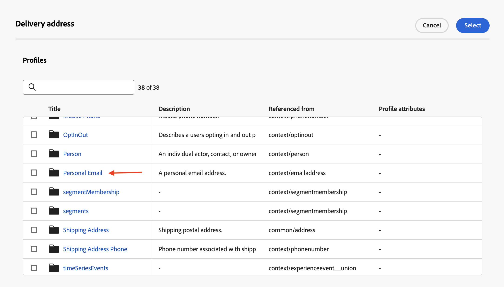
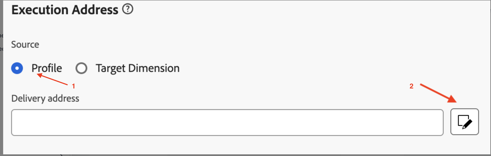

# 為設定檔進行設定

## 目標

在接下來的步驟中，您將使用`personalEmail.address` AEP設定檔屬性來建立包含歷程與協調行銷活動的電子郵件頻道設定

## 建立管道設定

1. 瀏覽至&#x200B;**頻道設定**，可在&#x200B;**管理→頻道→一般設定**&#x200B;下找到
2. 按一下&#x200B;**建立組態**&#x200B;按鈕

3. 在建立精靈中設定下列值：
   - **名稱：** `Profile-Email`
   - **頻道：** `Email`
   - **行銷動作：** `Email Targeting`

>[!NOTE]
>
>選取「電子郵件」作為頻道時，會顯示新區段&#x200B;**電子郵件設定**。

## 設定電子郵件型別

將&#x200B;**電子郵件型別**&#x200B;設定為&#x200B;**行銷**

## 設定子網域

從&#x200B;**子網域**&#x200B;下拉式清單中，選取&#x200B;**email.dep-labs.com**

## 設定IP集區詳細資料

從&#x200B;**IP集區**&#x200B;下拉式清單中，選取&#x200B;**行銷**

已選取行銷的

## 設定清單取消訂閱

1. 確定清單取消訂閱的切換是&#x200B;**啟用**
1. 在「清單取消訂閱」偏好設定區域下，確定所有核取方塊皆為&#x200B;**已核取**
1. 在「連結管理」下，確定已選取&#x200B;**受管理的Adobe**
1. 同意層級請確定此層級已設為&#x200B;**管道**

## 設定標頭引數

1. 設定下列欄位，如下所示：
   - **來源名稱：** `DEP Labs`
   - **來自電子郵件前置詞：** `dep`
   - **回覆名稱：** `DEP Labs Support`
   - **回覆電子郵件：** `reply@email.dep-labs.com`
   - **錯誤電子郵件首碼：** `error`

## 設定密件副本電子郵件

將此項留空

>[!NOTE]
>
>您可以透過將電子郵件傳送到密件副本收件匣來保留已傳送之電子郵件的副本。 輸入您選擇的電子郵件地址，以便每封電子郵件都會以密件方式傳送至此密件副本地址。 請注意，密件副本地址網域必須不同於委派給 Adobe 的任何子網域。 此功能為選用。 *如何使用密件副本處理電子郵件*

## 設定電子郵件重試引數

保留&#x200B;**小時**&#x200B;的預設設定為&#x200B;**84**

## 設定URL追蹤引數

保留預設設定

## 執行詳細資料

1. 完成&#x200B;**執行詳細資料**&#x200B;區段。 在&#x200B;**歷程與動作**&#x200B;索引標籤 — > **執行維度**&#x200B;下，選取&#x200B;**設定檔**&#x200B;做為&#x200B;**Source**，然後按一下&#x200B;**執行地址**&#x200B;區段下&#x200B;**傳遞地址**&#x200B;的編輯圖示

2. 按一下標題為&#x200B;**個人電子郵件**&#x200B;的資料夾以開啟

3. 按一下`Address`欄位上的&#x200B;**核取方塊**，然後按一下&#x200B;**選取**&#x200B;按鈕

4. 針對&#x200B;**設定檔**，`personalEmail.address`現在已設定為&#x200B;**執行地址**&#x200B;區段下的&#x200B;**傳遞地址**

5. 按一下[協調的行銷活動]索引標籤，然後&#x200B;**核取**[啟用]核取方塊。

6. 在執行維度標題下，設定以下專案：
   - **針對每個**&#x200B;傳遞一封郵件`Target Dimension`
   - **設定檔目標Dimension：** `dep-rel: Customer Account - customer_id`

7. 在執行位址下設定以下專案：
   - **Source：** `Profile`
   - **傳遞位址：** `click on the Edit icon`

8. 搜尋並按一下`Personal Email`資料夾以開啟它

9. 選取[個人電子郵件]資料夾中的`Address`欄位並按一下[選取] ****

10. 針對&#x200B;**協調的行銷活動**，**dep-rel：客戶帳戶 — customer\_id**&#x200B;已設定為&#x200B;**執行維度**&#x200B;的&#x200B;**設定檔目標Dimension**，**執行地址**&#x200B;的&#x200B;**Source**&#x200B;為&#x200B;**設定檔**，而`personalEmail.address`為&#x200B;**傳遞地址**

>[!NOTE]
>
>針對協調行銷活動，您會以電子郵件定位客戶帳戶，因此您只需為每個設定檔傳送&#x200B;*封訊息*。  您使用的執行位址來自設定檔本身（亦即儲存在&#x200B;**personalEmail.address**&#x200B;屬性下的AEP設定檔中的內容）

## 檢閱並儲存

1. 再次檢視所有詳細資料以確保其相符。
1. 向上捲動並按一下&#x200B;**提交**。

> [!NOTE]
>
>已觀察到處理電子郵件通道設定最多需要2小時！  啊呀！
>
>在您等待此管道設定進行時，請繼續進行下一個練習。

>[!TIP]
>
>🚀一旦電子郵件通道設定狀態為「**作用中**」，它即已準備就緒，現在可以直接在「協調的行銷活動」中的&#x200B;**電子郵件活動**&#x200B;中選取。

## 重述

您現在已瞭解如何建立電子郵件通道設定，以將AEP設定檔屬性用於歷程和協調行銷活動。
