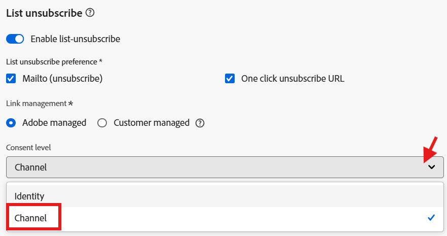
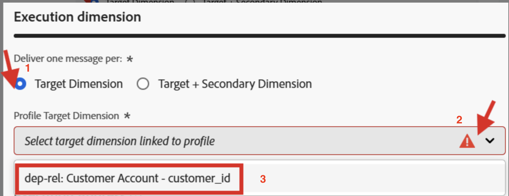
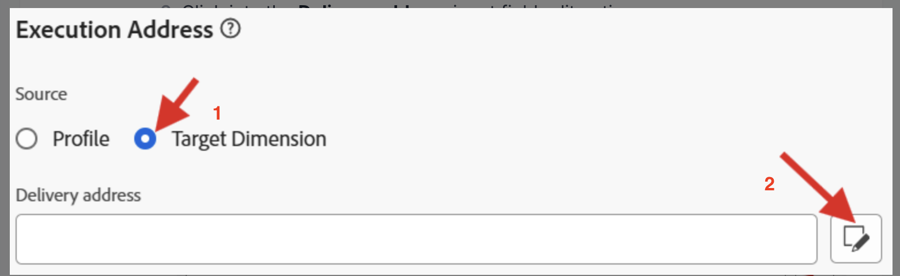

# 設定關聯式

## 目標

在接下來的幾個步驟中，您將使用關聯式結構描述`dep-rel: Customer Account`中的`email`屬性，建立僅用於協調行銷活動的電子郵件通道設定

## 建立管道設定

1. 瀏覽至&#x200B;**頻道設定**，可在&#x200B;**管理→頻道→一般設定**&#x200B;下找到
2. 按一下&#x200B;**建立組態**&#x200B;按鈕

&#x200B;3. 在建立精靈中設定下列值：
   - **名稱：** `Relational-Email`
   - **頻道：** `Email`
   - **行銷動作：** `Email Targeting`

>[!NOTE]
>
>選取「電子郵件」作為管道時，會顯示新的「電子郵件設定」區段。

## 設定電子郵件型別

將&#x200B;**電子郵件型別**&#x200B;設定為&#x200B;**行銷**

## 設定子網域

從&#x200B;**子網域**&#x200B;下拉式清單中，選取&#x200B;**email.dep-labs.com**

## 設定IP集區詳細資料

從&#x200B;**IP集區**&#x200B;下拉式清單中，選取&#x200B;**行銷**

已選取行銷的

## 設定清單取消訂閱

1. 確定清單取消訂閱的切換是&#x200B;**啟用**
1. 在「清單取消訂閱」偏好設定區域下，確定所有核取方塊皆為&#x200B;**已核取**
1. 在「連結管理」下，確定已選取&#x200B;**受管理的Adobe**
1. 同意層級請確定此層級已設為&#x200B;**管道**

## 設定標頭引數

1. 設定下列欄位，如下所示：
   - **來源名稱：** `DEP Labs`
   - **來自電子郵件前置詞：** `dep`
   - **回覆名稱：** `DEP Labs Support`
   - **回覆電子郵件：** `reply@email.dep-labs.com`
   - **錯誤電子郵件首碼：** `error`

## 設定密件副本電子郵件

將此項留空

>[!NOTE]
>
>您可以透過將電子郵件傳送到密件副本收件匣來保留已傳送之電子郵件的副本。 輸入您選擇的電子郵件地址，以便每封電子郵件都會以密件方式傳送至此密件副本地址。 請注意，密件副本地址網域必須不同於委派給 Adobe 的任何子網域。 此功能為選用。 *如何使用密件副本處理電子郵件*

## 設定電子郵件重試引數

保留&#x200B;**小時**&#x200B;的預設設定為&#x200B;**84**

## 設定URL追蹤引數

保留預設設定

## 執行詳細資料

1. 在「已協調的行銷活動」索引標籤中，並&#x200B;**勾選**「已啟用」核取方塊。

&#x200B;2. 在執行維度下設定以下專案：
   - **針對每個**&#x200B;傳遞一封郵件`Target Dimension `
   - **設定檔目標Dimension：** `dep-rel: Customer Account - customer_id`

&#x200B;3. 在執行位址下設定以下專案：
   - **Source：** `Target Dimension`
   - **傳遞位址：** `click on the Edit button`

&#x200B;4. 在快顯視窗中，按一下資料夾&#x200B;**dep-rel：客戶帳戶**

&#x200B;5. 選取&#x200B;**電子郵件**&#x200B;並按一下&#x200B;**選取**&#x200B;按鈕

&#x200B;6. 完成後，您的最終執行詳細資訊看起來像下面的熒幕擷圖

>[!NOTE]
>
>針對協調行銷活動，您會以電子郵件定位客戶帳戶，因此每個Target Dimension只需要傳送一封訊息。  您使用的執行位址來自目標Dimension本身（亦即儲存在&#x200B;**電子郵件**&#x200B;位址的&#x200B;**dep-rel：客戶帳戶**&#x200B;資料表中的專案）

## 檢閱並儲存

1. 再次檢視所有詳細資料以確保其相符。
1. 向上捲動並按一下&#x200B;**提交**。
1. 完成後，您會看到兩個電子郵件通道設定，兩者都可能處於「處理」狀態。

>[!WARNING]
>
>已觀察到處理電子郵件通道設定最多需要2小時！

## 重述

您現在已瞭解如何建立電子郵件通道設定，以使用關聯式結構描述屬性進行協調的行銷活動。
