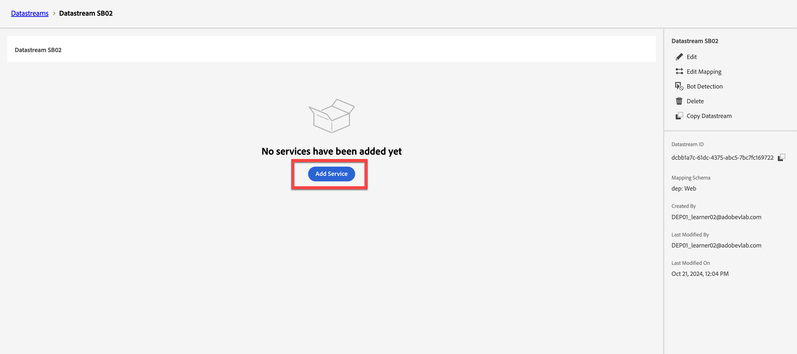
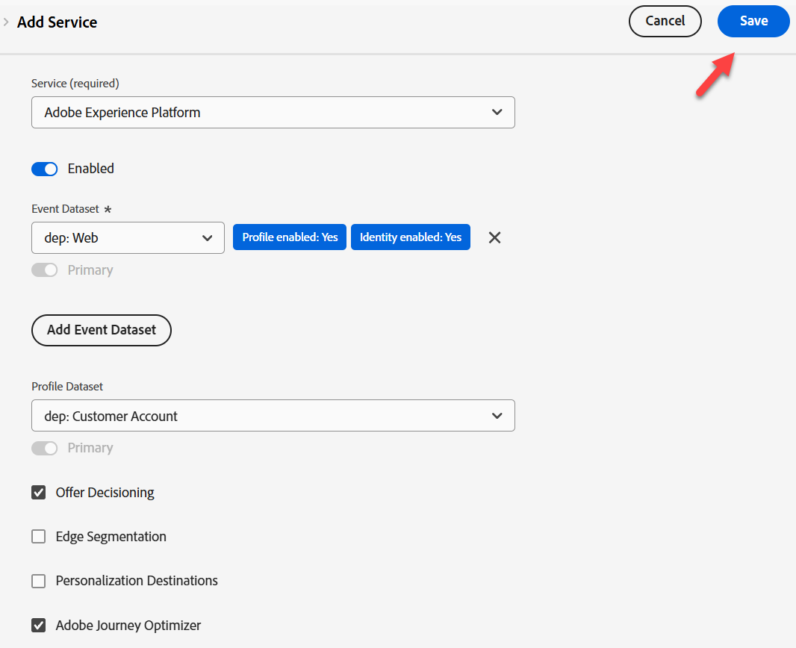

# 建立資料串流

## 學習目標

使用啟用Edge事件處理所需的服務來建立和設定資料流。

資料流定義將利用它的服務。

- 將資料傳送至Edge時，您可以指定要使用的資料流
- 傳送到這些資料串流的資料隨後可以根據設定的服務採取動作
  - Adobe Experience Platform

## 建立新的資料流

1. 在左側邊欄中&#x200B;**資料彙集**&#x200B;下，按一下&#x200B;**資料串流**
1. 然後按一下「**新增資料流**」以建立一個

![含有[新增資料流]按鈕的[資料流]清單](assets/create-datastream-new-datastream-button.png)

## 設定資料串流

使用下列資訊設定資料流：

1. 名稱 — > **資料流SB + \&lt;沙箱名稱> （亦即Datastream SB01）**
1. 對應結構描述 — > **dep： Web**
1. 如果要擷取此資訊，請將&#x200B;**開啟** **地理位置與網路查詢**&#x200B;下的所有選項切換為。
1. 完成時，按一下&#x200B;**儲存**&#x200B;按鈕

>[!WARNING]
>
>請勿按一下儲存並新增對應。  如果您不小心這麼做，只要取消即可

儲存資料流後，您會看到下列畫面：

儲存新的資料流後

## 新增Adobe Experience Platform服務

這可讓您將資料傳送至中心，並針對此資料流收到的資料在資料集中著陸。

1. 按一下熒幕中央的藍色&#x200B;**新增服務**&#x200B;按鈕

資料流設定畫面上的

2. 設定下列專案：
   - **服務** -> `Adobe Experience Platform`
   - **事件資料集** -> `dep: Web`
   - **設定檔資料集** -> `dep: Customer Account`
   - **選取核取方塊** -> `Offer Decisioning`
   - **選取核取方塊** -> `Adobe Journey Optimizer`
3. 完成時，按一下&#x200B;**儲存**

您會看到服務現在已新增至資料流

**複製**&#x200B;和&#x200B;**儲存** **資料串流ID**&#x200B;至您的本機電腦（稍後我們會在Postman中使用它）

## 重述

您應該要有正常運作的資料串流，且已設定Adobe Experience Platform服務。
