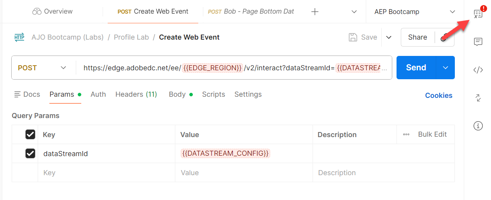

# 傳送Edge網路事件

## 學習目標

使用API傳送模擬網路事件至Adobe Edge Network。

若要模擬載入並傳送至AEP Edge的網頁，您會傳送Postman呼叫至您建立的資料流。

這會在沒有OAuth權杖的事件中傳送。  請確認您的電腦已開啟Postman以執行本實驗作業。

>[!NOTE]
>
>因為您未傳入已驗證的Token，所以無法取回任何屬性。

## 實驗室期望

1. 點選Edge的體驗事件
1. 資料流設定
1. 使用AEP服務的資料流設定
   1. 要執行的Edge對象
   2. 將事件傳送至中樞
1. Postman回應以包含Edge對象（不含屬性）
1. 用於接收事件並新增事件設定檔片段的設定檔存放區
1. 要新增關係的身分存放區
1. 要接收資料並儲存在Data Lake中的資料集

## 更新Postman環境變數

您必須先將資料串流ID新增至Postman變數環境，才能執行API要求。 首先，收集下列值：

### 收集資料串流ID

1. 您應該已有&#x200B;**資料串流識別碼**

>[!NOTE]
>
>**如果您遺失資料流識別碼**
>
>1. 在左側邊欄中，按一下&#x200B;**資料串流** （在「資料收集」標題下）
>2. 選取您的資料流並複製&#x200B;**資料流ID**&#x200B;值
>
>

### 導覽至通話

1. **Postman左側邊欄** -> `Collections`
1. **集合** -> `AJO Bootcamp (Labs)`
1. **資料夾** -> `Profile & Journey Labs`
1. **API要求** -> `Create Web Event`

### 更新資料流\_CONFIG變數

1. 按一下右上角要求中的&#x200B;**變數**

   在Postman工具列中的

2. 從頁面上的第一個步驟使用&#x200B;**資料流識別碼**&#x200B;更新&#x200B;**DATASTREAM_CONFIG** **值**。

   的DATASTREAM_CONFIG變數已更新

3. **儲存**&#x200B;您的更新（ctrl+s或command+s）
4. 按一下環境側邊欄右上角的&#39;**X**&#39;以關閉側邊欄

   

5. **建立Web事件**&#x200B;要求現在已準備好傳送，因為所有變數現在都是藍色的，且在環境中都有值。

## 執行API

按一下&#x200B;**傳送**&#x200B;按鈕以執行您的要求。

回應如下所示：

您在回應中看到的是這些核心內容：

- 200 OK回應表示Edge Network已成功傳送及接受資料

## 重述

事件已成功傳送至Edge Network並接受
