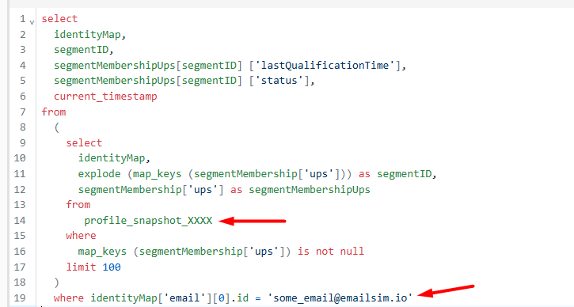
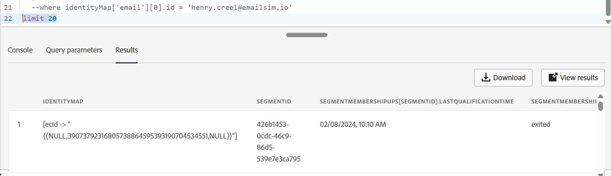

# 驗證設定檔快照

## 學習目標

確認設定檔尚未出現在設定檔快照集資料集中。

## 使用設定檔快照集資料集

1. 在左側導覽的「資料管理」區段下，按一下&#x200B;**資料集**，然後按一下頂端邊欄上的&#x200B;**瀏覽標籤**

   

2. 在&#x200B;**搜尋方塊**&#x200B;中輸入`profile`，然後&#x200B;**按一下標題為「設定檔快照……」的列**。   並且在右邊欄&#x200B;**中複製資料表名稱**，並將其貼到您可在下一個步驟中參考的位置。

   >[!NOTE]
   >
   >如果沒有看到「設定檔快照……」，您可能必須清除任何篩選器 資料集。


   

3. 導覽回查詢編輯器，並將以下SQL複製並貼到編輯器中

   ```sql
   select
     identityMap,
     segmentID,
     segmentMembershipUps[segmentID] ['lastQualificationTime'],
     segmentMembershipUps[segmentID] ['status'],
     current_timestamp
   from
     (
    select
      identityMap,
      explode (map_keys (segmentMembership['ups'])) as segmentID,
      segmentMembership['ups'] as segmentMembershipUps
    from
   
    where
      map_keys (segmentMembership['ups']) is not null
    limit 100
     )
     --where identityMap['email'][0].id = 'henry.creel@emailsim.io'
     limit 50
   ```

4. 更新表格名稱和電子郵件地址，如下所述：
   - **資料表名稱：**&#x200B;第14行複製並貼上您在`from`與`where`之間設定檔快照資料表的資料表名稱
   - **電子郵件地址：**&#x200B;目前在第19行輸入您過去在網頁事件中傳送的相同電子郵件地址（除非您加以變更，否則我們使用henry.creel\@emailsim.io）。
     - 目前我們已將此備註掉（請保持此狀態）。 當查詢執行而您尋找henry時，您找不到他。

   

5. 按一下左上方的箭頭&#x200B;**執行**&#x200B;查詢
6. 結果如下（但如果您尋找henry，就找不到他）



>[!NOTE]
>
>**為什麼沒有Henry的結果？**
>
>**提醒**：設定檔快照集是在&#x200B;**特定時間點**&#x200B;存在於設定檔中的&#x200B;**反射**&#x200B;或快照。 工作每日&#x200B;**執行**，並用於AJO等下游用途。 由於您剛才已串流處理此資料，因此設定檔快照尚未包含此資料。  明天就會了。

## 重述

瞭解快照資料集會在排程的批次程式上更新，而不是立即更新。
