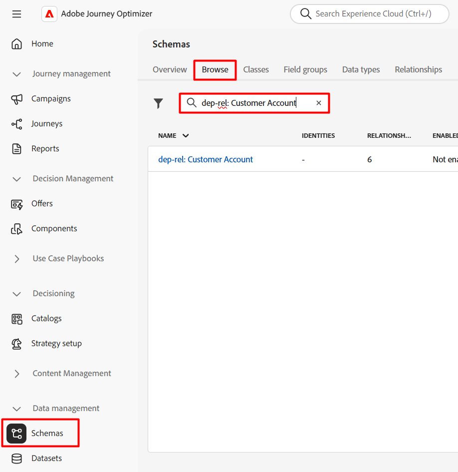
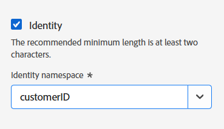
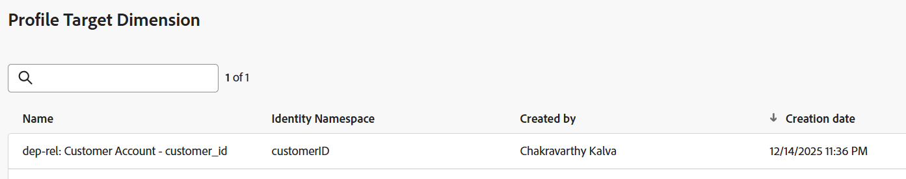

# 設定檔目標Dimension

## 目標

在接下來的步驟中，您將導覽UI以檢視結構並設定身分。 接下來，您將設定設定檔目標Dimension ，這是行銷活動正在定位並與AEP設定檔進行協調以傳送的實體型別。

## 為什麼這很重要

設定檔目標Dimension是用來告知Adobe Journey Optimizer如何聯結即時客戶設定檔與關聯式存放區之間的資料。 此組態的成分如下：

- 關聯式結構描述
- 關聯式結構描述的單一欄位
- 與該欄位相關聯的身分名稱空間

>[!CAUTION]
>
>若沒有此設定，將無法讀取或共用對象，也無法從「協調的行銷活動」傳送任何訊息

## 為身分加上標籤

1. 按一下&#x200B;**應用程式**&#x200B;圖示並選取&#x200B;**Journey Optimizer**

   已選取Journey Optimizer的

2. 按一下[資料管理]功能表下的&#x200B;**結構描述**，並確定已選取&#x200B;**瀏覽**&#x200B;索引標籤。
3. 搜尋名為`dep-rel: Customer Account`的結構描述

   dep-rel的

4. 按一下結構描述的名稱，然後按一下欄位&#x200B;**customer\_id**&#x200B;以開啟結構描述

   

5. 在右側邊欄中，找出名為&#x200B;**身分識別**&#x200B;的核取方塊，**核取方塊**，然後選擇名為&#x200B;**customerID**&#x200B;的身分識別名稱空間

   已選取customerID名稱空間的

6. 按一下&#x200B;**儲存**&#x200B;按鈕以儲存您的結構描述。 隨即顯示確認訊息
7. 按一下左側邊欄中的&#x200B;**取消**&#x200B;按鈕或&#x200B;**結構描述**&#x200B;以結束結構描述UI

>[!CAUTION]
>
>如果您在新增身分標籤後沒有儲存結構，下一組設定步驟將無法運作

>[!NOTE]
>
>儲存後，需要幾分鐘（5分鐘以內），才會顯示在下一個步驟的設定檔目標Dimension下拉式清單中。

## 建立設定檔目標Dimension

1. 按一下&#x200B;**管理**&#x200B;下的&#x200B;**組態**

   

2. 選取&#x200B;**設定檔目標Dimension**&#x200B;並按一下&#x200B;**管理**

   使用管理選項

3. 設定檔目標Dimension窗格開啟，按一下&#x200B;**建立**

   使用「建立」按鈕

4. 從下拉式清單中選取結構描述`dep-rel: Customer Account`。

   >[!NOTE]
   >
   >標示身分後，結構描述可能需要幾分鐘才會顯示在此畫面中。 重新整理頁面，並重複前兩個步驟，直到綱要出現為止。

   

5. 為&#x200B;**識別值**&#x200B;選取`/customer_id`

   

   >[!NOTE]
   >
   >關聯式結構描述可以有許多以身分標籤的欄位，因此這會是一個清單方塊。

6. 按一下&#x200B;**儲存**&#x200B;按鈕以建立設定檔目標Dimension。 然後您會看到記錄出現。

>[!NOTE]
>
>建立的記錄名稱是結構描述名稱&#x200B;*（dep-rel：客戶帳戶）*&#x200B;和標示為身分識別&#x200B;*(customer\_id)*&#x200B;的欄位的串連

>[!TIP]
>
>恭喜！ 本實驗的「設定檔目標Dimension」建立步驟到此結束。

## 重述

您現在已瞭解導覽結構、將屬性標示為身分以及建立設定檔目標Dimension的簡易程度。

若您有興趣，請參閱[此處](https://experienceleague.adobe.com/zh-hant/docs/journey-optimizer/using/campaigns/orchestrated-campaigns/data-configuration/target-dimension)以瞭解詳情。
