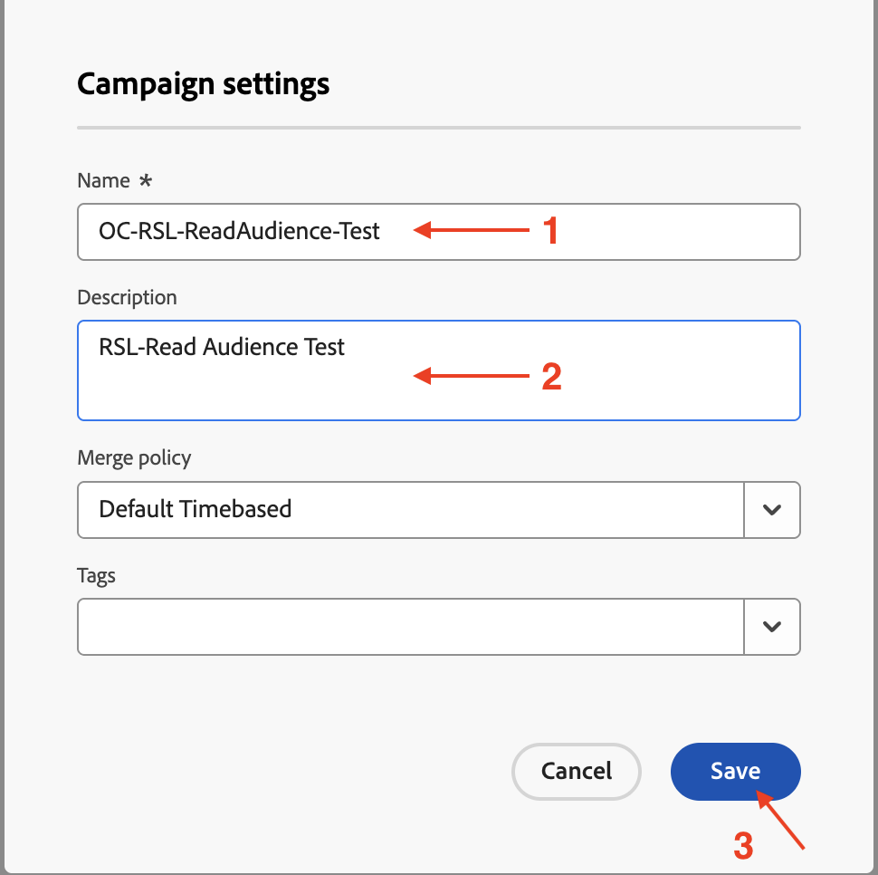
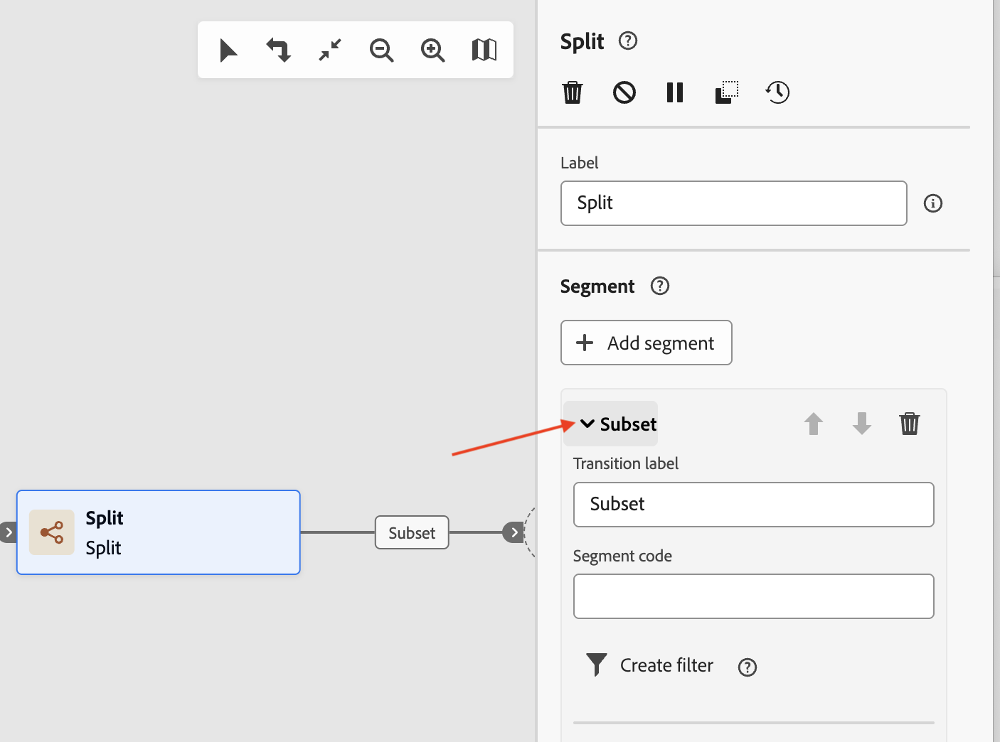
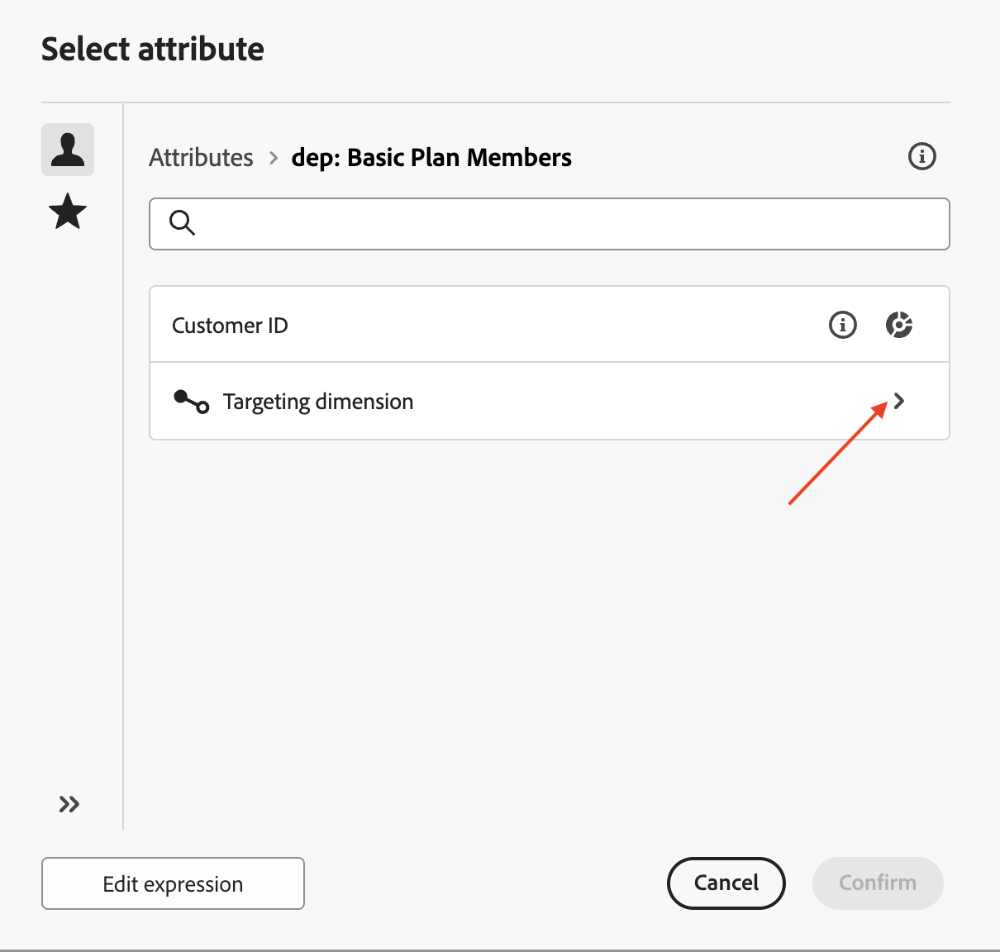

# 讀取對象

## 目標

在接下來的幾個步驟中，您將建立行銷活動以從AEP讀取對象，並將其與先前建立的設定檔目標Dimension搭配使用。 使用「分割」活動，根據條件分割資料。 最後，測試行銷活動，以瞭解這些對象在與關聯式結構描述搭配使用時的運作方式。

## 讀取客群

本實驗涵蓋結合讀取對象活動與關聯式結構描述一起使用以進行擴充。

「協調的行銷活動」會使用關聯式結構描述來處理所有活動。 使用讀取對象活動（從AEP讀取對象）時，應設定對應的實體(Target Dimension)來調解對象與Campaign Target Dimension。

## 建立行銷活動

1. 在左側邊欄中，按一下&#x200B;**行銷活動**

   

2. 按一下&#x200B;**建立行銷活動**

   

3. 選取&#x200B;**協調流程 — 行銷**&#x200B;並按一下&#x200B;**確認**

   

4. 提供行銷活動的詳細資訊，如下所示，然後按一下&#x200B;**儲存按鈕**
   - 名稱： **OC-RSL-ReadAudience-Test**
   - 描述： **RSL讀取對象測試**

   

5. 等候確認訊息

儲存行銷活動設定後

## 新增讀取對象活動

1. 按一下畫布內的&#x200B;**+**&#x200B;以開啟選項功能表，然後從&#x200B;**目標定位活動**&#x200B;中選取&#x200B;**讀取對象**

   ![已選取讀取對象的[目標定位活動]功能表](assets/read-an-audience-add-read-audience-activity.png)

2. 在&#x200B;**讀取對象**&#x200B;詳細資料窗格中，按一下&#x200B;**對象**&#x200B;的「搜尋」圖示

   

3. 選取設定檔計數為&#x200B;**9**&#x200B;的&#x200B;**dep：基本計畫成員**&#x200B;對象，然後按一下&#x200B;**新增對象**

   

4. 接著按一下&#x200B;**實體**&#x200B;的下拉式清單，然後選取`dep-rel: Customer Account - customer_id`促銷活動目標Dimension

>[!NOTE]
>
>也可以從AEP設定檔擷取其他屬性，以使用&#x200B;**新增屬性**&#x200B;按鈕在畫布中使用。 但就本實驗而言，不需要額外的屬性，因此會略過步驟。

## 測試行銷活動

1. 已填入&#x200B;**讀取對象**&#x200B;活動的設定。 按一下&#x200B;**開始**，在&#x200B;**測試模式**&#x200B;中執行行銷活動

   

   >[!NOTE]
   >
   >這需要幾分鐘的時間才能執行。
   >
   >測試模式允許執行行銷活動，以驗證及監控其行為以及每個活動的結果。 活動會依序執行直至畫布結尾。

2. 測試執行開始，並在完成後顯示結果。 按一下&#x200B;**結果**&#x200B;節點，然後按一下[預覽結果]以檢視執行結果

   

3. 請注意，來自&#x200B;**讀取對象**&#x200B;的&#x200B;**2** （共9個）設定檔沒有來自關聯式結構描述的對應&#x200B;**目標維度** （亦即，它們存在於設定檔存放區中，但不存在於關聯式存放區中）。 由於協調的行銷活動是透過關聯式結構描述運作，因此會捨棄來自&#x200B;**讀取對象**&#x200B;的不相符專案`customer_id` (**2**)，而且只有&#x200B;*相符專案* （在此案例中為&#x200B;**7**）可用於行銷活動中利用&#x200B;**關聯式資料**&#x200B;的後續活動

   

   >[!NOTE]
   >
   >下列步驟使用關聯式資料來確認上述不相符`customer_id`的陳述式已捨棄。

4. 按一下&#x200B;**停止**&#x200B;以停止行銷活動的&#x200B;**測試模式**

   

5. 按一下流程結尾的&#x200B;**+**，並從&#x200B;**目標定位活動**&#x200B;新增&#x200B;**分割**

   

6. 在&#x200B;**分割**&#x200B;活動的詳細資料窗格中，展開名為&#x200B;**子集**&#x200B;的第一個分割

   

7. 將其重新命名為「**在存放區中**」，然後按一下&#x200B;**建立篩選器**&#x200B;以設定篩選器條件

   

8. 在&#x200B;**建立篩選器** r窗格中，按一下&#x200B;**新增條件**

   ![使用[新增條件]按鈕建立篩選窗格](assets/read-an-audience-add-condition-button.png)

9. 由於沒有從AEP設定檔擷取其他屬性，此處唯一可用的AEP設定檔屬性為`Customer ID`。 不過，對應至相符Target維度的關聯式存放區中的欄，可用於設定篩選條件。 按一下&#x200B;**>**&#x200B;以展開&#x200B;**目標維度**

   

10. 從清單中選取`Source`並按一下&#x200B;**確認**

從目標維度資料行](assets/read-an-audience-select-source-attribute.png)中選取

12. 返回&#x200B;**分割**&#x200B;活動的詳細資料窗格，第一個分割的設定已完成。 按一下&#x200B;**將區段**&#x200B;新增至第二個分割

已建立名稱為&#x200B;**結果**&#x200B;的新區段

的新區段

13. 將「**Result**」重新命名為「**Not In Store**」，然後按一下「**建立篩選器**」以設定篩選器條件

重新命名為「不在市集」

14. 在&#x200B;**建立篩選器**&#x200B;窗格中，按一下&#x200B;**新增條件**。 遵循上述相同方法，按一下&#x200B;**>**&#x200B;以展開&#x200B;**目標維度**，然後從清單中選取`Source`，然後按一下&#x200B;**確認**

從目標維度資料行](assets/read-an-audience-select-source-attribute.png)中選取

16. 返回&#x200B;**分割**&#x200B;活動的詳細資訊窗格，兩個「分割」的設定已完成。 按一下&#x200B;**開始**，在&#x200B;**測試模式**&#x200B;中執行行銷活動

17. 測試執行開始，並在完成時顯示結果。 因為在關聯式結構描述中只找到&#x200B;**7**&#x200B;個相符的目標維度，所以在分割作業（**7**&#x200B;和&#x200B;**0**）之後也觀察到相同的計數

的計數

18. 按一下每個結果方塊並&#x200B;**預覽結果**&#x200B;以檢視結果

每個分割結果方塊的

19. 按一下&#x200B;**停止**&#x200B;以停止行銷活動的&#x200B;**測試模式**

>[!NOTE]
>
>讀取對象顯示&#x200B;**9**&#x200B;個設定檔。 由於我們在Source上建立了篩選器，且Source欄位存在於關聯式存放區中，因此我們必須從設定檔存放區加入關聯式存放區才能進行檢查。 透過Campaign Target Dimension以關聯式結構描述聯結時，總共只符合&#x200B;**7**&#x200B;個設定檔。 這&#x200B;**7**&#x200B;個相符的客戶ID可用於下列嘗試使用關聯資料的活動。 所有&#x200B;**7**&#x200B;客戶ID的`Source`已設為&#x200B;**「商店內」**，這透過分割流程顯而易見。
>
>因此，在使用AEP設定檔及其關聯式對應物進行擴充時，維持資料一致性至關重要。

>[!TIP]
>
>恭喜，這將完成實驗以搭配關聯式結構描述使用讀取對象活動。

## 重述

您現在已瞭解建立行銷活動、執行讀取對象活動與設定檔目標Dimension的簡易性，以便運用關聯式結構。 您已使用「分割」活動根據條件分割對象。 最後，測試模式有助於瞭解設定檔與關聯式結構描述之間的資料一致性很重要。

若您有興趣，請參閱[此處](https://experienceleague.adobe.com/en/docs/journey-optimizer/using/campaigns/orchestrated-campaigns/design-campaigns/read-audience)以瞭解詳情。
