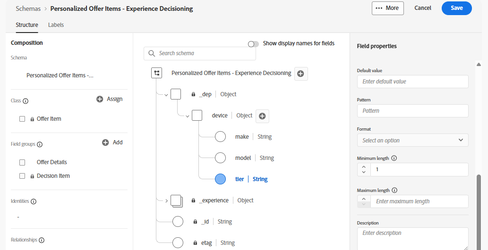

# 建立優惠屬性

## 目標

在本節中，您會將自訂XDM欄位新增至標準選件XDM結構描述。 這些自訂欄位可用於排名、排序和資格標準。 也可以是傳回至請求裝置的資料。

## 建立自訂裝置父物件

1. 如有必要，請展開左側邊欄中的&#x200B;**決策**&#x200B;功能表專案，然後按一下&#x200B;**目錄。**
2. 依預設，會顯示「選件」頁面。 按一下右上角的&#x200B;**編輯結構描述**&#x200B;按鈕。

在優惠方案目錄頁面上

>[!TIP]
>
>產生的頁面是標準XDM結構編輯器。 就像使用XDM來定義資料集的資料結構一樣，此處也使用XDM來定義選件的屬性。

>[!NOTE]
>
>「個人化優惠專案 — Experience Decisioning」結構描述是系統產生的標準結構描述，適用於所有優惠方案。 不過，您可以新增至此結構描述以滿足獨特的業務需求，這正是您在本節中會做的事。
>
>此外，瀏覽選件頁面是存取此結構的捷徑。 您也可以透過左側邊欄中的結構功能表導覽至該區域。

3. 按一下結構描述根層級右側的&#x200B;**+**&#x200B;圖示，然後在右側邊欄中使用現在可見的「欄位屬性」功能表，使用提供的值填入下列欄位：
   - 欄位名稱： **裝置**
   - 顯示名稱： **裝置**
   - 型別下拉式清單： **物件**
   - 指派給欄位群組（輸入此值）： **選件詳細資料**

>[!NOTE]
>
>指派給欄位群組似乎是一個下拉式清單，但它也接受直接文字輸入；因此，請輸入文字&#39;Offer Details&#39;。 當您輸入時，您也會看到「選件詳細資料（新）」專案出現。 任何新屬性都必須指派給欄位群組，因此在此步驟中，您實際上是建立一個名為「選件詳細資料」的新欄位群組。

4. 請確定所有屬性皆已填滿，如下列熒幕擷圖所示：

新裝置物件的

5. 在確認所有欄位都正確後，按一下[欄位屬性]功能表（右側邊欄）底部的藍色&#x200B;**[套用**]按鈕，檢視套用至結構描述的變更：

>[!TIP]
>
>就像一般的XDM一樣，自訂屬性會分組到IMS組織特定的名稱空間下，也就是此案例中的imsorg租使用者ID或「dep」。 您也會看到新的「選件詳細資料」欄位群組現在列於結構描述左側的「構成」窗格中。

>[!WARNING]
>
>請注意，這些變更不會儲存。 只是「套用」。 如果您要離開頁面而不儲存，您將會遺失工作。 請先完成本區段中的步驟，再離開瀏覽。

## 建立自訂裝置屬性

現在裝置XDM物件已建立，您可以接著建立裝置專用欄位。

1. 按一下您剛建立的新&#x200B;**裝置**&#x200B;物件右邊的&#x200B;**+**&#x200B;圖示，然後使用右側邊欄中的「欄位屬性」功能表，以提供的值填入下列欄位：
   - 欄位名稱： **make**
   - 顯示名稱： **製作**
   - 型別下拉式清單： **字串**
   - 指派給欄位群組： **選件詳細資料** （應已選取）
   - 確認所有欄位正確後，按一下藍色的&#x200B;**套用**&#x200B;按鈕，檢視您套用至結構描述的變更
2. 重複上述步驟，為&#x200B;**模型**&#x200B;和&#x200B;**階層**&#x200B;新增兩個額外的屬性。 使用相同的命名模式、型別和欄位群組。 完成後，結構描述應該如下所示：

3. 建立所有新的XDM欄位/屬性後，按一下右上角的「儲存&#x200B;****」，畫面底部就會顯示綠色的「已成功儲存的結構描述」訊息。 您現在已經完成本節中的步驟。

>[!WARNING]
>
>您剛更新的結構描述會套用至所有選件，包括所有未來的選件。 將屬性新增至此結構描述時，請務必謹慎。 在我們的銷售行動電話的電信公司範例使用案例中，裝置製造商、型號和層級屬性可能會在未來數年和許多優惠方案中被廣泛使用，因此新增這些屬性是合理的。 考慮優惠方案所需的屬性時，請避免新增特定行銷活動特有的屬性。 在幾個月或幾年內，此結構描述可能會膨脹，並在建立優惠方案時造成問題。 您會在要建立優惠方案的區段中看到此套用的方式。

## 重述

您已成功使用可重複使用的自訂欄位更新標準優惠方案結構，這些欄位將在實驗室稍後建立和評估優惠方案時運用。
