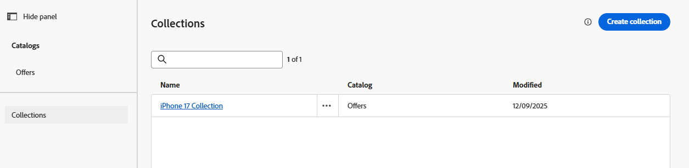

# 建立優惠收藏

## 目標

現在您的優惠方案已建立，需要將其整理到集合中。 一個集合有一或多個優惠方案專案，而一個優惠方案專案可以位於多個集合中。

## 建立iPhone選件集合

1. 如有必要，請在左側邊欄中展開&#x200B;**決策**，然後按一下&#x200B;**目錄**。 您會看到在上一節中建立的四個優惠方案。
2. 按一下優惠方案名稱左邊的&#x200B;**集合**

目錄頁面上的

&#x200B;3. 按一下藍色的&#x200B;**建立集合**&#x200B;以建立新的集合。
&#x200B;4. 為集合&#x200B;**命名iPhone 17集合**
&#x200B;5. 在「集合規則」區段中，按一下包含文字的文字方塊&#x200B;**_按一下以建立決定專案_**。 按一下後，畫面就會顯示建立規則的選項。

&#x200B;6. 按一下「**選取屬性**」按鈕，然後按一下「**裝置>製作**」，瀏覽選件專案結構描述。 按一下&#x200B;**儲存，**，您會看到&#39;Make&#39;屬性現在位於決定規則中。

>[!NOTE]
>
>請注意，您可用的選項與您建立優惠方案專案時所用的可設定欄位相同。 由於集合是優惠方案專案的群組，因此將其分組的規則取決於其屬性也是合理的。

&#x200B;7. 保留「等於」運運算元，並在值欄位中輸入文字&#x200B;**iPhone**，您會看到專案數變更為4，表示您的所有優惠方案專案都符合該條件

>[!NOTE]
>
>您也可以按一下&#x200B;**預覽集合**&#x200B;按鈕，檢視符合條件的選件專案。

&#x200B;8. 選取全部四個優惠方案專案後，按一下藍色的&#x200B;**「建立」**&#x200B;按鈕。 這會將您帶往顯示您新建立之集合的頁面。

>[!NOTE]
>
>集合不僅僅是一種組織方式。 在後續步驟中，您會看到在決定中，我們將選取邏輯套用至優惠方案集合。 想想企業規模的實作，不難想出這幾年的使用會建立多少優惠方案。 為了決定應套用選擇策略的選件，可凸顯適當集合管理的重要性。
>
>在這種情況下，如果以「iPhone」作為條件的系列，在發行幾年iPhone後就會引入太多選件。 我們原本可以使用其他條件（例如「讓等於17」）或使用AEP標籤來標籤特定行銷活動的優惠方案。 但為簡化起見，我們使用這個簡單的邏輯來建立集合。

## 重述

您現在已建立優惠收藏，將您先前建立的優惠方案專案分組。 您將所有iPhone 17優惠方案新增至集合，並根據優惠方案屬性（類似裝置製作）定義規則，因此只有相關優惠方案才屬於此集合。
