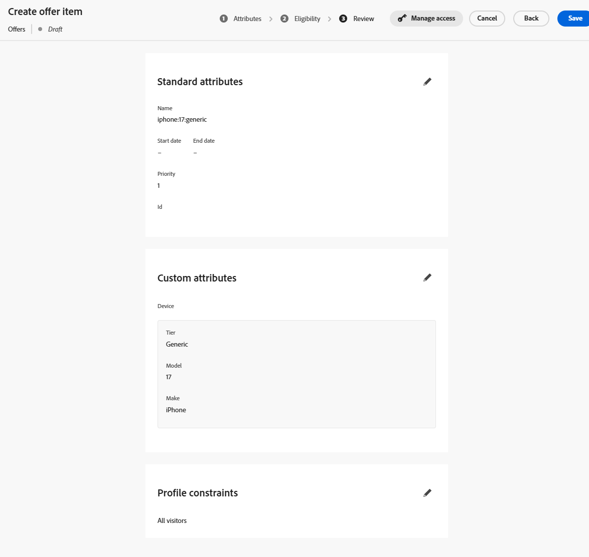
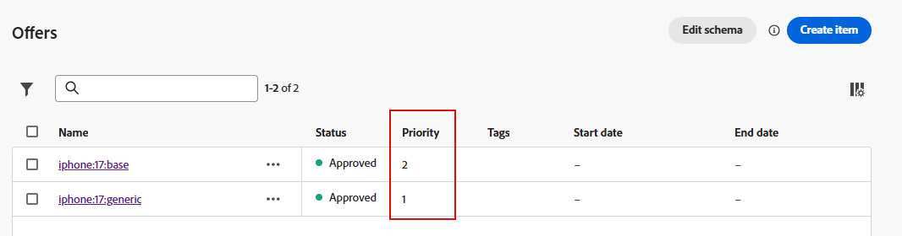
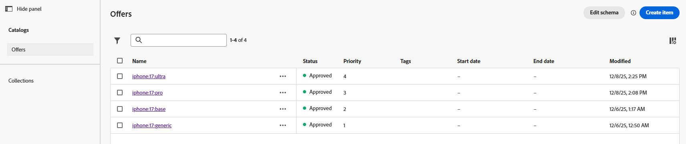

# 建立優惠專案

## 目標

在本節中，您將建立程式碼型體驗(CBE)將傳回給請求使用者端的實際選件專案。 部分優惠方案專案會有資格需求和頻率上限，其他專案則否。

## 案例概述

但是，在建立優惠方案專案之前，以下提供有關我們情境的一些快速提醒。 首先，我們的情境中有3個iPhone 17階層：Ultra、Pro和Base。 您總共建立4個選件（每個層級各1個），外加一般備援選件，接收系統可用來顯示所有層級的iPhone 17一般資訊。

第二，只有計畫ID為2或3的客戶才符合Ultra和Pro層級手機的資格。

接下來，企業要求每個優惠方案每天只顯示三次，才會顯示下一個較低層級的電話。

最後，如果一切條件都相同，Connection 5G會傾向於銷售Ultra階層，其次是Pro，然後是基本機型。 因此，當您為每個優惠方案專案指定優先順序分數時，就會看到這些優先順序出現。

## 建立預設/遞補優惠專案

您建立的第一個、最簡單的優惠方案專案是遞補優惠方案，任何人都可以無限期檢視。

1. 如有必要，請在左側邊欄中展開&#x200B;**決策**，然後按一下&#x200B;**目錄**
2. 系統會顯示空白的選件頁面：

   在建立任何優惠方案專案之前

3. 按一下藍色&#x200B;**建立專案**&#x200B;按鈕。 如此將可開啟「建立選件專案」頁面。
4. 在[選件名稱]欄位中，輸入文字&#x200B;**iphone：17\：generic**。 如果您願意，請輸入說明。

   >[!NOTE]
   >
   >以冒號分隔的全小寫命名慣例是我們自己的設計之一，可作為實際客戶遵循的命名慣例。 實際上，您可以為優惠方案專案開發不同的命名策略。 在建立優惠方案專案之前，請確定它有檔案記錄且一致。 這將確保優惠方案專案在集合中易於查詢和分組。 稍後將提供更多相關資訊。

5. 由於這是最低優先順序/預設選件專案，請將預設優先順序保留為1。

   >[!NOTE]
   >
   >在決策中，數字越低，優先順序就越低。 例如，優先順序為100的優惠方案專案會顯示在優先順序為1的優惠方案專案之前

6. 展開[自訂屬性]區域中的&#x200B;**裝置**&#x200B;專案，然後在文字方塊中輸入下列資訊：
   - 階層： **一般**
   - 模型： **17**
   - 製作： **iPhone**

   這些是說明優惠方案的實際文字值，以及可用於排序、排名和資格標準的內容。 它們也是可傳回至請求裝置的文字值。

   

   >[!NOTE]
   >
   >您展開的裝置區域與上一節使用自訂屬性更新「個人化優惠專案 — 體驗決策」結構描述時所建立的「裝置」父物件相同。 Tier、Model和Make欄位是新增的個別屬性：
   >
   >

   >[!WARNING]
   >
   >上一節提到將自訂屬性新增到系統產生的「個人化優惠專案 — Experience Decisioning」架構時，必須格外小心。 每個額外的自訂節點都會顯示為往後每個優惠方案專案的可能欄位。 建立不必要或行銷活動專屬的屬性會讓優惠方案專案建立UI變得混亂，並可能造成混淆。

7. 按一下右上角的藍色&#x200B;**下一步**&#x200B;按鈕，以繼續執行下一個步驟。
8. 此選件應可供所有人/所有訪客使用，且沒有任何頻率上限，因此不需要變更「適用性」或「上限」區段。 再次按一下藍色的&#x200B;**「下一步**」按鈕以繼續執行最後一個步驟。
9. 在「檢閱」步驟中，確認所有資料正確無誤：

   

10. 進行任何必要的變更。 準備就緒後，按一下藍色的&#x200B;**儲存**&#x200B;按鈕。
11. 儲存後，白色「核准」按鈕會出現，其中「儲存」按鈕曾是。 按一下白色&#x200B;**核准**&#x200B;按鈕以核准此優惠方案專案。 您在選件專案標題下方看到綠色的「已核准」指標：

一般優惠方案專案上的

>[!NOTE]
>
>實際上，如果選件較複雜，則應設定適當的核准程式，以確保已正確建立選件專案。 為了節省本實驗的時間，您只需核准您建立的每個優惠方案專案。

1. 按一下選件專案標題旁的&#x200B;**向左箭頭**&#x200B;以返回「選件」頁面，您會看到列出您的iphone：17\：generic選件。

## 建立基本模型優惠方案專案

現在一般優惠方案專案已建立，您可以為iPhone 17的基礎模型建立下一個優先順序優惠方案專案。

1. 再次按一下藍色&#x200B;**建立專案**&#x200B;按鈕，並命名選件&#x200B;**iphone：17\：base**
2. 因為這是下一個最低優先順序的選件專案，請將&#x200B;**優先順序**&#x200B;欄位增加到&#x200B;**2**
3. 展開&#x200B;**裝置**&#x200B;區域，並為欄位指定下列值：
   - 階層： **基底**
   - 模型： **17**
   - 製作： **iPhone**

   完成後，選件專案將如下所示（會新增紅色方塊以確保優先順序正確無誤）：

   的基本模型優惠方案專案

   當一切正確時，按一下藍色的&#x200B;**下一步**&#x200B;按鈕以繼續執行下一個步驟。

4. 此優惠方案專案應可供所有人使用，因此沒有資格要求；不過，每日最多只能有3次曝光。 按一下&#39;**+建立上限&#39;**&#x200B;按鈕。
5. 在新的上限規則上，將&#x200B;**選擇上限事件**&#x200B;變更為&#x200B;**曝光數。**
6. 將&#x200B;**上限事件計數**&#x200B;變更為&#x200B;**3**。 完成後，您的上限規則將如下所示：

   

   一旦正確，按一下藍色的&#x200B;**建立**&#x200B;按鈕以儲存上限規則。

   >[!NOTE]
   >
   >請注意如何建立其他上限規則。 實際上，您可能想要新增多個規則。 在此案例中，我們原本可以新增規則，在看到特定事件（例如購買事件）時對此進行限制。 本實驗使用單一上限規則，讓操作簡單明瞭。
   >
   >

   >[!NOTE]
   >
   >頻率上限規則中提到的「天數」是指GMT時區的天數。  以天數為上限的邏輯會在午夜(GMT)重設。

7. 按一下[下一步]****&#x200B;繼續檢閱步驟。
8. 確定一切如預期顯示，然後按一下&#x200B;**儲存**&#x200B;按鈕。 儲存後，按一下&#x200B;**核准。**
9. 核准後，按一下標題旁邊的左箭頭並返回選件頁面。 您現在會看到兩個選件，每個都具有適當的優先順序。

## 建立上層模型優惠方案專案

現在已建立類屬和基礎模型選件，您可以移至pro和ultra模型的選件專案。 這些優惠方案專案也需要包含適用性的元素，因為只有具有特定計畫層級的成員才應該看到這些優惠方案。

1. 依照上述步驟和命名模式所列的步驟，建立名稱為&#x200B;**iphone：17\：pro**&#x200B;的新選件，並將其優先順序設為&#x200B;**3.**
2. 將&#x200B;**Tier**&#x200B;屬性設定為&#x200B;**Pro**&#x200B;和其他自訂屬性，如同您在其他選件中所做的一樣。
3. 在「資格」步驟中，選取&#x200B;**依規則**&#x200B;選項按鈕。
4. 左側欄僅顯示一個決定規則，即先前建立的稱為「上層計畫」的決定規則。 按一下該規則旁的&#x200B;**+**&#x200B;圖示，將其新增至畫布。
5. 如先前所述，企業已宣告，非遞補優惠的每日頻率上限應為3次顯示（或曝光數）。 請依照上一節中的步驟，建立每日3次曝光次數的上限規則。 完成後，您的頁面看起來像這樣：

   

6. 確認一切正確後，請按一下[下一步] ****。 最終選件專案設定看起來像這樣：

   

7. 一切看起來正確後，**儲存**&#x200B;並&#x200B;**核准**&#x200B;優惠專案。
8. 返回「選件」頁面，並確認有3個選件存在，且每個選件都有適當的優先順序。
9. 建立最終選件專案並將其命名為&#x200B;**iphone：17\：ultra，**，將其優先順序設為&#x200B;**4，**，並使用與其他選件相同的值來設定其他自訂屬性。
10. 如同最後一個優惠專案，請將適用性設定為「上層計畫」決定規則，並將頻率上限設定為每天3次曝光。 完成後，您的選件專案看起來像這樣：

1. 在您確認所有設定皆正確後，請儲存並核准此選件專案。 您現在會看到全部四個優惠方案專案，每個專案都有獨特的優先順序。

>[!NOTE]
>
>本實驗室的指示著重於確保每個優惠方案的優先順序不同。 在這個簡單的使用案例中，這很重要，但UI中不會強制您為每個選件專案指定唯一的優先順序。 長期下來，您可能會有多個具有相同優先順序的選件專案。 您將在後續章節中瞭解此內容為何重要。

## 重述

您已為不同的iPhone 17層級定義多個選件，包括一般備援選件及特定層級選件（基本、專業和ultra）。 您也已核准所有四個具有正確優先順序、資格和曝光上限設定的優惠方案專案，因此可在您的決定套件中使用。
