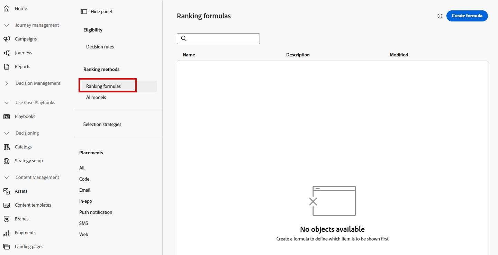
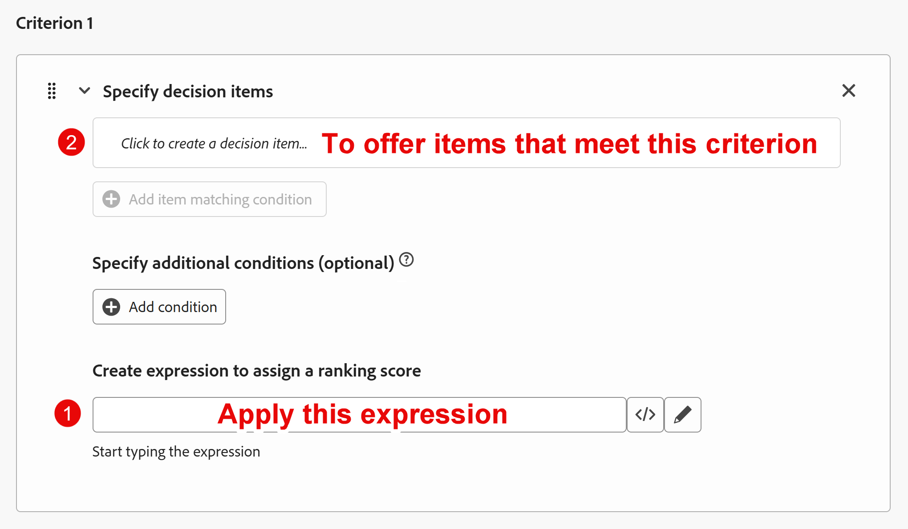

# 建立排名公式

## 目標

現在，所有優惠方案專案都已建立、排定優先順序、套用適用資格，並組織到集合中，我們可以轉而決定針對指定設定檔如何排名這些專案。 這可透過建立排名公式來完成。

排名公式會根據與Web/行動屬性互動的設定檔條件，或體驗事件本身，以動態方式提升特定優惠方案優先順序，讓優惠方案「躍升至頂端」。

在本實驗情境中，我們會假定Connection 5G的研究行銷團隊顯示，年齡在39歲以下的人會被吸引到Ultra或Pro階層，而40-59歲的人則會被吸引到基本和專業階層。 由於Connection 5G寧願銷售更高階的手機，在同等條件下，Ultra機型會先針對39歲以下的人呈現，而Pro機型則先針對40至59歲的人呈現。 本節將說明如何建立排名公式，以滿足這些業務需求。

## 建立排名公式和預設運算式

1. 如有必要，請在左側邊欄中展開&#x200B;**決策**，然後按一下&#x200B;**策略設定**。 您進入「決定規則」頁面，並檢視您先前建立並作為上層電話優惠專案資格需求使用的「上層計畫」決定規則。
2. 按一下「排名方法」功能表下的&#x200B;**排名公式**。 這會開啟一個空白頁面，因為您還沒有任何排名公式。

建立公式前

&#x200B;3. 按一下藍色&#x200B;**建立公式**&#x200B;按鈕，開始建立新的排名公式
&#x200B;4. 命名排名公式&#x200B;**iPhone 17排名公式**

>[!NOTE]
>
>當體驗事件使用要求引數傳送至Edge資料收集，以從使用中的決定套件請求優惠時，該套件中的所有優惠都會使用排名公式來評估。 每個選件都會保留其原始優先順序，或根據觸發體驗事件的設定檔動態調整其優先順序。

&#x200B;5. 捲動至「條件」區段的底部，然後按一下最底部文字方塊的&#x200B;**\&lt;/>**&#x200B;圖示，並選取&#x200B;**優惠優先順序分數**&#x200B;變數。

預設運算式現在設定如下：

>[!NOTE]
>
>此底部文字方塊是套用至不符合任何優先順序調整條件之任何優惠方案專案的預設運算式。 在此情況下，這僅僅是在建立優惠方案時指派給優惠方案的優先順序。 如果未對此排名公式將執行的集合指定預設優先順序分數，則您想要指派預設分數

## 建立優先順序調整規則

現在有了預設運算式，您可以開始新增規則，以根據使用者年齡動態調整優先順序。

考慮優先順序調整規則的一種方式是，將其視為只適用於特定優惠的標準if/then陳述式。 如果測試證實為true，則調整符合指定准則之優惠方案的優先順序。 UI會以稍微不同的順序排列這些專案，如同此熒幕擷圖中所說。

優先順序調整規則中的

>[!NOTE]
>
>「if」是選用專案，因為若選件符合特定條件，且未先輸入條件陳述式，即可套用優先順序調整規則。 展開本指南中的範例，想像我們有數個選件具有手機作業系統屬性（Android與iOS）。 如果設定檔偏好的作業系統是iOS，可以提升所有iPhone選件的優先順序。 沒有「if」。 只需「調整優惠屬性=設定檔屬性的分數」。 下方影像與上述影像類似，概述此概念，但不含條件陳述式。
>
>

## 建立條件1:39歲以下者的調整規則

1. 首先，建立Ultra層選件專案的排名規則。 按一下「**條件1**」區段中的第一個文字方塊，然後按一下「**選取屬性**」按鈕（當它出現時）。

選取顯示的屬性選項

&#x200B;2. 當[選取屬性]對話方塊開啟時，按一下&#x200B;**選件名稱**。 選取後，按一下&#x200B;**儲存。**

>[!NOTE]
>
>「決定屬性」是指優惠專案的元素。 由於這是您概述條件將套用至哪個優惠方案專案的位置，因此您唯一可用的選項是優惠方案專案的屬性。
>

&#x200B;3. 讓運運算元設為&#39;Equals&#39;，並在剩餘的文字方塊中，輸入ultra層級選件專案的名稱，即&#x200B;**iphone：17\：ultra**。 輸入文字後，UI會更新並反映已接受相符條件。
&#x200B;4. 按一下&#x200B;**+新增條件**，然後按一下顯示的&#x200B;**新文字方塊** (文字為&#39;*按一下以建立決定專案……*&#39;
&#x200B;5. 按一下現在可用的&#x200B;**選取屬性**&#x200B;選項&#x200B;**.**
&#x200B;6. 當[選取屬性]對話方塊開啟時，按一下&#x200B;**個人資料屬性>人員** （您可能需要向下捲動）**>出生年份**。 選取後，按一下&#x200B;**儲存。**

>[!NOTE]
>
> 「設定檔屬性」是指傳送體驗事件的使用者或設定檔，而「內容資料」是指體驗事件本身中的元素，例如URL、頁面名稱或體驗事件裝載的其他屬性。

&#x200B;7. 將運運算元變更為&#x200B;**大於**，並輸入出生年份&#x200B;**1986** （UI會在預期年份中放入逗號）。 進入後，UI會更新，以反映已接受條件。 由於業務使用案例是為40歲以下的人提供Ultra Tier，因此會針對1986年以後出生的人調整優先順序。

>[!NOTE]
>
>如前所述，UI會指出這些額外的條件為「選用」。 這為true，因為使用者可能想要在不需任何其他條件的情況下動態調整一組優惠方案專案的優先順序。 相同的選件專案也可能會用於不同的集合中，並依照不同的排名規則集進行排名。 由於本實驗僅使用單一優惠方案專案集，因此會使用其他條件來調整優先順序。

&#x200B;8. Ultra層選件專案的原始優先順序為4。 若要提升優先順序，請將其乘以100。 若要這麼做，請按一下最後一個文字方塊旁的&#x200B;**\&lt;/>**&#x200B;圖示，並選取&#x200B;**優惠優先順序分數**&#x200B;變數。 在自動輸入的文字之後新增&#x200B;**\*100**。 此運算式將原始優先順序(4)乘以100，並賦予其新優先順序400。

   您的規則現在應如下所示：

>[!NOTE]
>
>為什麼要乘以100？ 我們的想法是，如果您想要確保您的優先順序調整得遠遠高於其他優先順序，100隻是簡單數學實現這一點的方法。 排名公式可能會很複雜（您將在下一節中看到），因此保持簡單的數學會很有幫助。
>
>此外，雖然我們使用乘法來增加優先順序分數，但其他數學運算式也可以用來減少優先順序分數。 不過，一般而言，想要的優惠方案很容易浮到最上層，而不是提供不想「沈到最下層」的優惠方案。

## 建立條件2:40-59的調整規則

1. 在您剛建立的調整規則正下方，按一下&#x200B;**+新增條件**&#x200B;按鈕。
2. 建立&#x200B;**選件名稱**&#x200B;不等於&#x200B;**iphone：17\：ultra**&#x200B;的相符條件。

>[!WARNING]
>
>此規則旨在套用至所有其他優惠方案專案。 有關詳細資訊請參閱本頁內容，但您應在實務中使用這類邏輯時特別小心，因為這會套用至集合中沒有此值的每個選件。 在我們的案例中，這沒關係，但可能不會在其他使用案例中。

3. 新增此規則應套用至出生年份超過&#x200B;**1966**&#x200B;之任何人（60歲以下的人）的條件。
4. 如同先前的規則，將選件專案的預設優先順序分數乘以100。 完成後，您的「條件2」規則看起來如下所示：

>[!NOTE]
>
>同時使用排名公式和適用性規則可能會覺得複雜，但核心構想如下：
>
>- **排名公式**&#x200B;會動態調整優先順序分數，進而調整優惠的順序。
>- **適用性規則** （例如決定規則和頻率上限）會從排序清單中移除優惠方案（如果使用者無法檢視）。
>
>以下提供範例和您剛建立的排名公式中選件的排序方式：
>
>**出生年份= 1990**
>
>- 超優先順序變成&#x200B;**400**
>- Pro = **3**，基底= **2**，一般= **1**
>  結果：Ultra會先顯示（最多3次），然後顯示Pro、Base，最後顯示Generic。
>
>**出生年份= 1970**
>
>- 超優先順序保持在&#x200B;**4**
>- Pro變成&#x200B;**300**，基底= **200**，一般= **100**
>  結果： Pro會先顯示（3次），然後顯示「基底」(Base)，再顯示「類屬」(Generic)。 Ultra最後排序，因為其優先順序(4)低於一般(100)。
>
>透過決定規則和頻率上限套用資格時，則
>
>- 1990年出生且計畫ID為&#x200B;**的計畫ID = 1**&#x200B;的使用者將會移除Ultra和Pro選件，即使這些選件排名最高。 使用者只會看到Base和Generic選件，因為Ultra和Pro層級有額外的條件：只有具有&#x200B;**計畫ID 2或3**&#x200B;的使用者才能看到它們。
>- 由於一般選件沒有頻率上限規則，因此&#x200B;**1970**&#x200B;出生年份的使用者永遠不會看到Ultra選件，因為其優先順序分數低於一般提升的分數。

&#x200B;5. 設定好所有規則和預設優先順序分數後，捲動回頂端並按一下右上角的藍色&#x200B;**「建立」**&#x200B;按鈕。

>[!TIP]
>
>現在您會回到「策略設定」頁面，看到您剛才建立的單一排名公式。
> [!NOTE]
>
>如果兩個選件產生相同的優先順序，會發生什麼情況？ 優先順序分數相同的選件會隨機選擇，以傳回至請求系統。

## 重述

在此頁面中，您建立了排名公式，用來決定如何為每個設定檔動態排序優惠專案。 您也可以定義預設運算式（原始優先順序分數），然後新增優先順序調整規則，以根據設定檔條件（例如年齡）提升選件優先順序。 此排名邏輯可確保評估時，相關選件（例如特定年齡範圍的Ultra或Pro層級）會升至頂端。
