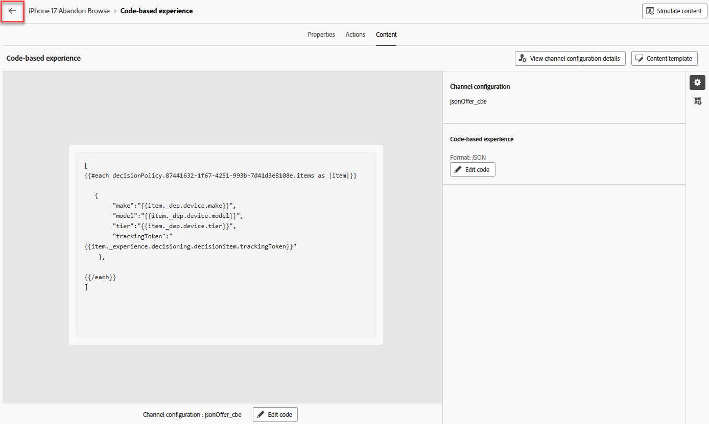

# 建立歷程

## 為進入條件命名並定義

1. 如有必要，請展開左側邊欄中的&#x200B;**歷程管理**&#x200B;功能表專案，然後按一下&#x200B;**歷程**。 您進入「歷程」頁面。
2. 按一下藍色的&#x200B;**建立歷程**&#x200B;按鈕。
3. 當「建立歷程」覆蓋圖出現時，選取&#x200B;**從頭開始建立**&#x200B;並按一下&#x200B;**確認**
4. 在右邊欄中，將歷程命名為&#x200B;**iPhone 17 「放棄瀏覽」**，然後按一下藍色的&#x200B;**儲存**&#x200B;按鈕，讓您可以開始將動作新增至歷程畫布。
5. 將&#x200B;**對象資格**&#x200B;事件拖曳到畫布上。
6. 在右側欄中，按一下&#x200B;**鉛筆**&#x200B;圖示以選取此事件的對象。
7. 選取&#x200B;**dep：對iPhone 17**&#x200B;對象感興趣。
8. 確定&#x200B;**名稱空間**&#x200B;下拉式清單已設定為&#x200B;**customerID。** 此時，您的歷程看起來像這樣：

   的歷程畫布

9. 一旦所有人員看起來都正確後，按一下藍色的&#x200B;**儲存**&#x200B;按鈕以儲存您的進度。

>[!NOTE]
>
>「dep：對iPhone 17感興趣」對象是串流對象，其進入條件為在同一天檢視了虛構的Connection 5G iPhone 17概觀頁面3次。 如同許多產品概觀頁面，Connection 5G的iPhone 17概觀頁面是包含多個元素的動態頁面，可更新而不需重新載入頁面。 您可以在此單一頁面上比較iPhone 17的不同階層及其功能。 因此，如果有人在當天檢視此頁面3次，則他們可能會對iPhone 17感興趣。 不過，由於並非頁面上的每個元素都經過標籤和測量，Connection 5G將會使用已驗證使用者的年齡，來決定當使用者與Connection 5G品牌的不同接觸點互動時，要向他們顯示的手機層級。


## 設定CBE和決定原則

1. 展開畫布左邊的&#x200B;**動作**&#x200B;摺疊式功能表，將&#x200B;**動作**&#x200B;元素拖曳到畫布上，然後將其連線到第一個節點。
2. 當「選取動作型別」覆蓋顯示時，請選取&#x200B;**程式碼基底體驗**&#x200B;動作，然後按一下藍色的&#x200B;**新增**&#x200B;按鈕。
3. 在現在可見的「Action\：Code-based experience」屬性中，按一下&#x200B;**設定動作**&#x200B;按鈕。

   

4. 將&#x200B;**程式碼基底組態**&#x200B;下拉式清單變更為您在上一個區段中建立的&#x200B;**jsonOffer\_cbe** cbe。

   

5. 按一下「程式碼型設定」下拉式清單上方的&#x200B;**編輯內容**&#x200B;按鈕。
6. 在產生的程式碼基底體驗編輯器畫面上，按一下&#x200B;**編輯程式碼**&#x200B;按鈕。 產生的畫面可讓您新增傳回至體驗事件請求的JSON

   

7. 在程式碼編輯器的最左側，按一下&#x200B;**決定原則**&#x200B;功能表專案，然後按一下新功能表中的&#x200B;**新增決定原則**&#x200B;按鈕。

   

   >[!NOTE]
   >
   >如果選取策略是將優惠集合連結至排名方法（並套用策略層級資格）的地方，則決定策略是將選取策略連結至頻道的特定投放的地方。

8. 為此決定原則命名&#x200B;**iPhone 17 DP**，並將「專案數」設定為1。

   >[!NOTE]
   >
   >到目前為止，您已設定選件及排序方式，但尚未設定要傳回多少選件。 您可以在此處設定應傳回的選件數量。

9. 按一下藍色的&#x200B;**下一步**&#x200B;按鈕。 這是您新增選取策略的位置。 按一下&#x200B;**+新增**&#x200B;按鈕（您可能需要向下捲動才能看到它），然後選擇&#x200B;**選取策略**。
10. 勾選您唯一應該擁有的選取策略（**iPhone 17選取策略**）旁的方塊，然後按一下&#x200B;**儲存**。 完成後，您會看到以下內容：

已為決定原則選取iPhone 17選取策略

>[!NOTE]
>
>請注意如何新增多個選取策略或僅新增決策專案本身。 何時會使用多重選取策略？ 假設您的其中一個數位財產上有4 X 4格線建議。 您想要用16個選件填滿所有選件。 您可能會讓這些優惠方案散佈在數個集合中，或者前兩列需要一種選擇策略，而後兩列需要不同的策略。 在上一個畫面中，您會選擇16，然後使用此畫面來新增所需數量的選取策略或選件，以達到16個。
>
>遞補優惠為選用，因為只有當使用者可能不符合任何優惠方案的資格時，才會套用遞補優惠。 在我們的案例中，我們的選取策略是針對所有訪客，而唯一能到達CBE節點的是進入歷程的人。 驗證是歷程進入的必要條件（在歷程中設定的名稱空間是他們只有在驗證之後才會擁有的名稱空間）。 我們也在排名公式中建立了遞補優惠，因此我們不需要設定此遞補優惠。

1. 按一下藍色的&#x200B;**下一步**&#x200B;按鈕以檢閱決定原則。

   在建立決定原則之前，請先檢閱決定原則的步驟

1. 一切看起來正確後，按一下藍色的&#x200B;**建立**&#x200B;按鈕。 建立後，您會返回運算式編輯器頁面。
1. 您應該會看到類似下列的畫面；如果沒有，請再按一下&#x200B;**決定原則**，您就會看到您的決定原則出現。

   顯示決定原則的

1. 按一下&#x200B;**+插入原則**&#x200B;按鈕，您會看到ForEach回圈出現在程式碼編輯器中：

   插入決定原則之後，將

   >[!NOTE]
   >
   >為何每個回圈使用？ 在本例中，我們只傳回單一選件。 不過，請考慮先前傳回多個選件的步驟。 考慮功能時，這裡的循環機制是合理的。

1. 在回圈範圍內新增有效的JSON，以傳回手機應提供給一般使用者的品牌、型號和階層。 由於也設有頻率上限，因此需要將trackingToken新增至回應。 稍後在指示中進一步說明。 為節省時間，只需將這些行程式碼複製並貼到For Each回圈中的程式碼編輯器中：

   ```javascript
   {
        "make":"",
        "model":"",
        "tier":"",
        "trackingToken":""
    },
   ```

   

   >[!NOTE]
   >
   >回想一下，您已將屬性新增至標準選件XDM結構描述，特別是品牌、模型和階層。 接著您會在建立優惠方案時填入這些屬性。 您現在可新增這些屬性，作為使用所選選件之值填入的變數。 trackingToken欄位是系統產生的值，用於追蹤點按和曝光數。

1. 將游標置於&#39;make&#39;節點的&#x200B;**&quot;**&#x200B;之間。 在決定原則功能表中導覽至&#x200B;**\_dep > Device > Make**&#x200B;節點，以插入優惠方案製作。  按一下&#x200B;**Make**&#x200B;元素上的&#x200B;**+**&#x200B;圖示，您會看到它填入編輯器。

   

1. 以類似方式新增&#x200B;**模型**&#x200B;和&#x200B;**層**&#x200B;屬性。
1. 按一下屬性導覽中的&#x200B;**決定原則**&#x200B;以返回根層級。
1. 透過&#x200B;**\_experience > decisioning > decisionitem >追蹤Token**&#x200B;路徑導覽至追蹤Token值，填入trackingToken屬性。
1. 最後，將整段程式碼封裝在方括弧(**\[]**)中。 您最終的JSON程式碼應如下所示：

   

   >[!WARNING]
   >
   >請務必在整個決定專案兩側加上括弧「\[ ]」。 困惑？ 請再次參閱步驟#20。


1. 一旦所有專案都看上方的熒幕擷圖後，按一下右上方的&#x200B;**儲存並關閉**&#x200B;以儲存您的程式碼。 接著，您會返回「程式碼型體驗」頁面。
1. 按一下歷程名稱旁的向後箭頭&#x200B;**\&lt;**&#x200B;圖示，您就會回到畫布。

   從程式碼型體驗編輯器返回後的

1. 按一下藍色的&#x200B;**儲存**&#x200B;按鈕，儲存CBE動作節點。 您的歷程現在看起來像這樣：

   

1. 歷程完成時，按一下右上方的藍色&#x200B;**發佈**&#x200B;按鈕，然後在確認方塊出現時再按一次&#x200B;**發佈**。 過了一兩會兒，您會看到您的歷程現在已上線！


>[!TIP]
>
>您的歷程現在已準備好為此決策套件提供JSON選件！

>[!NOTE]
>
>為何在畫布上放置CBE後會自動建立等待節點？ 請記住，CBE是傳入頻道。 不同於主動傳送給使用者的電子郵件或推播通知，CBE會推播至Edge，並在那裡等待使用者造訪數位屬性並請求優惠方案。 等待的時間由該等待節點定義。 預設會設定3天，但可進行設定。 本實驗室假設為3天，但在真實世界情況中，您可能會想要將其延長更久，因為等待時間過後，該使用者的Journey會進展至結束節點，而CBE會從該使用者的Edge設定檔存放區中移除。
>
>這也突顯出重要的架構和時機考量。 該使用者的CBE何時會推送至Edge設定檔存放區？ 當使用者進入該節點時，這表示在他們符合區段的資格後。 這表示在使用者檢視了第三個頁面後，無論幾秒到幾分鐘，資料流細分都會執行，使用者會被放在該區段中，他們進入歷程並進展到CBE節點，然後該CBE會投影到該使用者的Edge。  在資料和處理需求極少的測試組織中，整個流程只需要幾秒或幾分鐘的時間。 對於擁有更高輸送量的大型組織，計畫至少15分鐘，可能長達2小時。


## 重述

在此頁面中，您設定了程式碼型體驗(CBE)管道，此管道可讓外部系統透過API樣式的傳入管道要求優惠決定。 此設定包括指定使用者端系統將傳送的表面/位置引數，以及選擇JSON輸出格式。
