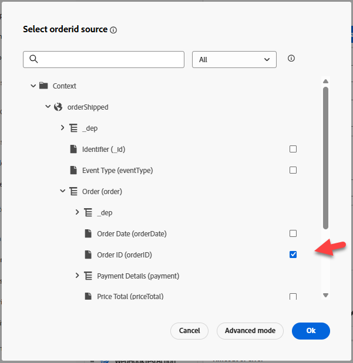
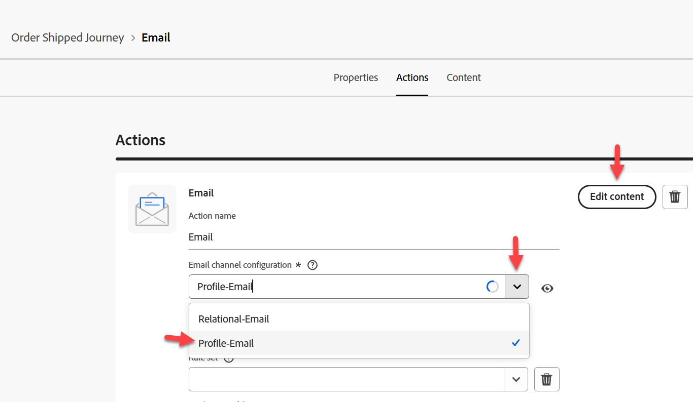
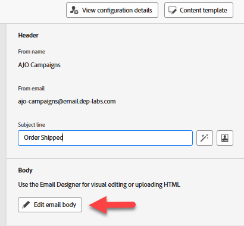
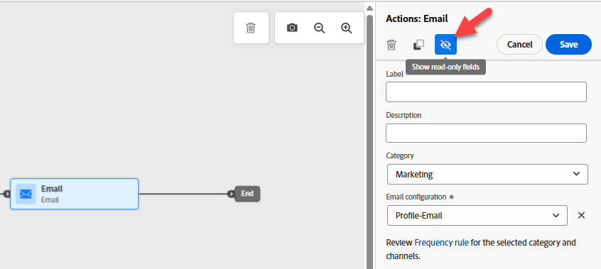

# 建立歷程

## 學習目標

建立以設定的Order Shipped事件開始的單一歷程，從外部服務取得ETA並傳送電子郵件。

## 建立歷程

移至&#x200B;**歷程**&#x200B;並按一下&#x200B;**建立歷程 — 從頭開始建立**


## 歷程屬性

1. 使用以下專案更新右側邊欄中的歷程屬性：
   - **名稱**： `Order Shipped Journey`
   - **描述**： `Notify customer that order has shipped. Include shipping details.`
   - **標籤**： `Default`
   - **歷程量度**： *留空*

     >[!NOTE]
     >
     >**空下拉式清單？**
     >
     >別擔心，繼續前行。 在沙箱中建立的第一個歷程需要「裝填泵」。  發佈歷程後，此下拉式清單將可供選擇。

   - **允許重新進入**： `checked`

   - **重新進入等待期間：** `5 minutes`

   - **存取標籤**： *留空*

   - **時區**： `Your Local timezone`

   - **在等待和條件中使用設定檔時區**： `NOT checked`

   - **開始/結束日期**： *保留空白*

   - **逾時或錯誤**： `30`

   - **上限規則：** *留空*

   - **優先順序**： `0`


2. 如果一切正常，請按一下&#x200B;**儲存**&#x200B;按鈕

歷程屬性面板的


## 歷程畫布

### 新增單一事件

從&#x200B;**事件功能表**&#x200B;下方的左窗格，將&#x200B;**orderShipped**&#x200B;事件拖放到畫布上，如下所示

![從[事件]功能表將orderShipped事件拖曳到歷程畫布](assets/build-journey-drag-order-shipped-event-onto-canvas.png)


### 新增自訂動作

1. 如果左窗格展開&#x200B;**動作功能表**，然後將&#39;n拖放到您建立的動作（名為&#x200B;**GetShippingDetails**，位於orderShipped事件之後）的畫布上


&#x200B;2. 在右側邊欄中，在「存取和隱私權設定 — >行銷動作」下拉式清單下，確定值設為&#x200B;**無**


&#x200B;3. 在「端點組態 — >查詢引數」功能表下，按一下orderid旁的&#x200B;**鉛筆圖示**


&#x200B;4. 在出現的強制回應視窗中，展開&#x200B;**Context** -> **orderShipped** -> **Order**，然後選取&#x200B;**訂單ID (orderID)**，然後按一下&#x200B;**確定**



&#x200B;5. 回到右側邊欄，確定「逾時」或錯誤的選項為&#x200B;**未勾選**，然後按一下&#x200B;**儲存按鈕**

取消勾選


### 新增電子郵件動作

1. 在[動作]功能表下，將&#39;n拖曳&#39;0&rbrace;動作&#x200B;**至GetShippingDetails動作之後的畫布**

![在GetShippingDetails動作之後，將[動作]節點拖曳到畫布上](assets/build-journey-drag-email-action-onto-canvas.png)

&#x200B;2. 選取行銷動作的&#x200B;**電子郵件**，然後選取&#x200B;**新增**。

![選取電子郵件作為行銷動作，然後按一下[新增]](assets/build-journey-select-email-marketing-action.png)

&#x200B;3. 在右側邊欄中，按一下&#x200B;**設定動作**


&#x200B;4. 將&#x200B;**電子郵件通道設定**&#x200B;設為`Profile-Email`，然後按一下&#x200B;**編輯內容**




### 新增電子郵件內文內容

對於內容，您將保持簡單。 就像愚蠢的簡單。

1. 將主旨行更新為`Order Shipped`，然後按一下&#x200B;**編輯電子郵件內文按鈕**



&#x200B;2. 在頂端列中，按一下&#x200B;**從草稿開始設計**&#x200B;內容區塊


&#x200B;3. 從結構容器下方的左列拖曳&#39;n，將&#x200B;**1:1欄**&#x200B;拖放到畫布上


&#x200B;4. 然後在「內容」容器下方，將&#x200B;**Text**&#x200B;元件拖放到您的&#x200B;**1:1欄**&#x200B;中


&#x200B;5. 按一下文字元件並&#x200B;**刪除目前的文字**，然後按一下&#x200B;**新增Personalization**&#x200B;圖示

刪除預設文字後

&#x200B;6. 在左側邊欄中，按一下&#x200B;**內容屬性**&#x200B;資料夾，然後導覽至&#x200B;**Journey Orchestration** -> **動作**，並選取&#x200B;**GetShippingDetails**


&#x200B;7. 現在，在電子郵件的正文中&#x200B;**複製並貼上以下JSON**&#x200B;至Personalization **編輯器**

```json
{{profile.person.name.firstName}}, your order has shipped
ETA: 
Tracking Number: 
```

&#x200B;8. 新增個人化欄位，如下所示（**按一下左側邊欄**&#x200B;欄位旁的加號「+」）：
   - **ETA：** `eta`
   - **追蹤號碼：** `tracking_number`


>[!NOTE]
>
>按一下&#x200B;**+符號**，將個人化屬性從邊欄新增至畫布。  它會將其放在游標所在的位置，以確保您正確「排好」

>[!NOTE]
>
>您的電子郵件將使用內容屬性（ETA和追蹤編號）和設定檔屬性（名字）的組合。 如果您想要新增其他設定檔屬性，可以按一下「設定檔屬性」標籤，然後選取您看到的任何專案。
>
>![新增其他設定檔屬性的[設定檔屬性]索引標籤](assets/build-journey-profile-attributes-tab.png)

&#x200B;9. 在熒幕底部按一下&#x200B;**驗證**&#x200B;按鈕，並確定您沒有錯誤


&#x200B;10. 如果一切正常，請按一下右上方的&#x200B;**儲存按鈕**
&#x200B;11. 再按一下右上方的&#x200B;**儲存**&#x200B;按鈕，然後按一下左上方的&#x200B;**\&lt; — 左箭頭**


&#x200B;12. 最後，按一下左上方的&#x200B;**\&lt;上一頁圖示**&#x200B;以回到歷程畫布

左上方的

>[!TIP]
>
>然後再次按一下&#x200B;**上一步**&#x200B;按鈕……開玩笑！ 這是本節😜的最後一個按鈕


### 覆寫電子郵件引數

回到主要「歷程畫布」，在「電子郵件」節點上，確定您可以看到唯讀欄位（您可能需要按一下「**顯示唯讀欄位**」圖示）



1. 向下捲動至&#x200B;**電子郵件引數**&#x200B;並按一下&#x200B;**啟用引數覆寫**&#x200B;圖示


&#x200B;2. 按一下空白文字方塊，然後在左側邊欄中向下展開至&#x200B;**內容** -> **orderShipped** -> **\_dep**，然後按一下&#x200B;**personalEmail**&#x200B;欄位。  然後按一下&#x200B;**確定按鈕**

下的personalEmail欄位

>[!WARNING]
>
>這是很危險的做法，除非您需要在生產設定中使用，否則請避免使用。  這將覆寫Journeys在設定檔上尋找以執行訊息的預設位置。


&#x200B;3. 按一下右上方的&#x200B;**儲存按鈕**，然後按一下左上方的&#x200B;**上一箭號** \&lt; — 以&#x200B;**關閉**&#x200B;歷程


## 重述

能夠回應Order Shipped事件觸發器的已發佈歷程，從外部服務取得ETA並傳送電子郵件。
