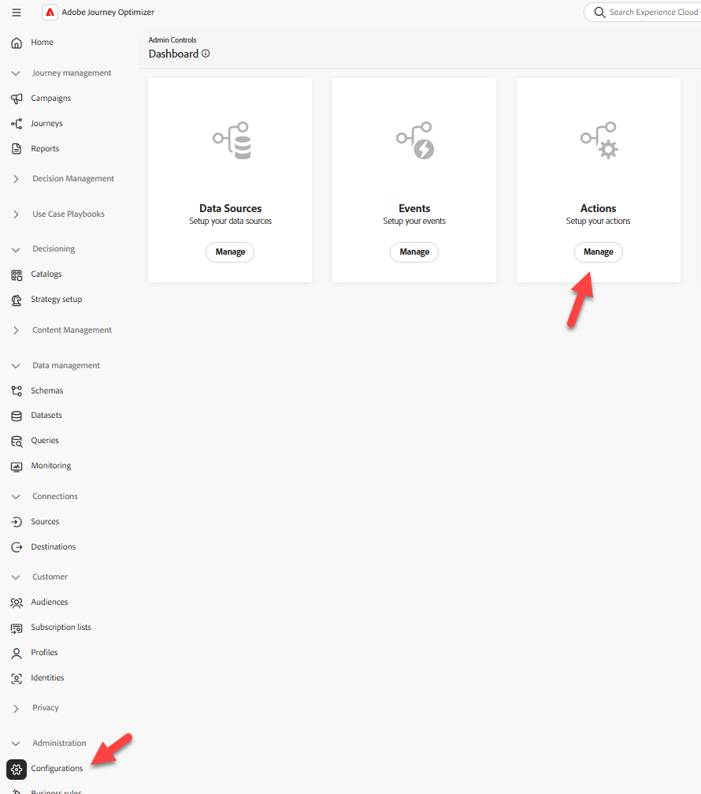

# 設定自訂動作

## 學習目標

建立自訂動作，定義歷程將與外部端點或服務通訊的方式，以取得封裝到達時間的ETA。

## 導覽至動作

在左側邊欄的[管理]功能表下，按一下[設定] **&#x200B;**，然後在[動作]方塊上按一下[管理] **按鈕**

設定底下[動作]方塊上的管理按鈕


## 設定動作

### 動作名稱和詳細資訊

1. 在右上角按一下&#x200B;**建立動作**&#x200B;按鈕

右上角的

&#x200B;2. 在出現的設定面板中，更新下列基本值，如下所示：
   - **名稱**： `GetShippingDetails`
   - **描述**： `Call third party to get Shipping ETA and Tracking Number`
   - **動作型別**： `Custom`
   - **頻道**： `Email`
   - **必要的行銷動作**： `Email Targeting`


### 端點詳細資料

在「端點」設定區域中，提供下列詳細資訊：

- **端點URL**： `https://api.mockaroo.com/api/67077bb0?count=1&key=a0dbce20`
- **方法**： `GET`
- **標頭：** *保持原樣*
- **查詢引數：**
  - **名稱**： `orderid`
  - **型別**： `variable`

>[!NOTE]
>
>變數可讓我們在歷程期間傳入值，而不是讓所有歷程都傳入靜態值

- **驗證型別**： `No Authentication`


![端點的[驗證型別]設定為[無驗證]](assets/configure-custom-action-endpoint-details-configured--2.png)


### 回應裝載詳細資料

現在您必須提供範例裝載，讓動作知道回應裝載的外觀。

1. 在[裝載]區域中，按一下&#x200B;**鉛筆圖示**&#x200B;以開啟[欄位設定]畫面


&#x200B;2. **複製並貼上**&#x200B;以下承載到承載方塊中

```json
{
    "eta": "11/19/2025",
    "tracking_number": "072000326"
}
```

>[!NOTE]
>
>此即為上述Mockaroo端點應傳回的相同JSON結構：


&#x200B;3. 將會顯示回應裝載。 按一下&#x200B;**儲存**&#x200B;按鈕。

以「儲存」按鈕顯示的

>[!NOTE]
>
>您可以將所有內容保留為字串，但在現實情況中，您可能想要更新以符合資料型別


### 測試動作

1. 按一下右下邊欄中的&#x200B;**傳送測試要求**&#x200B;按鈕，驗證您沒有搗亂任何專案😀


&#x200B;2. 按一下&#x200B;**查詢引數**&#x200B;標籤，並將`orderId`的值更新為&#x200B;**123**

的查詢引數索引標籤


&#x200B;3. 按一下「**傳送」按鈕**，如果一切順利，您應該會看到200的回應代碼，以及裝載的預覽，如下所示……


預覽

```json
{
  "eta": "12/26/2025",
  "tracking_number": "063112249"
}
```

>[!WARNING]
>
>如果您沒有看到200回應或預覽不再繼續。 請提高您的✋以取得協助。


&#x200B;4. 按一下&#x200B;**取消**&#x200B;按鈕以返回「動作」畫面，然後在右上欄向上捲動並按一下&#x200B;**儲存**&#x200B;按鈕

>[!TIP]
>
>恭喜！ 您的自訂動作已上線，這要歸功於您的專家級Ctrl+C、Ctrl+V技能。

## 重述

Adobe Journey Optimizer中設定的可重複使用自訂動作，需取用訂單ID並傳回ETA和追蹤編號。
