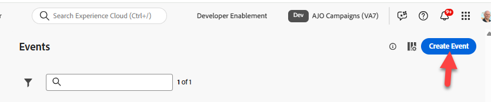
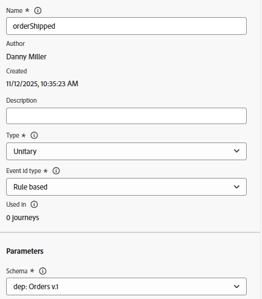

# 設定事件

## 學習目標

建立並設定事件，此事件將在購買後動作（已送出訂單）發生時觸發客戶歷程。

## 導覽至Journey Optimizer

在瀏覽器的右上角，按一下&#x200B;**Cube**，然後選取&#x200B;**Journey Optimizer**

## 設定訂單出貨事件

為了建立使用單一事件的歷程，我們需要先設定事件。

1. 在左側邊欄的[管理]功能表下，按一下[設定] **&#x200B;**，然後在[事件]方塊上按一下[管理] **按鈕**

   「設定」底下的「事件」方塊上的「

2. 在右上角按一下&#x200B;**建立事件**&#x200B;按鈕

   右上角的

3. 更新事件的設定，如下所示：
   - **名稱** = `orderShipped`
   - **型別** = `Unitary`
   - **事件識別碼型別** = `Rule based`
   - **結構描述** = `dep: Orders v.1`

   

4. 在`Fields`輸入方塊中，按一下&#x200B;**鉛筆圖示**

   欄位輸入方塊中的

5. 選取下列欄位以新增至事件，完成時按一下&#x200B;**確定**&#x200B;按鈕
   - `Event Type (eventType)`
   - `Order ID (orderID)`

   已選取要新增至事件的

   >[!NOTE]
   >
   >請確定您只選取訂單ID欄位，而非訂單😁中的所有欄位

6. 在`Event Id condition input`中，按一下&#x200B;**鉛筆圖示**

   事件ID條件輸入中的

7. **將** `Event Type`欄位拖曳到畫布上

   ![將[事件型別]欄位拖曳到條件畫布](assets/configure-event-drag-event-type-field-onto-canvas.png)

8. 在出現的選取方塊中尋找並檢查標題為&#x200B;**orders.shipped.**&#x200B;的值 然後按一下&#x200B;**確定**&#x200B;按鈕。

   

9. 接著，使用下列值更新名稱空間和設定檔識別碼的最後兩個值：
   - **名稱空間** —> `Email`
   - **設定檔識別碼** —> `personalEmail`

>[!NOTE]
>
>**名稱空間和設定檔識別碼是用於什麼？**
>
>對於使用事件的任何歷程，您必須為該事件指定應該使用哪個身分名稱空間和關聯的設定檔識別碼來查詢設定檔。 務必要瞭解，選擇一種身分而非另一種身分可能會影響歷程的運作方式。
>
>*快速範例：*
>
>事件有效負載是包含身分的頁面檢視，例如：ECID （主要身分）和客戶ID （選用）
>
>- 已選擇ECID —>這可能是身分服務第一次看到這種關係，所以當歷程收到此事件時，它會嘗試使用ECID查詢設定檔，但找不到設定檔。  為什麼？ ECID和客戶ID之間的關係尚未存在，而且設定檔的特徵可能會以已知的識別碼「客戶ID」儲存
>- 已選取的客戶ID —>此身分不需要填入，而且在大部分的頁面檢視中，該身分可能是空的。  因此，如果選擇此身分，歷程唯一會引發的時間是設定了客戶ID的已驗證頁面檢視。
>
>簡短回答：沒有正確答案，僅需根據使用案例😃進行權衡

## 最終訂單已出貨事件設定

驗證您的最終事件設定符合以下內容。  如果一切正常，請按一下&#x200B;**儲存**&#x200B;按鈕

>[!TIP]
>
>您已設定您的第一個AJO事件。 親自擊掌！

## 重述

Adobe Journey Optimizer中已設定的訂單出貨事件，可作為歷程的進入點
